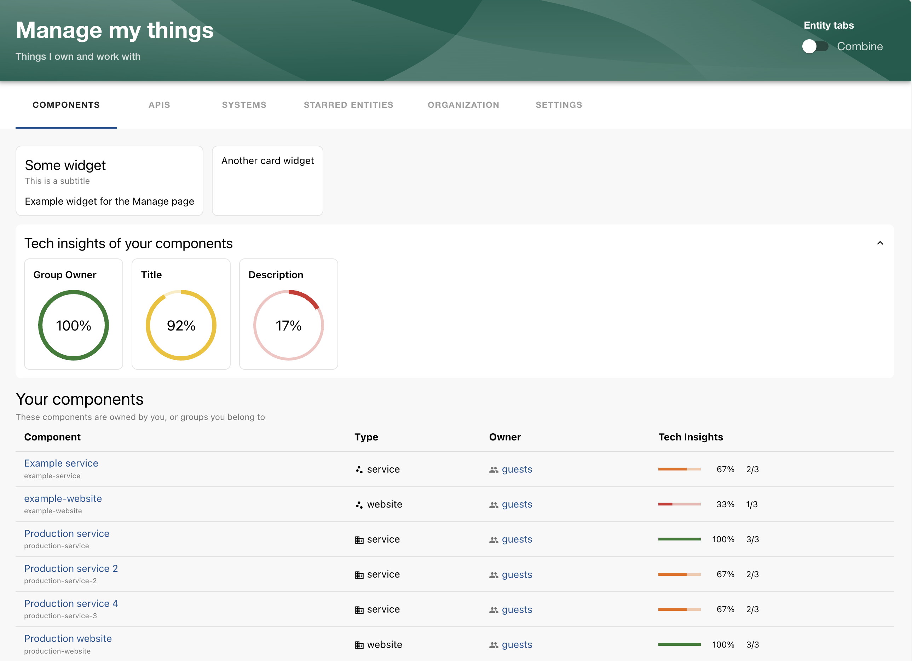

# Manage page

This plugin offers a place for developers to manage things they and their team own.

Read the [documentation](./plugins/manage/README.md) for the frontend plugin.



## Packages

- [manage](./plugins/manage/README.md) - The frontend plugin for the Manage page
- [manage-module-tech-insights](./plugins/manage-module-tech-insights/README.md) - The tech insights module for the Manage plugin, to display tech insight checks in the entity tables, and/or display aggregated gauges.
- [manage-react](./plugins/manage-react/README.md) - A module for extending the Manage page with custom components, features, entity table columns, etc.

## Local Development

To start the Backstage App, run:

```sh
yarn install
yarn start
```
