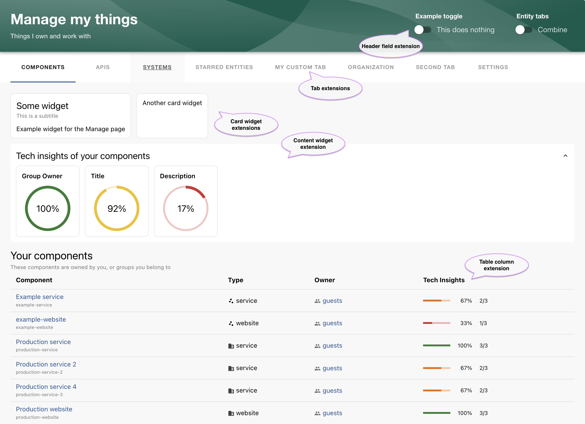

# Manage, react package

This package contains shared utilities used by the Manage plugin. It provides blueprints, hooks, and components for building extensions to the Manage page, including custom tabs, widgets, providers, and entity table columns.

The APIs in this package are intended for extension authors. Unless otherwise stated, the provided hooks can be used anywhere within the Manage page.

This documentation applies to the new frontend system.



## Table of contents

- [Blueprints](#blueprints)
  - [ManageTabBlueprint](#managetabblueprint)
  - [Widgets](#widgets)
    - [ManageEntityCardWidgetBlueprint](#manageentitycardwidgetblueprint)
    - [ManageEntityContentWidgetBlueprint](#manageentitycontentwidgetblueprint)
  - [ManageEntityColumnBlueprint](#manageentitycolumnblueprint)
  - [ManageHeaderLabelBlueprint](#manageheaderlabelblueprint)
  - [ManageConfigBlueprint](#manageconfigblueprint)
  - [ManageProviderBlueprint](#manageproviderblueprint)
  - [ManageSettingsBlueprint](#managesettingsblueprint)
- [Hooks](#hooks)
  - [useOwnedKinds](#useownedkinds)
  - [useOwnedEntities](#useownedentities)
  - [useManagedEntities](#usemanagedentities)
  - [useOwners](#useowners)
  - [useCurrentKind](#usecurrentkind)
  - [useCurrentKinds](#usecurrentkinds)
  - [useCurrentKindTitle](#usecurrentkindtitle)
  - [useUserSettings](#useusersettings)
  - [useProgressStyle](#useprogressstyle)
- [Components](#components)
  - [Accordion](#accordion)
  - [GaugeCard](#gaugecard)
  - [GaugeGrid](#gaugegrid)
  - [Icons](#icons)
  - [ColumnSkeleton](#columnskeleton)
  - [ReorderableTabs](#reorderabletabs)

### ManageTabBlueprint

Custom tabs can be added using the `ManageTabBlueprint`. The default tab order is configured in `app-config.yaml`. Tabs may also define an optional `condition` (which may be asynchronous) to control visibility.

Example:

```tsx title="my-tab-extension.tsx"
export const testTab1 = ManageTabBlueprint.make({
  name: 'my-tab',
  params: defineParams =>
    defineParams({
      loader: async () => import('./MyTab').then(m => <m.MyTab />),
      path: 'my-tab',
      title: 'My feature',
      // Wrap the content in a full-height container,
      // and set the height of the child component too.
      fullHeight: { resizeChild: true },
      // Optional condition - only show the tab if the user is part of a group
      condition: ({ owners }) =>
        owners.ownerEntityRefs.includes('group:default/some-group'),
    }),
});
```

The `fullHeight` property can be set to provide a container element that has the full available height, adapting to window resizing. `resizeChild` allows setting the height of the child component too.

### Widgets

Widgets can be rendered above or below the entity table. They are commonly used for summaries, metrics, or aggregated views.

Widgets support an optional `condition` function (which may be asynchronous) that can disable rendering when the widget is not applicable. This does not override configuration, but allows widgets to opt out dynamically.

Widget placement, ordering, and visibility per tab are configured in `app-config.yaml`.

### ManageEntityCardWidgetBlueprint

Card widgets are rendered at the top of the page. They should generally be kept compact to avoid consuming excessive screen space. It is recommended to size the component to `height: 100%` so that all cards align visually.

Example:

```tsx title="my-card-widget-extension.ts"
ManageEntityCardWidgetBlueprint.make({
  name: 'my-card-widget',
  params: defineParams =>
    defineParams({
      type: 'card',
      attachTo: ['component', '$entities'],
      loader: async () => import('./MyWidget').then(m => m.MyWidget),
    }),
});
```

### ManageEntityContentWidgetBlueprint

Content widgets are full-width and stacked vertically. They can optionally be rendered inside an accordion. Accordion state is persisted in user settings and restored per user.

Example:

```tsx title="my-content-widget-extension.ts"
ManageEntityContentWidgetBlueprint.make({
  name: 'my-content-widget',
  params: defineParams =>
    defineParams({
      type: 'content',
      attachTo: ['component', '$entities'],
      accordion: {
        show: true,
        accordionTitle: 'Content widget things are here',
      },
      loader: async () => import('./MyWidget').then(m => m.MyWidget),
    }),
});
```

### ManageEntityColumnBlueprint

The entity tables rendered in the Manage page can be extended with additional columns using the `ManageEntityColumnBlueprint`. A concrete example can be found in the `@backstage-community/plugin-manage-module-tech-insights` package.

An extension may provide:

- A single-column variant
- A multi-column variant (for example, dynamically generated columns)
- Or both

Which variant is used can be configured per table in `app-config.yaml` (for example for the combined view, per kind, or for starred entities). If both variants are provided, the multi-column variant is used by default, unless overridden by configuration or by the extension itself.

The blueprint accepts two loader functions:

- One returning a single `ManageColumn`
- One returning an array of `ManageColumn`

Both loaders are invoked deterministically and may call React hooks. Hooks are also allowed inside the column `render` function, but care should be taken to avoid unnecessary data fetching and performance. Consider using a shared Provider (below) to batch or cache requests.

The `ManageColumn` type is defined as:

```ts
interface ManageColumn {
  id: string;
  title: string;
  render: (opts: { entity: Entity }) => ReactNode;
}
```

A `condition` parameter (which may be asynchronous) can be provided to control whether the column(s) should be displayed.

Example:

```tsx title="my-column-extension.ts"
ManageEntityColumnBlueprint.make({
  name: 'my-columns',
  params: defineParams =>
    defineParams({
      // Show the columns on the three entities views/tabs:
      //   components, systems and "combined".
      // For the components view, show the single-column version by default.
      attachTo: [{ tab: 'component', multi: false }, 'system', '$entities'],
      loaderSingle: async () =>
        import('./single-column.ts').then(m => m.useSingleColumn),
      loaderMulti: async () =>
        import('./multi-column.ts').then(m => m.useMultiColumn),
    }),
});
```

A single-column implementation:

```tsx title="single-column.tsx"
export function useSingleColumn() {
  // useSomeApi(); // <-- hooks are allowed

  return {
    id: 'the-title',
    title: 'The title',
    render: (props: { entity: Entity }) => (
      <div>Column for {props.entity.metadata.name}</div>
    ),
  };
}
```

A multi-column implementation:

```tsx title="multi-column.tsx"
export function useMultiColumn() {
  // Hooks are allowed, maybe fetching from a provider
  const cols = useMyColumns();

  return useMemo(
    () =>
      cols.map(col => ({
        id: `my-column-${col.id}`,
        title: col.title,
        render: (props: { entity: Entity }) => (
          <div>
            <MyGauge entity={props.entity} />
          </div>
        ),
      })),
    [cols],
  );
}
```

### ManageHeaderLabelBlueprint

Custom header labels can be added to the top-right area of the Manage page using the `ManageHeaderLabelBlueprint`. This is useful for toggles or other lightweight controls that apply to the entire page.

Example:

```tsx title="my-header-label-extension.ts"
ManageHeaderLabelBlueprint.make({
  name: 'my-label',
  params: defineParams =>
    defineParams({
      loader: async () => import('./MyHeaderLabel').then(m => m.default),
    }),
});
```

A corresponding component might look like:

```tsx title="MyHeaderLabel.tsx"
export default function MyHeaderLabel() {
  return (
    <HeaderLabel
      label="Custom toggle"
      value={
        <FormGroup row>
          <FormControlLabel
            control={<Switch name="my-switch" color="primary" />}
            label={<Typography>Toggle me</Typography>}
          />
        </FormGroup>
      }
    />
  );
}
```

### ManageConfigBlueprint

The Manage page supports user settings that are fetched eagerly during page load. Registering settings up front reduces the number of HTTP requests and improves initial load performance.

Because the Manage page can be extended by multiple plugins, user settings are namespaced using a `feature` and a `key`. The `feature` acts as a namespace for an extension or plugin, minimizing the risk of key collisions.

Registered settings can be accessed using the `useUserSettings` hook described below.

Use the `ManageConfigBlueprint` to instruct the Manage page to fetch a set of user settings on page load.

Example:

```ts title="my-config-extension.ts"
ManageConfigBlueprint.make({
  name: 'my-config',
  params: defineParams =>
    defineParams({
      primeUserSettings: [['the-feature', 'the-key']],
    }),
});
```

### ManageProviderBlueprint

The Manage page is wrapped in a set of providers that expose shared state such as owned entities and the currently active tab. Extensions may register additional providers using the `ManageProviderBlueprint`.

This is useful when components (for example columns and/or widgets) need access to shared, cached, or batched data.

Example:

```ts title="my-provider-extension.ts"
ManageProviderBlueprint.make({
  name: 'my-provider',
  params: defineParams =>
    defineParams({
      loader: async () => import('./MyProvider').then(m => m.MyProvider),
    }),
});
```

The registered provider will wrap the entire Manage page, making its context available anywhere in the Manage page.

> [!IMPORTANT]
> Providers **should avoid blocking rendering with loading spinners or error boundaries**. Instead, allow children to render immediately and handle loading and error states within individual components. A single extension should never delay or break rendering of the entire Manage page.

### ManageSettingsBlueprint

The Manage page includes a Settings tab, rendered as the last tab in the page. This tab allows users to configure Manage-specific preferences, such as reordering tabs.

Extensions can also contribute custom settings components to this tab. Use the `ManageSettingsBlueprint` to register such settings.

```tsx title="my-settings-extension.tsx"
ManageSettingsBlueprint.make({
  name: 'my-settings',
  params: defineParams =>
    defineParams({
      title: 'Example settings',
      loader: async () => <div>Settings go here</div>,
    }),
});
```

## Hooks

### useOwnedKinds

Returns the entity kinds configured for the Manage page, or the default Backstage kinds if none are configured. When `onlyOwned` is true, only kinds that the user actually owns entities of are returned.

### useOwnedEntities

Returns all entities owned by the current user. A kind or list of kinds may be provided to filter the result.

### useManagedEntities

Returns all managed entities, including both owned and starred entities.

### useOwners

Returns an object with the following shape:

```ts
{
  groups: Entity[];
  user: Entity | undefined;
  ownedEntityRefs: string[];
}
```

`ownedEntityRefs` is a list of entity refs for all owners (incl. the current user). `groups` is a list of `Entity` objects for the owners that are groups. `user` is the current user entity.

The returned data is ordered by:

1. Immediate group membership
2. Groups higher or lower in the hierarchy
3. The user

Within each category, entities are ordered alphabetically by title or name.

### useCurrentKind

Returns the currently active entity kind when called from within an entity tab. Returns `undefined` when called outside an entity tab.

### useCurrentKinds

Similar to `useCurrentKind`, but returns an array of kinds. If no specific kind is active, it falls back to the result of `useOwnedKinds` (such as for the combined Entities tab).

### useCurrentKindTitle

Returns a human-readable title for the current kind, such as "components", "systems", "entities", or "starred entities".

This is intended for use by extensions and is used, for example, by the Tech Insights module to label accordion sections.

### useUserSettings

The `useUserSettings` hook is used to read and update user settings given a a `feature` and a `key`. The `feature` can be seen as a namespace for the extension or plugin, and can simply be the name of the plugin.

Example:

```ts
const { value } = useUserSettings('my-plugin', 'some-key');
```

The hook returns:

- `value`: The current value, or `undefined` if not yet loaded
- `setValue`: Update the value
- `removeValue`: Removes the value
- `isSettled`: Indicates whether the value has been fetched from the backend

The hook listens for changes and updates live when values are modified.

### useProgressStyle

The Manage page can be globally configured to prefer circular or linear progress indicators. The `useProgressStyle` hook can be used to detect which style is configured, to adapt visual elements accordingly.

## Components

### Accordion

An accordion component with its expanded state persisted in user settings.

### GaugeCard

A circular gauge indicator with predefined styling to ensure consistent appearance when multiple plugins render gauges.

### GaugeGrid

An alternative to GaugeCard that renders more compact gauge cards in a grid layout.

### Icons

The following helper components are provided for use primarily in entity table columns:

- `ColumnIconError` for error states
- `ColumnIconNoData` for missing data
- `ColumnIconPercent` for circular or linear percentage gauges. Their styles are [configured](../manage/README.md#progress-style) in the app-config.yaml.

### ColumnSkeleton

For columns waiting for data to load, the `<ColumnSkeleton/>` component can be used to display a skeleton component before the content is ready.

### ReorderableTabs

A tab component implemented as a button group with drag-and-drop support. This is used in the Manage settings page to allow users to reorder tabs and kinds.

### TabContentFullHeight

> [!IMPORTANT]
> This component exists for backwards compatibility with the old frontend system and should not be used with the new frontend system. Full-height behavior is defined via the `ManageTabBlueprint`.

The `TabContentFullHeight` component wraps tab content and sets its height dynamically based on the viewport. The optional `resizeChild` prop updates the size of the single child component. The `bottomMargin` prop can be used to override the default bottom margin.
