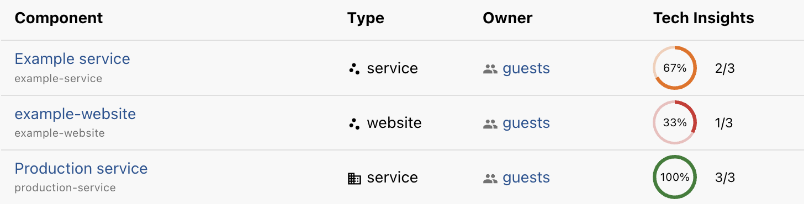
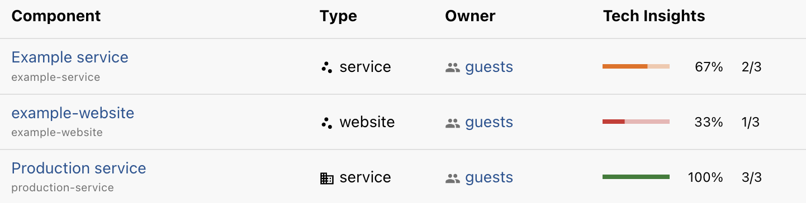

# Manage

The Manage plugin provides a dedicated place for developers to manage things they and their team own.

The Manage page is modular and highly customizable. It ships with a default set of tabs for common views: entities (such as components and systems), starred entities, and organization structure. Additional tabs can be added as needed.

Entity tabs render a table of owned entities. Above and below this table, custom React components can be injected. The table itself can also be extended with additional columns, for example to display Tech Insights checks or other custom metadata.

The page is wrapped in a React provider that fetches:

- All groups the user belongs to
- All entities owned by the user or any of those groups

These are exposed as hooks for extensions to use, if needed. Each built-in tab also provides contextual information about which kind of entities are being displayed, also exposed through hooks. This makes it straightforward for extensions to add gauges, statistics, table columns, and other enhancements that depend on the current view.


## Installation (New frontend system)

If frontend feature discovery is enabled for all packages, simply installing the plugin is enough to register it at `/manage` and add a sidebar entry:

```sh
yarn --cwd packages/app add @backstage-community/plugin-manage
```

Remember to also install the corresponding [backend plugin](../manage-backend).

### Enabling feature discovery explicitly

To enable feature discovery for this plugin specifically, add it to `app-config.yaml`:

```yaml title="app-config.yaml"
app:
  packages:
    include:
      - '@backstage-community/plugin-manage'
```

Extensions can be installed in the same way, for example:

```sh
yarn --cwd packages/app add @backstage-community/plugin-manage-module-tech-insights
```

## Configuration

The Manage plugin is configured via `app-config.yaml`. Below is an example taken from the `app-next` package in this plugin’s workspace:

```yaml title="app-config.yaml"
manage:
  title: Manage my things
  subtitle: Things I own and work with
  showStarred: true
  enableWholeOrganization: true
  progressStyle: linear # linear or circular
  order:
    tabs:
      - entities
      - starred-entities
      - my-tab-1
      - organization
      - my-tab-2
    cards: []
    contentAbove:
      - app/foo-widget1
      - app/foo-widget2
      - tech-insights/cards
    contentBelow:
    columns:
      - app/foo-column
      - tech-insights/checks
```

Refer to `config.d.ts` for the full set of supported configuration options. For a more comprehensive example, see the [`app-config.yaml`](../../app-config.yaml) used by the `app-next` package in this workspace.

#### Progress style

The `progressStyle` affects how gauges, primarily in columns, are displayed - either as circular (the default) or linear progress indicators. It is up to module extensions to respect this, but an example of the `@backstage-community/plugin-manage-module-tech-insights` columns with `circular` looks like:



And with `linear`:



### Extension configuration

Extensions are configured in the `app.extensions` section in `app-config.yaml`, and are named based on the plugin name and extension name.

Manage page modules should be expected to document their configuration options, as well as the names of their provided extensions, for example as done in the `@backstage-community/plugin-manage-module-tech-insights` package.

| Node ID                                 | Extension                |
| --------------------------------------- | ------------------------ |
| `manage-tab:{plugin}/{name}`            | Tab extension            |
| `manage-card-widget:{plugin}/{name}`    | Card widget extension    |
| `manage-content-widget:{plugin}/{name}` | Content widget extension |
| `manage-column:{plugin}/{name}`         | Tab extension            |

The configuration options depend on the type of extension.

Tab extensions:

```ts
// Title of the tab
title?: string;
```

Card widgets:

```ts
// List of tabs on which to render the card widget
attachTo?: string[];
```

Content widgets:

```ts
// List of tabs on which to render the card widget
attachTo?: string[];

// Whether to wrap the component in an accordion which saves
// the open/close state for each user, or an object:
// {kind: boolean} to show accordions for certain entity kinds
inAccordion?: boolean | Record<string, boolean>;

// Whether the accordion is default expanded. Defaults to false.
accordionDefaultExpanded?: boolean;

// Whether to save the open/close state per-kind.
// Defaults to false, meaning the state is global for all kinds.
accordionPerKind?: boolean;

// Show the accordion title, even when not in an accordion.
showTitle?: boolean;
```

Column widgets:

```ts
// List of tabs on which to render the columns.
// Tabs can be strings (the kind name) or an object where multi
// can be set to false, to choose a single-column version, if
// the extension provides such.
attachTo?: (string | { tab: string; multi: boolean; })[];
```

The following is a real example taken from the `app-next` package in this workspace.

```yaml title="app-config.yaml"
app:
  extensions:
    - manage-tab:app/my-tab:
        config:
          title: Second tab
    - manage-card-widget:app/foo-widget1:
        config:
          attachTo:
            - component
            - system
            - $entities
    - manage-content-widget:tech-insights/cards:
        config:
          attachTo:
            - component
            - $entities
    - manage-content-widget:tech-insights/grid:
        config:
          attachTo:
            - system
    - manage-column:tech-insights/checks:
        config:
          attachTo:
            - tab: '$entities'
              multi: false
            - tab: 'component'
              multi: false
            - system
            - api
```

## Extension development

The Manage page can be extended with custom tabs, columns and widgets using a set of provided blueprints.

For detailed explanations and complete examples of all available blueprints, see the [README](../manage-react/README.md) for the `@backstage-community/plugin-manage-react` package.

## Installation (Old frontend system)

For the old frontend system, see [README-OFS.md](./README-OFS.md).

Note that the old frontend system is deprecated, and support for it will be removed from this plugin in a future release.
