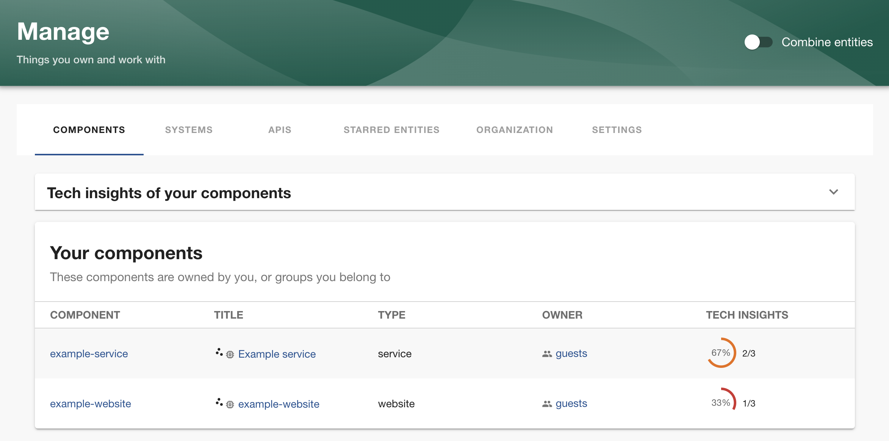
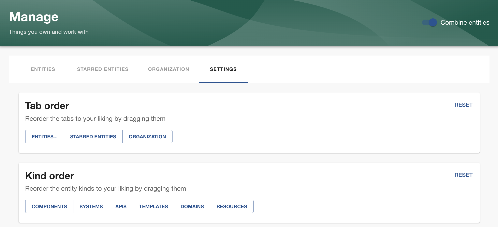

# Manage

This plugin offers a place for developers to manage things they and their team own.

The Manage page is modular and customizable. It can be designed arbitrarily, but comes with a default implementation of a set of tabs for each view - entities (such as components and systems), starred entities and organization structure. Other tabs can be added as well. The entities tabs show a table of owned entities, and above and below these, custom React components can be rendered. The table can be extended with columns for additional information, such as tech-insight checks.

The page is wrapped in a provider which has fetched all groups the user belongs to, and all entities owned by the user or any of these groups. Each built-in tab also wraps information about what kind of entity is shown, exposed as hooks. This is useful for extensions that provide gauges, statistics, etc.



## Installation

In `App.tsx`, add a route:

```tsx
import { ManagePage } from '@backstage-community/plugin-manage';

// ...
<Route
  path="/manage"
  element={
    <ManagePage>
      <Manage />
    </ManagePage>
  }
/>;
```

Implement the `Manage` component somewhere, e.g. in `src/components/manage/Manage.tsx`:

```tsx
import { ManageTabs } from '@backstage-community/plugin-manage';

export function Manage() {
  return <ManageTabs />;
}
```

Add it to the sidebar (`src/components/Root/Root.tsx`):

```tsx
import ManageIcon from '@material-ui/icons/Ballot';
import { managePlugin } from '@backstage-community/plugin-manage';

export const Root = ({ children }: PropsWithChildren<{}>) => {
  const managePage = useRouteRef(managePlugin.routes.root);

  // ...
  <SidebarItem icon={ManageIcon} to={managePage()} text="Manage" />;
  // ...
};
```

Install the API (e.g. in `src/apis.ts`). The preferred order of the tabs to show for owned entities can be provided to the API factory function.

```ts
import { createManageApiFactory } from '@backstage-community/plugin-manage-react';

export const apis = [
  // ...,
  createManageApiFactory({
    kindOrder: ['component', 'api', 'system'],
  }),
];
```

## Configuration

The `Manage` component can render anything, but the `ManageTabs` are useful to show as a minimum. It renders the user's owned entities in individual tabs per kind, and a tab for starred entities (by default, but can be turned off).

`ManageTabs` can show custom tabs before and after the built-in ones using the `tabsBefore` and `tabsAfter` props. The `@backstage-community/plugin-manage` package provides a view for the organization graph for the current user which can be added as a tab like this:

```tsx
import {
  ManageTabs,
  OrganizationGraph,
} from '@backstage-community/plugin-manage';

export function Manage() {
  return (
    <ManageTabs
      tabsAfter={[
        {
          path: 'organization',
          title: 'Organization',
          children: <OrganizationGraph />,
        },
      ]}
    />
  );
}
```

What to be displayed above and below the table, and the table columns, can be configured, either for any table or for certain kinds, for starred entities, and for the combined view (all entity kinds in one tab).

- `commonHeader` and `commonFooter` are the components to show above and below each table.
- `commonColumns` are the extra columns to display in each table.
- `combined`, `kinds` and `starred` are used to configure the header, footer and columns for each specific table.

Example (using the tech-insights module `@backstage-community-plugin-manage-module-tech-insights`):

```tsx
<ManageTabs
  combined={{
    header: <ManageTechInsightsCards inAccordion />,
    columns: [manageTechInsightsColumns({ combined: true })],
  }}
  starred={{
    header: <ManageTechInsightsGrid />,
    columns: [manageTechInsightsColumns({ combined: true })],
  }}
  kinds={{
    [MANAGE_KIND_COMMON]: {
      header: <ManageTechInsightsCards inAccordion />,
      columns: [manageTechInsightsColumns()],
    },
    component: {
      columns: [manageTechInsightsColumns({ combined: true })],
    },
  }}
/>
```

### ManagePage configuration

The top-level component `ManagePage` which is added to the flat routes can be configured to force entities to be showed combined (into one tab) or separate, by setting the `combined` prop. The `labels` prop can be used to completely override the right side of the header. It's possible to inject custom React Providers inside the manage page by adding them to the `providers` props.

## Settings

By default, a Settings tab will be added at the end of the tabs. This tab can be turned off or replaced by custom content. The default Settings page allows the user to reorder the tabs, e.g. to put a certain kind of entity first (or any other tab), so that it becomes the default when navigating to the Manage page.



To customize this view, set the `settings` prop for `ManagePage` to your custom component. The default settings are available as the components `TabOrderCard` and `KindOrderCard` exported from `@backstage-community/plugin-manage`.

## Manage page extensions

The manage page can be extended with functionality, e.g. columns to the owned entity tables, or other useful gauges, charts, statistics etc to display above or below the entity table, or in separate tabs. An example of an extension to the manage page is `@backstage-community/plugin-manage-module-tech-insights` which provides tech-insight checks as guages and columns to the entity tables, as well as aggregated gauges to render above or below the table.

More information on how to build extensions, check out the README for `@backstage-community/plugin-manage-react`

## Full-height custom tabs

When adding a custom tab, it's sometimes useful to make its content full height (to the bottom of the window).

Example of adding the `JiraUserIssuesTable` from `@axis-backstage/plugin-jira-dashboard` to a tab:

```tsx
import { TabContentFullHeight } from '@backstage-community/plugin-manage-react';
import { JiraUserIssuesTable } from '@axis-backstage/plugin-jira-dashboard';

// ...

<ManageTabs
  tabsAfter={[
    {
      path: 'jira',
      title: 'Jira',
      children: (
        <TabContentFullHeight resizeChild>
          <JiraUserIssuesTable
            maxResults={40}
            tableStyle={{ maxHeight: '100%', width: '100%' }}
            style={{
              maxHeight: '100%',
              padding: '20px',
              overflowY: 'auto',
              width: '100%',
            }}
          />
        </TabContentFullHeight>
      ),
    },
  ]}
/>;
```
