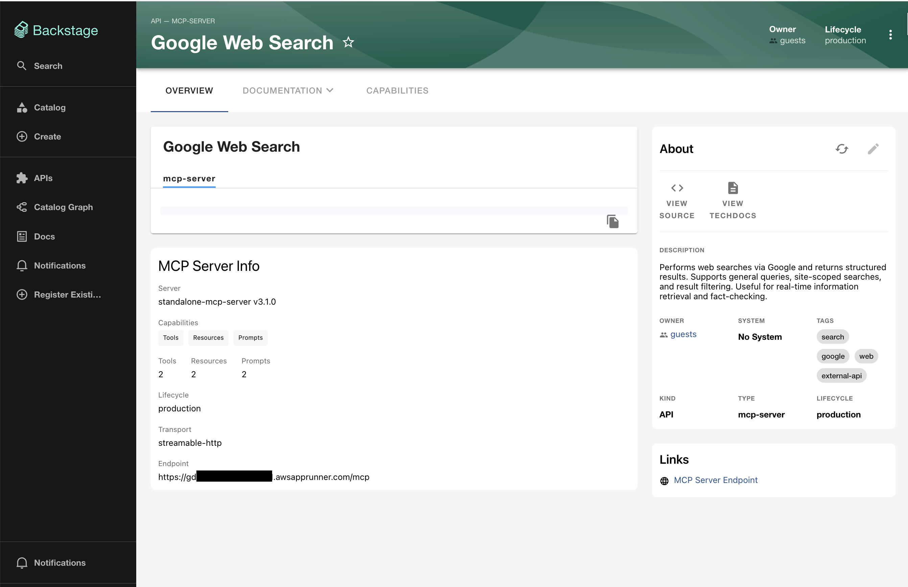
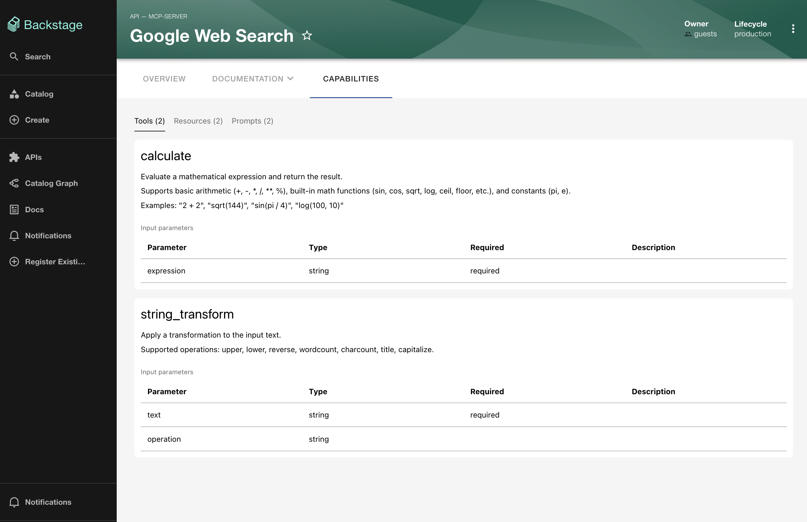
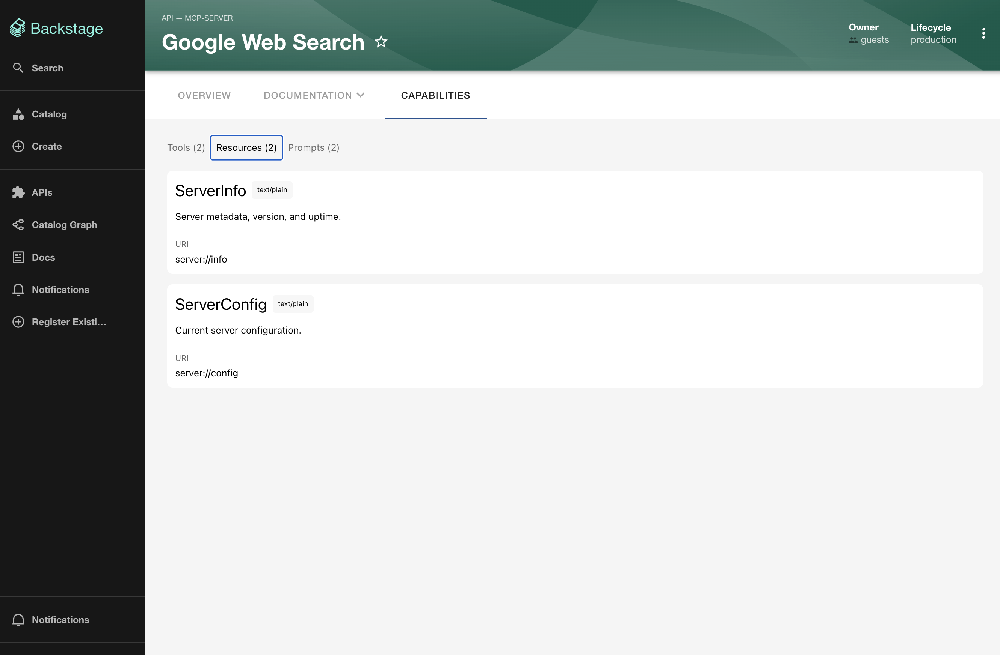
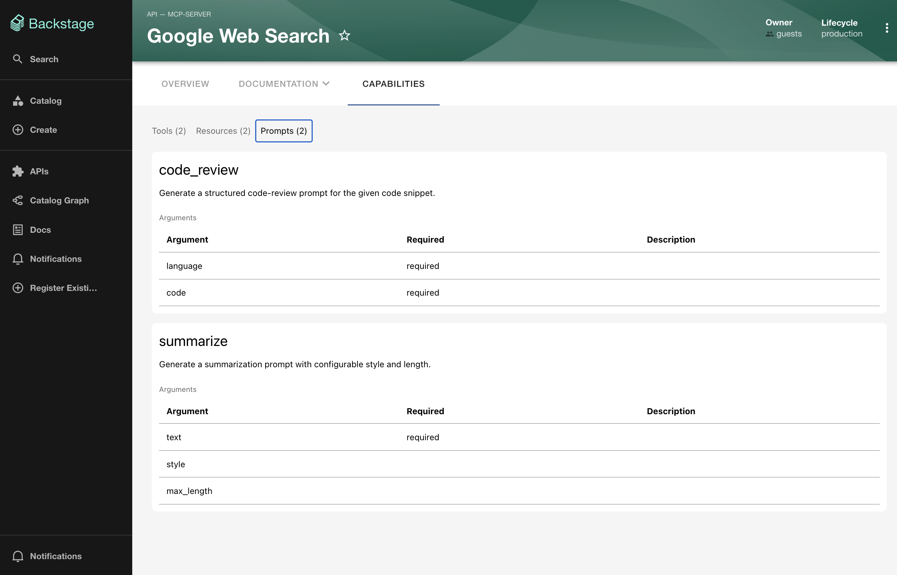

# @backstage-community/plugin-mcp-capabilities

Frontend for the MCP Capabilities suite. Built with Backstage's **new frontend
system** and pure [Backstage UI](https://backstage.io/docs/getting-started/ui)
(BUI) — no Material UI. It enriches the native `API` / `spec.type: mcp-server`
entity page (it does not add a separate page or kind).

Two extensions, both shown only on entities with `spec.type: 'mcp-server'`:

- **MCP Server Info** — an overview card: server identity, capability badges,
  tool/resource/prompt counts, transport + endpoint. Reads the summary the
  backend persisted onto the entity (no network call).
- **Capabilities** — an entity tab that fetches the live spec from the backend
  and lists tools (with Markdown descriptions + input-schema tables), resources,
  and prompts.

## Screenshots

**MCP Server Info card** — server identity, capability badges, tool/resource/prompt
counts, transport, and endpoint, on the entity overview:



**Capabilities tab** — each tool renders as a card with its (Markdown) description
and an input-parameter table; resources and prompts have their own panels:







## Installation

Requires the companion backend
([`@backstage-community/plugin-mcp-capabilities-backend`](../mcp-capabilities-backend/README.md))
and the new frontend system.

With frontend feature discovery enabled (`app.packages: all` in
`app-config.yaml`), installing the package is enough to register the card + tab:

```sh
yarn --cwd packages/app add @backstage-community/plugin-mcp-capabilities
```

Or register it explicitly as a feature:

```ts
// packages/app/src/App.tsx
import mcpCapabilitiesPlugin from '@backstage-community/plugin-mcp-capabilities';

export default createApp({
  features: [/* … */ mcpCapabilitiesPlugin],
});
```

## Development

`yarn start` in this directory serves the plugin in isolation (see [`/dev`](./dev)).

## Exports

- default — the frontend plugin
- `mcpCapabilitiesApiRef`, `McpCapabilitiesClient`, `McpCapabilitiesApi` — the
  read-only client for `/api/mcp-capabilities/spec`

## Credits

Made at [EPAM](https://www.epam.com), with love for the community. ❤️
