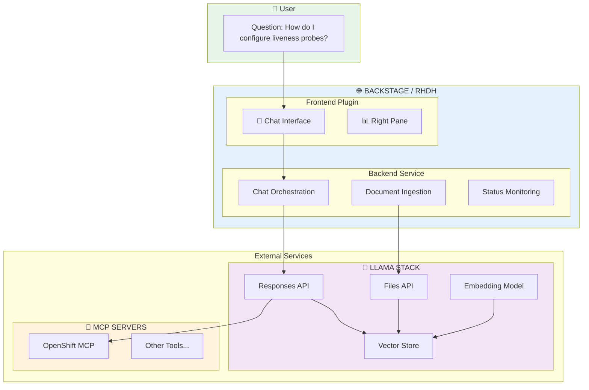
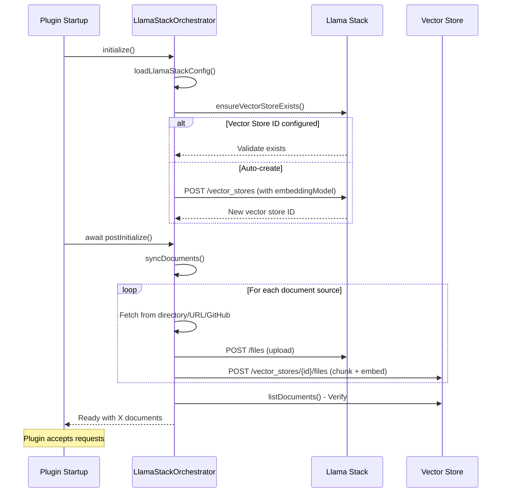
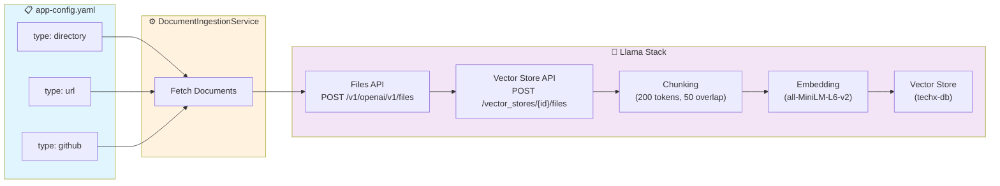
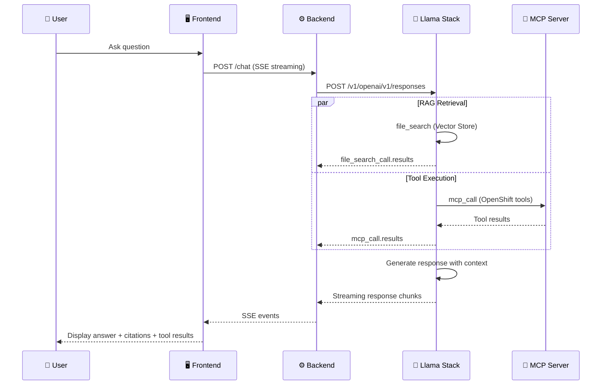
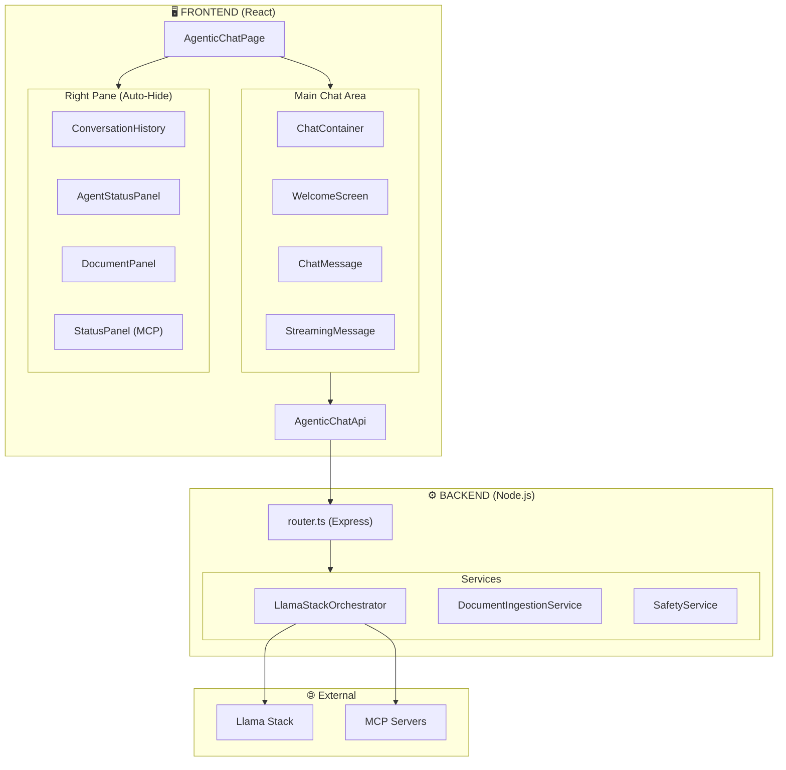
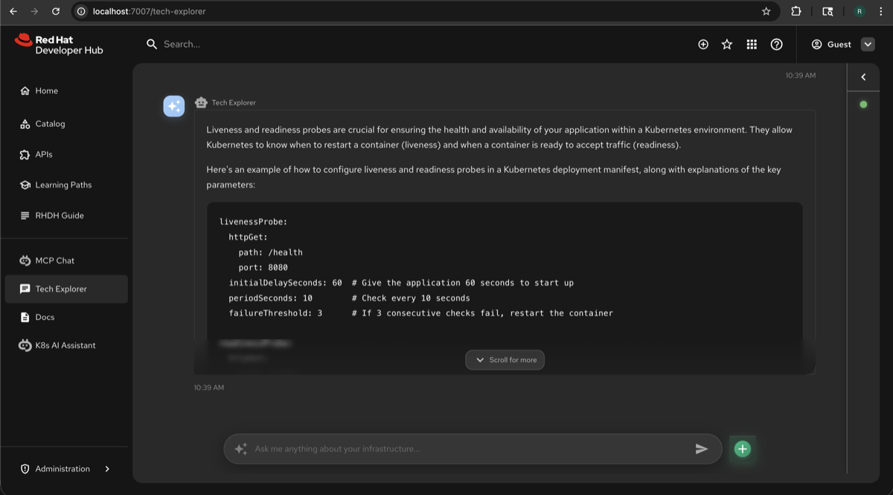

# Agentic Chat Architecture

> **RAG-Powered AI Assistant for Application Platform**

Agentic Chat is an intelligent documentation assistant that combines **Retrieval Augmented Generation (RAG)** with **Model Context Protocol (MCP)** tool execution, built on Llama Stack's Responses API.

📖 **Related Documentation:**

- [Agentic Capabilities](./agent-architecture.md) - How Agentic Chat provides AI agent capabilities through the Responses API

---

## High-Level Overview



### Key Capabilities

| RAG (Retrieval Augmented Generation) | MCP (Model Context Protocol)     |
| ------------------------------------ | -------------------------------- |
| Auto-ingest docs from config         | Execute actions on OpenShift/K8s |
| Semantic search over knowledge base  | Extensible tool ecosystem        |
| Context-aware AI responses           | Real-time cluster operations     |
| Source citations in responses        | Tool results in chat             |

| Document Sources    | LLM Providers             | Embedding Models                       |
| ------------------- | ------------------------- | -------------------------------------- |
| Local directories   | Gemini (gemini-2.5-flash) | sentence-transformers/all-MiniLM-L6-v2 |
| GitHub repositories | OpenAI-compatible models  | text-embedding-004                     |
| Remote URLs         | Ollama (local)            | Custom models                          |

---

## Plugin Initialization Flow



### Startup Sequence

1. **initialize()**

   - Load config from `app-config.yaml`
   - `ensureVectorStoreExists()` - Create with embedding model if needed
   - Load MCP server configs
   - Test connections

2. **await postInitialize()** ← BLOCKS until complete

   - `syncDocuments()` - Fetch, upload, chunk, embed
   - Verify documents in vector store
   - Log document count

3. **Router setup** → Plugin READY

---

## Document Ingestion (RAG Pipeline)



### RAG Configuration

```yaml
agenticChat:
  llamaStack:
    # Vector Store (auto-created if not specified)
    vectorStoreName: 'techx-db'
    embeddingModel: 'sentence-transformers/all-MiniLM-L6-v2'
    embeddingDimension: 384

    # Chunking
    chunkingStrategy: 'static' # or 'auto'
    maxChunkSizeTokens: 200
    chunkOverlapTokens: 50
```

---

## Chat with RAG + MCP Flow



### Responses API Request

```json
{
  "input": "How do I configure liveness probes?",
  "model": "gemini/gemini-2.5-flash",
  "instructions": "You are Agentic Chat...",
  "tools": [
    { "type": "file_search", "vector_store_ids": ["vs_..."] },
    { "type": "mcp", "server_url": "https://...", "server_label": "openshift" }
  ],
  "store": true,
  "include": ["file_search_call.results"]
}
```

---

## Component Architecture



---

## API Endpoints

| Endpoint                                          | Method   | Description                                 |
| ------------------------------------------------- | -------- | ------------------------------------------- |
| `/api/agentic-chat/health`                        | `GET`    | Health check                                |
| `/api/agentic-chat/chat`                          | `POST`   | Send chat message (SSE streaming)           |
| `/api/agentic-chat/documents`                     | `GET`    | List documents in knowledge base            |
| `/api/agentic-chat/sync`                          | `POST`   | Trigger document sync from sources          |
| `/api/agentic-chat/status`                        | `GET`    | Get service status (LLM, Vector Store, MCP) |
| `/api/agentic-chat/conversations`                 | `GET`    | List conversation history                   |
| `/api/agentic-chat/conversations/:id`             | `GET`    | Get specific conversation                   |
| `/api/agentic-chat/conversations/:id`             | `DELETE` | Delete a conversation                       |
| `/api/agentic-chat/conversations/:id/input_items` | `GET`    | Get conversation input items                |
| `/api/agentic-chat/branding`                      | `GET`    | Get branding configuration                  |
| `/api/agentic-chat/workflows`                     | `GET`    | Get workflow cards                          |
| `/api/agentic-chat/quick-actions`                 | `GET`    | Get quick action prompts                    |

---

## Configuration Reference

### Complete Configuration

```yaml
agenticChat:
  # =============================================================================
  # LLAMA STACK - AI Backend
  # =============================================================================
  llamaStack:
    baseUrl: 'https://llama-stack-server.example.com'

    # Vector Store Configuration
    # Option 1: Use existing vector store
    vectorStoreId: 'vs_abc123...'
    # Option 2: Auto-create (if vectorStoreId not specified)
    vectorStoreName: 'techx-db'

    # Embedding Model (for RAG)
    embeddingModel: 'sentence-transformers/all-MiniLM-L6-v2'
    embeddingDimension: 384

    # LLM Model
    model: 'gemini/gemini-2.5-flash'

    # Chunking Configuration
    chunkingStrategy: 'static' # 'auto' or 'static'
    maxChunkSizeTokens: 200
    chunkOverlapTokens: 50

    # TLS Configuration
    skipTlsVerify: true # For dev/self-signed certs

  # =============================================================================
  # DOCUMENT SOURCES - For RAG
  # =============================================================================
  documents:
    syncMode: full # 'full' removes deleted, 'append' only adds
    sources:
      # Local directory
      - type: directory
        path: ./examples/docs
        patterns: ['**/*.md', '**/*.yaml']

      # GitHub repository
      - type: github
        repo: owner/repo
        branch: main
        path: /docs
        patterns: ['*.md']
        # token: ${GITHUB_TOKEN}  # For private repos

      # Remote URLs
      - type: url
        urls:
          - 'https://example.com/doc1.md'
          - 'https://example.com/doc2.md'

  # =============================================================================
  # MCP SERVERS - Tool Execution
  # =============================================================================
  mcpServers:
    - id: openshift-server
      name: OpenShift MCP Server
      type: streamable-http
      url: 'https://openshift-mcp-server.example.com/mcp'

  # =============================================================================
  # SYSTEM PROMPT
  # =============================================================================
  systemPrompt: |
    You are Agentic Chat, an AI assistant for Application Platform.
    You have access to documentation via RAG and can execute actions via MCP tools.
    Always provide helpful, accurate responses with source citations.
```

---

## Frontend Components

| Component               | Purpose                                        |
| ----------------------- | ---------------------------------------------- |
| **AgenticChatPage**     | Main page container, state management          |
| **ChatContainer**       | Chat interface with messages, input, streaming |
| **ChatMessage**         | Individual message display (user/assistant)    |
| **StreamingMessage**    | Real-time streaming response with phases       |
| **WelcomeScreen**       | Initial screen with workflow cards             |
| **RightPane**           | Collapsible sidebar (auto-hides on send)       |
| **ConversationHistory** | Browse and resume past conversations           |
| **AgentStatusPanel**    | LLM and Vector Store status                    |
| **DocumentPanel**       | Knowledge base documents list                  |
| **StatusPanel**         | MCP server connection status                   |

---

## Backend Services

| Service                      | Purpose                                           |
| ---------------------------- | ------------------------------------------------- |
| **LlamaStackOrchestrator**   | Core: chat, RAG, documents, conversations, status |
| **DocumentIngestionService** | Fetch documents from directory, URL, GitHub       |
| **SafetyService**            | AI safety guardrails and content filtering        |
| **router.ts**                | Express routes for REST API endpoints             |

---

## Key Features

| Feature                        | Description                                                   |
| ------------------------------ | ------------------------------------------------------------- |
| **Vector Store Auto-Creation** | Creates vector store with embedding model if not configured   |
| **Blocking Ingestion**         | Plugin waits for document ingestion before accepting requests |
| **Conversation History**       | Persistent chat sessions using Responses API `store: true`    |
| **Auto-Hide Right Pane**       | Sidebar collapses when user sends a message                   |
| **RAG with Citations**         | Shows source documents used in responses                      |
| **MCP Tool Execution**         | Execute actions on OpenShift/Kubernetes via MCP servers       |
| **Streaming Responses**        | Real-time SSE streaming with phase indicators                 |

---

## Llama Stack APIs Used

| API                    | Endpoint                                      | Purpose                     |
| ---------------------- | --------------------------------------------- | --------------------------- |
| **Responses API**      | `POST /v1/openai/v1/responses`                | Unified chat with RAG + MCP |
| **Files API**          | `POST /v1/openai/v1/files`                    | Upload documents            |
| **Vector Stores API**  | `POST /v1/openai/v1/vector_stores`            | Create vector store         |
| **Vector Store Files** | `POST /v1/openai/v1/vector_stores/{id}/files` | Attach files with chunking  |
| **List Responses**     | `GET /v1/openai/v1/responses`                 | Conversation history        |

---

## Deployment

### Static Plugin (Standard Backstage)

```bash
# Backend
yarn --cwd packages/backend add @backstage-community/plugin-agentic-chat-backend

# Frontend
yarn --cwd packages/app add @backstage-community/plugin-agentic-chat
```

### Dynamic Plugin (Red Hat Developer Hub)

See [README.md](../README.md) for complete RHDH deployment instructions including:

- Building and exporting dynamic plugins
- Packaging as OCI image
- Configuration in `dynamic-plugins.override.yaml`

---

## Screenshots


_Welcome screen with workflow cards and quick actions_


_Chat interface with AI response and code formatting_


_Right pane with conversation history and agent status_
