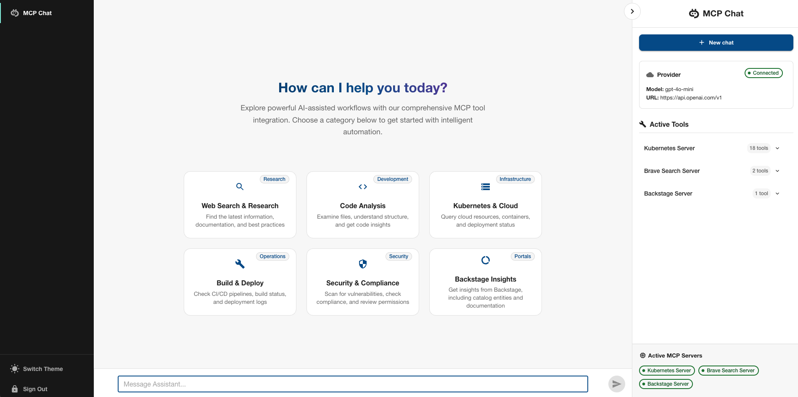
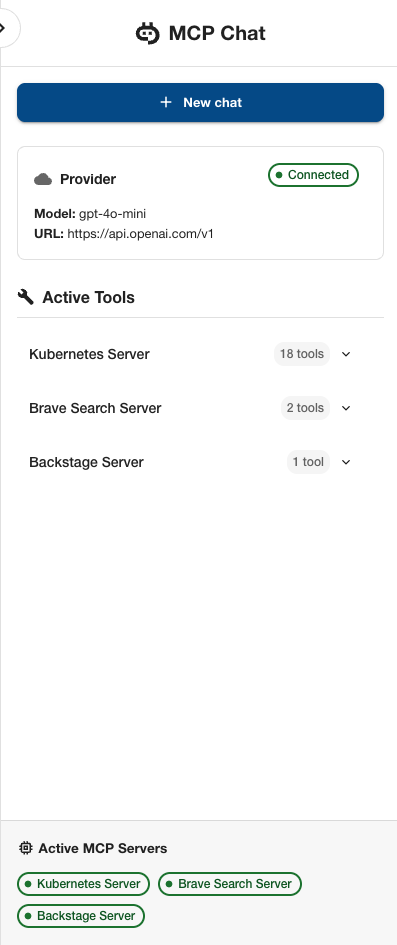
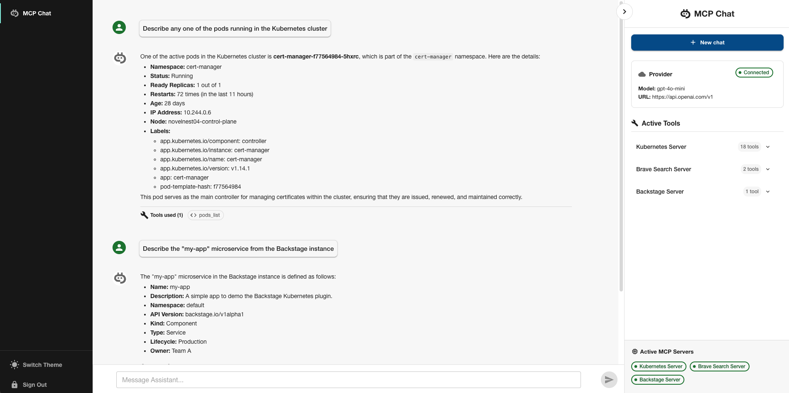

# MCP Chat for Backstage

Welcome to the MCP (Model Context Protocol) Chat plugin for Backstage! This plugin enables you to integrate AI-powered chat capabilities into your Backstage platform, supporting multiple AI providers and MCP servers.

[](https://backstage.io)

## Overview

The MCP Chat plugin brings conversational AI capabilities directly into your Backstage environment. It leverages the Model Context Protocol to connect with various AI providers and external tools, enabling developers to interact with their infrastructure, catalogs, and external services through natural language.

## Features

- 🤖 **Multi-Provider AI Support**: Works with OpenAI, Claude, Gemini, and Ollama
- 🔧 **Multi-Server Support**: Connect multiple MCP servers (STDIO, SSE, Streamable HTTP)
- 🛠️ **Tool Management**: Browse and dynamically enable/disable tools from connected MCP servers
- 💬 **Rich Chat Interface**: Beautiful, responsive chat UI with markdown support
- ⚡ **Quick Setup**: Configurable QuickStart prompts for common use cases

## Supported AI Providers

The following AI providers and models have been thoroughly tested:

| Provider   | Model              | Status          | Notes                                                         |
| ---------- | ------------------ | --------------- | ------------------------------------------------------------- |
| **OpenAI** | `gpt-4o-mini`      | ✅ Fully Tested | Recommended for production use                                |
| **Gemini** | `gemini-2.5-flash` | ✅ Fully Tested | Excellent performance with tool calling                       |
| **Ollama** | `llama3.1:8b`      | ✅ Tested       | Works well, but `llama3.1:30b` recommended for better results |

> **Note**: While other providers and models may work, they have not been extensively tested. The plugin supports any provider that implements tool calling functionality, but compatibility is not guaranteed for untested configurations.

## Quick Start with Gemini (Free)

To quickly test this plugin, we recommend using Gemini's free API:

1. **Visit Google AI Studio**: Go to <https://aistudio.google.com>
2. **Sign in**: Use your Google account to sign in
3. **Create API Key**:
   - Click on "**Get API key**" in the left sidebar
   - Click "**Create API key in new project**" (or select an existing project)
   - **Copy** the generated API key
4. **Set Environment Variable**:

   ```bash
   export GEMINI_API_KEY="your-api-key-here"
   ```

> **💡 Tip**: Gemini offers a generous **free tier** that's perfect for testing and development with the MCP Chat.

## Screenshots

<div align="center">

<table>
  <tr>
    <td style="padding: 0 10px;">
      
      <div align="center"><em>Pre-configured prompts for common tasks</em></div>
    </td>
    <td rowspan="2" style="vertical-align: top; padding: 0 10px;">
      
      <div align="center"><em>Available MCP tools and server connections</em></div>
    </td>
  </tr>
  <tr>
    <td style="padding: 0 10px;">
      
      <div align="center"><em>The main chat interface with AI responses and tool integration</em></div>
    </td>
  </tr>
</table>

</div>

## Prerequisites

- Backstage v1.20+ (for new backend system support)
- Backstage v1.40+ (if installing Backstage MCP server in the same instance)
- Node.js 18+
- One or more AI provider API keys (OpenAI, Gemini, etc.)
- (Optional) MCP server dependencies

## Installation

This plugin consists of two packages:

- `@backstage-community/plugin-mcp-chat` - Frontend plugin
- `@backstage-community/plugin-mcp-chat-backend` - Backend plugin

### Backend Installation

1. **Install the backend plugin**:

   ```bash
   # From your Backstage root directory
   yarn --cwd packages/backend add @backstage-community/plugin-mcp-chat-backend
   ```

2. **Add to your backend**:

   ```ts
   // In packages/backend/src/index.ts
   const backend = createBackend();
   // ... other plugins
   backend.add(import('@backstage-community/plugin-mcp-chat-backend'));
   ```

### Frontend Installation

1. **Install the frontend plugin**:

   ```bash
   # From your Backstage root directory
   yarn --cwd packages/app add @backstage-community/plugin-mcp-chat
   ```

2. **Add to your app**:

   **For the classic frontend system:**

   ```tsx
   // In packages/app/src/App.tsx
   import { McpChatPage } from '@backstage-community/plugin-mcp-chat';

   // Add to your routes
   <Route path="/mcp-chat" element={<McpChatPage />} />;
   ```

3. **Add navigation**:

   ```tsx
   // In packages/app/src/components/Root/Root.tsx
   import { MCPChatIcon } from '@backstage-community/plugin-mcp-chat';

   // In your sidebar items
   <SidebarItem icon={MCPChatIcon} to="mcp-chat" text="MCP Chat" />;
   ```

## Configuration

Add the following configuration to your `app-config.yaml`:

```yaml
mcpChat:
  # Configure AI providers (currently only the first provider is used)
  # Supported Providers: OpenAI, Gemini, Claude, and Ollama
  providers:
    - id: openai # OpenAI provider
      token: ${OPENAI_API_KEY}
      model: gpt-4o-mini # or gpt-4, gpt-3.5-turbo, etc.
    - id: claude # Claude provider
      token: ${CLAUDE_API_KEY}
      model: claude-sonnet-4-20250514 # or claude-3-7-sonnet-latest
    - id: gemini # Gemini provider
      token: ${GEMINI_API_KEY}
      model: gemini-2.5-flash # or gemini-2.0-pro, etc.
    - id: ollama # Ollama provider
      baseUrl: 'http://localhost:11434'
      model: llama3.1:8b # or any model you have locally

  # Configure MCP servers
  mcpServers:
    # Brave Search for web searching
    - id: brave-search-server
      name: Brave Search Server
      npxCommand: '@modelcontextprotocol/server-brave-search@latest'
      env:
        BRAVE_API_KEY: ${BRAVE_API_KEY}

    # Kubernetes server for K8s operations
    - id: kubernetes-server
      name: Kubernetes Server
      npxCommand: 'kubernetes-mcp-server@latest'
      env:
        KUBECONFIG: ${KUBECONFIG}

    # Backstage server integration
    - id: backstage-server
      name: Backstage Server
      url: 'http://localhost:7007/api/mcp-actions/v1'
      headers:
        Authorization: 'Bearer ${BACKSTAGE_MCP_TOKEN}'

  # Configure quick prompts
  quickPrompts:
    - title: 'Search Latest Tech News'
      description: 'Find the latest technology news and developments'
      prompt: 'Search for the latest developments in Model Context Protocol and its applications'
      category: Research

    - title: 'Kubernetes Health Check'
      description: 'Check the health of Kubernetes clusters'
      prompt: 'Show me the current Kubernetes deployments, pods status, and resource utilization in a nicely formatted text with bullet points'
      category: Infrastructure

    - title: 'Backstage Catalog Query'
      description: 'Query the Backstage software catalog'
      prompt: 'Describe the "example-app" microservice in our Backstage catalog'
      category: Catalog
```

For more advanced MCP server configuration examples (including STDIO, Streamable HTTP, SSE, custom scripts, and arguments), see [SERVER_CONFIGURATION](../../docs/SERVER_CONFIGURATION.md).

### Environment Variables

Set the following environment variables in your Backstage deployment:

```bash
# AI Provider API Keys
export OPENAI_API_KEY="sk-..."
export GEMINI_API_KEY="..."

# MCP Server Configuration
export BRAVE_API_KEY="..."
export BACKSTAGE_MCP_TOKEN="..."
export KUBECONFIG="/path/to/your/kubeconfig.yaml"
```

## Usage

1. **Navigate to the Plugin**: Go to the **MCP Chat** page in your Backstage instance

2. **Access Configuration**: Expand the Configuration sidebar on the right to view:

   - Provider connectivity status
   - Connected MCP servers and their available tools
   - Tool management controls for enabling/disabling specific servers

3. **Start Chatting**: Begin a conversation by:
   - Selecting from the provided quick prompts, or
   - Typing your own queries directly into the chat input field

### Example Queries

| Query                                                              | MCP Server Required | Purpose                         |
| ------------------------------------------------------------------ | ------------------- | ------------------------------- |
| "Search for the latest news about Kubernetes security"             | Brave Search        | Find relevant articles and news |
| "Show me all pods in the default namespace"                        | Kubernetes          | Query cluster resources         |
| "Describe the "example-app" microservice in our Backstage catalog" | Backstage           | Access catalog entity           |

## Development

### Local Development Setup

1. **Clone the repository**:

   ```bash
   git clone https://github.com/backstage/community-plugins.git
   cd workspaces/mcp-chat
   ```

2. **Install dependencies**:

   ```bash
   yarn install
   ```

3. **Start the development server**:

   ```bash
   yarn start
   ```

4. **Access the plugin**: Navigate to <http://localhost:3000/mcp-chat>

### Testing

Run the test suite:

```bash
# Run all tests
yarn test:all

# Run tests in watch mode
yarn test --watch
```

### Building

Build all packages:

```bash
yarn build:all
```

## Troubleshooting

### Common Issues

#### AI Provider Shows as Disconnected

- **Cause**: Missing or invalid API keys
- **Solution**:
  - Verify API keys are set as environment variables
  - Check provider configuration in `app-config.yaml`
  - Ensure the specified model is available for your API key

#### Tools Are Not Being Called

- **Cause**: AI provider doesn't support tool calling or model limitations
- **Solution**:
  - Ensure your AI provider supports tool calling
  - For Ollama, use larger models like `llama3.1:30b` for better results
  - Verify MCP server API keys are correctly configured
  - Check backend logs for connection errors

#### MCP Servers Not Connecting

- **Cause**: Missing dependencies or configuration issues
- **Solution**:
  - Verify all required environment variables are set
  - Check MCP server logs for connection errors
  - Ensure MCP server dependencies are installed

### Debug Endpoints

Use these endpoints for debugging:

- **Provider Status**: `/api/mcp-chat/provider/status`
- **MCP Server Status**: `/api/mcp-chat/mcp/status`
- **Available Tools**: `/api/mcp-chat/tools`

## API Reference

### Backend Endpoints

| Endpoint                        | Method | Description                           |
| ------------------------------- | ------ | ------------------------------------- |
| `/api/mcp-chat/chat`            | POST   | Send chat messages                    |
| `/api/mcp-chat/provider/status` | GET    | Get status of connected AI provider   |
| `/api/mcp-chat/mcp/status`      | GET    | Get status of connected MCP servers   |
| `/api/mcp-chat/tools`           | GET    | List available MCP tools from servers |

## Contributing

Please see our [Contributing Guidelines](../../CONTRIBUTING.md) for detailed information.

### Development Guidelines

- Follow the existing code style and patterns
- Add tests for new functionality
- Update documentation as needed
- Ensure all tests pass before submitting

## Support and Community

- **Issues**: [Create an issue](https://github.com/backstage/community-plugins/issues)
- **Discord**: [Join our Discord](https://discord.gg/backstage)
- **Documentation**: [Backstage Documentation](https://backstage.io/docs)
- **Community**: [Backstage Community](https://backstage.io/community)

## Changelog

See [CHANGELOG.md](./CHANGELOG.md) for details about changes in each version.

## License

This plugin is licensed under the Apache 2.0 License. See [LICENSE](../../LICENSE) for details.

---

**Made with ❤️ for the Backstage Community**
