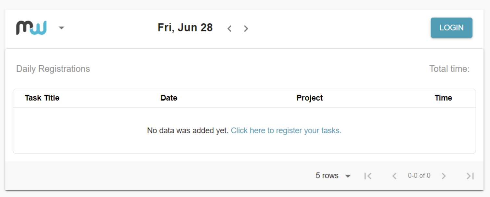
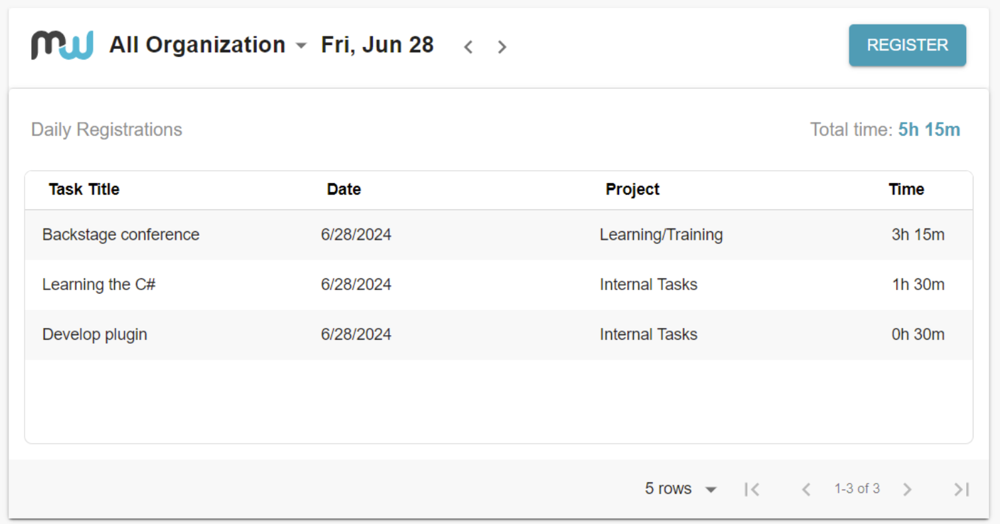

# MeeWee Time Registration Plugin

This plugin is contributed by [Dewise](https://www.dewise.com/).

## Features

The MeeWee Time Registration plugin enables users to register their time to MeeWee directly from the Backstage application:

1. Login using MeeWee account.
2. Redirect to the signup site.
3. Register time to your MeeWee account.
4. View all registered time by dates.

## Learn More About MeeWee

Get to know more about MeeWee and how to create an account by visiting [MeeWee](https://what.meewee.com/en/).

## Setup

Follow these steps to set up the MeeWee plugin:

1. Install the plugin by running this command from your Backstage root directory:

```bash
yarn --cwd packages/app add @backstage-community/meewee-time-registration
```

2. Import the component from `@backstage-community/meewee-time-registration`.

```tsx
import { MeeweeTimeRegistrationPage } from '@backstage-community/meewee-time-registration';
```

3. Call the component inside the location where you want to place the plugin:

```tsx
<Grid item xs={12} md={6}>
  <MeeweeTimeRegistrationPage />
</Grid>
```
4. Add the following configuration to your `app-config.yaml`:

```yaml
integrations:
  pluginMeeweeTimeRegistration:
    apiBaseUrl: ${PLUGIN_MEEWEE_API_BASE_URL}
  pluginMeeweeSignUp:
    signUpUrl: ${PLUGIN_MEEWEE_SIGNUP_URL}
```

5. Set up the required environment variables in your `.env` file:

```env
PLUGIN_MEEWEE_API_BASE_URL='https://api.staging.meewee.com/0/'
PLUGIN_MEEWEE_SIGNUP_URL='https://nxt.staging.meewee.com/signup'
```

## User Interface


