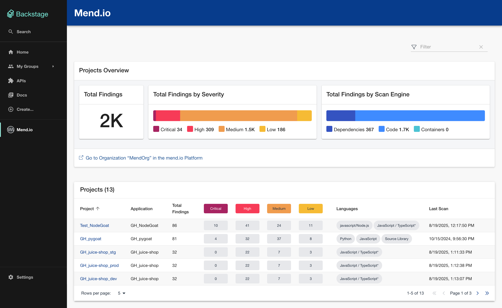
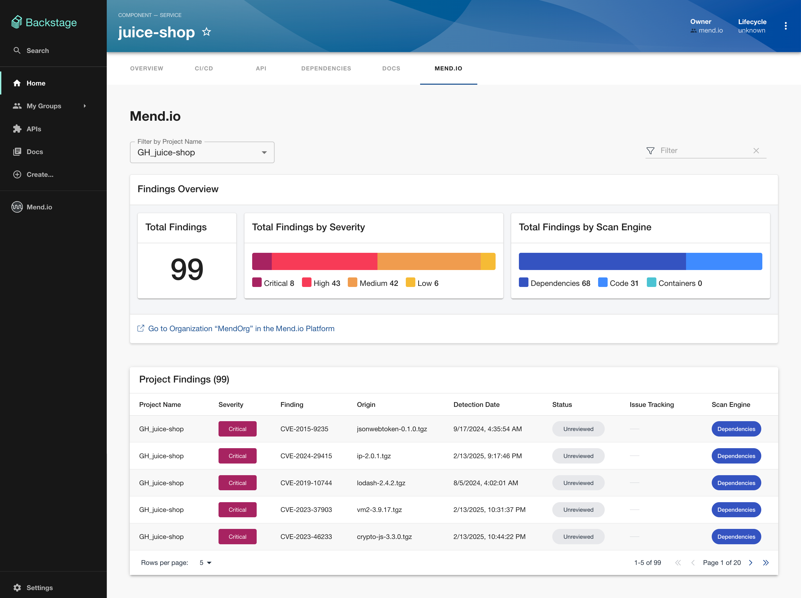
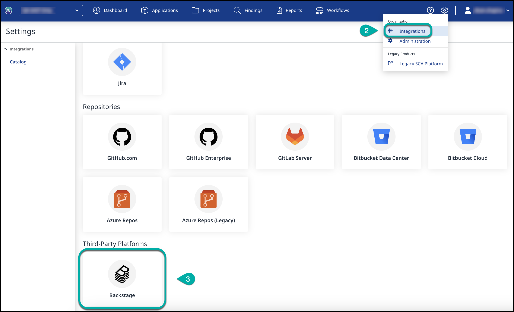
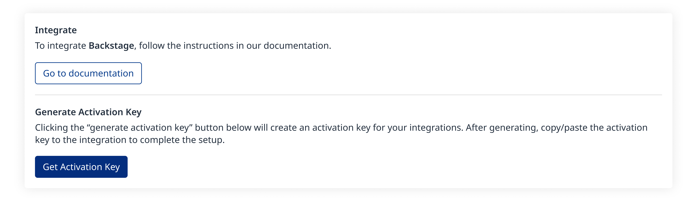
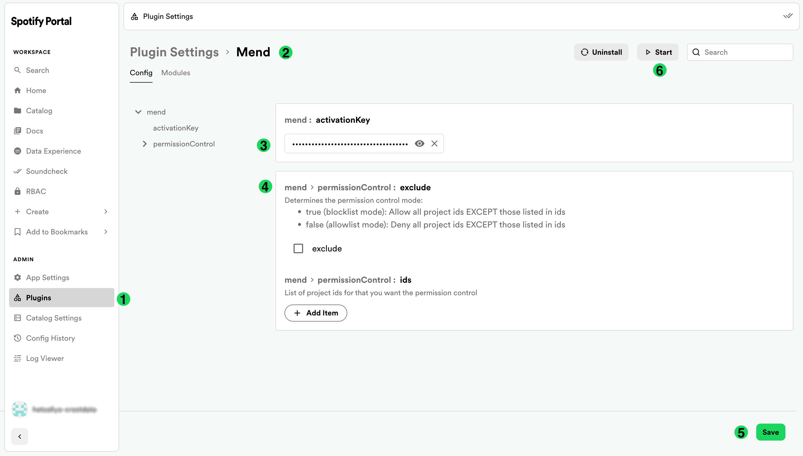

# Mend.io

This plugin integrates Mend.io functionality seamlessly into your Backstage application.

## Features

This plugin provides views to display:

- Collections of integrated projects
- Collection of project security findings

Use these views to visualize your data.

### Project Overview

This view showcases a project list along with statistics derived from these projects.



### Findings Overview

This view presents the project's security findings and detailed statistics derived from these findings.



## Installation

From your Backstage root directory, run the following commands:

```bash
yarn --cwd packages/app add @backstage-community/plugin-mend
yarn --cwd packages/backend add @backstage-community/plugin-mend-backend
```

### Dependencies

> [!IMPORTANT]
> Please note that the frontend plugin will not function without the backend plugin.

## Getting Started

### Get Mend.io Activation Key

1. Navigate to the **Settings** menu.
2. Select **Integrations** from the available options.
3. Click on the **Backstage** card.
   
4. Click **Get Activation Key** to generate key.
   

### Configure your Mend.io Activation Key

In the Backstage application, configure your Mend.io Activation Key in your `app-config.yaml` or production `app-config.production.yaml` file:

```yaml
mend:
  activationKey: ${YOUR_ACTIVATION_KEY_HERE}
```

### Add the Mend.io tab to your entity page

In your `packages/app/src/components/Catalog/EntityPage.tsx` file:

```tsx
// ... other imports here
import { MendTab } from '@backstage-community/plugin-mend';
// ... other components
const serviceEntityPage = (
  <EntityLayout>
    <EntityLayout.Route path="/" title="Overview">
      // ... other elements
      <EntityLayout.Route path="/mend" title="Mend.io">
        <MendTab />
      </EntityLayout.Route>
      // ... other elements
    </EntityLayout.Route>
  </EntityLayout>
  // ...
);
// ...
```

### Add the Mend.io page to your routes

In your `packages/app/src/App.tsx` file:

```tsx
// ... other imports here
import { MendPage } from '@backstage-community/plugin-mend';
// ... other components
const routes = (
  <FlatRoutes>
    <Route path="/" element={<Navigate to="catalog" />} />
    <Route path="/catalog" element={<CatalogIndexPage />} />
    // ... other elements
    <Route path="/mend" element={<MendPage />} />
    // ... other elements
  </FlatRoutes>
  // ...
);
// ...
```

### Add the Mend.io sidebar button

In your `packages/app/src/components/Root/Root.tsx` file:

```tsx
// ... other imports here
import { MendSidebar } from '@backstage-community/plugin-mend';
// ... other components
export const Root = ({ children }: PropsWithChildren<{}>) => (
  <SidebarPage>
    <Sidebar>
      // ... other elements
      <MendSidebar />
      // ... other elements
    </Sidebar>
    {children}
  </SidebarPage>
  // ...
);
// ...
```

### Add the Mend.io backend plugin

See the [mend backend plugin instructions](../mend-backend/README.md).

## Configuration Steps for Spotify Portal

> **Note:** Ensure you have Administrator access before configuring the Mend plugin.

The Mend Plugin also supports the [Spotify Portal](https://spotify.github.io/portal/). To install the plugin into the portal, use the same npm packages:

- `@backstage-community/plugin-mend`
- `@backstage-community/plugin-mend-backend`

For detailed installation instructions, refer to the [Portal documentation](https://spotify.github.io/portal/docs/plugins/installing-plugins).



### Installation Steps

1. **Navigate** to the _Plugins_ section
2. Click on the **Mend Plugin** - this will redirect you to the Mend configuration page
3. Enter your **Mend activation key** in the `activationKey` configuration field
4. **(Optional)** Configure the **Permission Control** section as needed to filter Mend projects using ids
5. Save your configuration by clicking the **Save** button
6. **Start** the plugin and wait for the confirmation message indicating successful installation

Once completed, you will be able to see the Mend plugin on the sidebar navigation.
