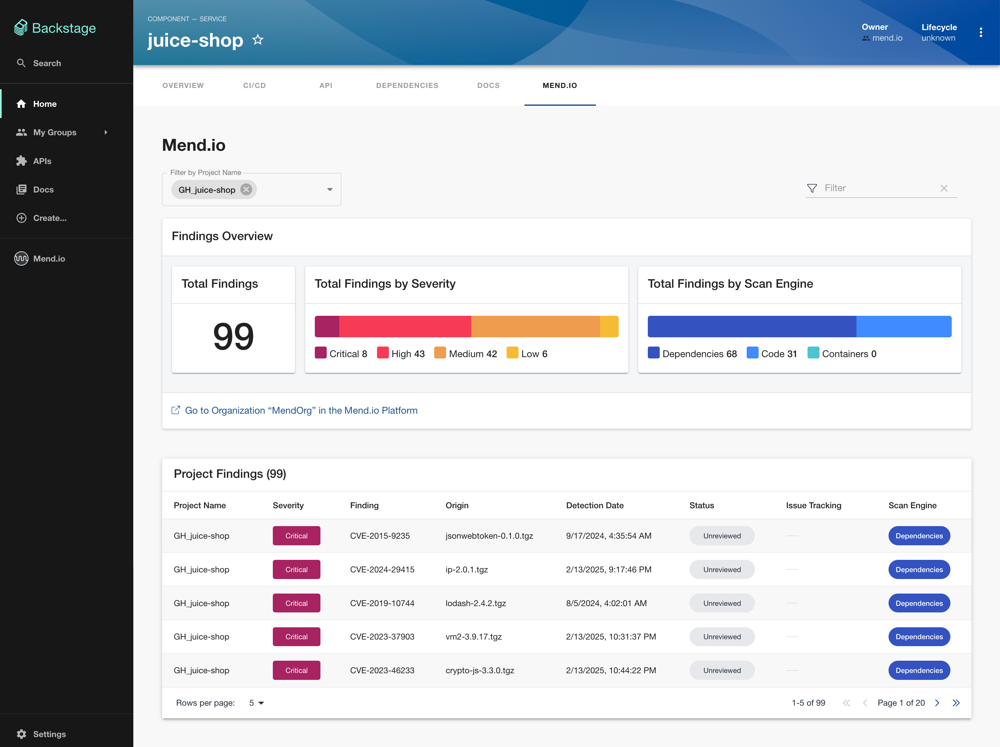

# Mend.io

This plugin integrates Mend.io functionality seamlessly into your Backstage application.

### Plugin Compatibility

The plugin has been successfully tested with Backstage v1.40.0 If you are using a newer version of Backstage, please file an issue, and we will provide guidance on the best integration practices for your specific version.

### Features

This plugin provides views to display:

- Collections of integrated projects
- Collection of project security findings

Use these views to visualize your data.

### Project Overview

This view showcases a project list along with statistics derived from these projects.


### Findings Overview

This view presents the project's security findings and detailed statistics derived from these findings.



### Installation

From your Backstage root directory, run the following commands:

```bash
yarn --cwd packages/app add @backstage-community/plugin-mend
yarn --cwd packages/backend add @backstage-community/plugin-mend-backend
```

### Dependencies

> [!IMPORTANT]
> Please note that the frontend plugin will not function without the backend plugin.

### Getting Started

**Get Mend.io Activation Key:**

1. Navigate to the "Settings" menu.

2. Select "Integrations" from the available options.

3. Click on the "Backstage" card.

4. Click "Get Activation Key" to generate key.


**Configure your Mend.io Activation Key** in your local app-config.yaml or production app-config.production.yaml file:

```yaml
mend:
  activationKey: ${YOUR_ACTIVATION_KEY_HERE}
```

**Add the Mend.io tab to your entity page:**

In your `packages/app/src/components/Catalog/EntityPage.tsx` file:

```tsx
// ... other imports here
import { MendTab } from '@backstage-community/plugin-mend';
// ... other components
const serviceEntityPage = (
  <EntityLayout>
    <EntityLayout.Route path="/" title="Overview">
      // ... other elements
      <EntityLayout.Route path="/mend" title="Mend.io">
        <MendTab />
      </EntityLayout.Route>
      // ... other elements
    </EntityLayout.Route>
  </EntityLayout>
  // ...
);
// ...
```

**Add the Mend.io page to your routes:**

In your `packages/app/src/App.tsx` file:

```tsx
// ... other imports here
import { MendPage } from '@backstage-community/plugin-mend';
// ... other components
const routes = (
  <FlatRoutes>
    <Route path="/" element={<Navigate to="catalog" />} />
    <Route path="/catalog" element={<CatalogIndexPage />} />
    // ... other elements
    <Route path="/mend" element={<MendPage />} />
    // ... other elements
  </FlatRoutes>
  // ...
);
// ...
```

**Add the Mend.io sidebar button:**

In your `packages/app/src/components/Root/Root.tsx` file:

```tsx
// ... other imports here
import { MendSidebar } from '@backstage-community/plugin-mend';
// ... other components
export const Root = ({ children }: PropsWithChildren<{}>) => (
  <SidebarPage>
    <Sidebar>
      // ... other elements
      <MendSidebar />
      // ... other elements
    </Sidebar>
    {children}
  </SidebarPage>
  // ...
);
// ...
```

**Add the Mend.io backend plugin**

See the [mend backend plugin instructions](../mend-backend/README.md).
