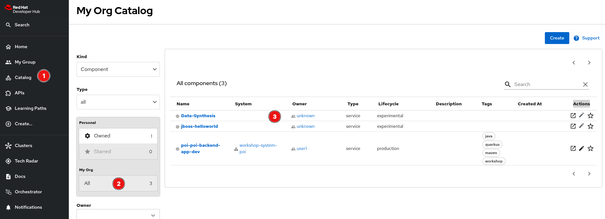
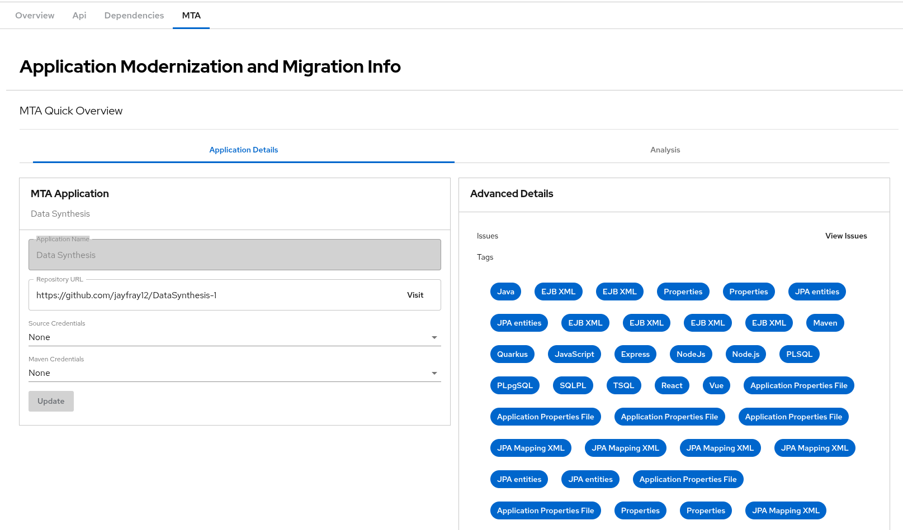
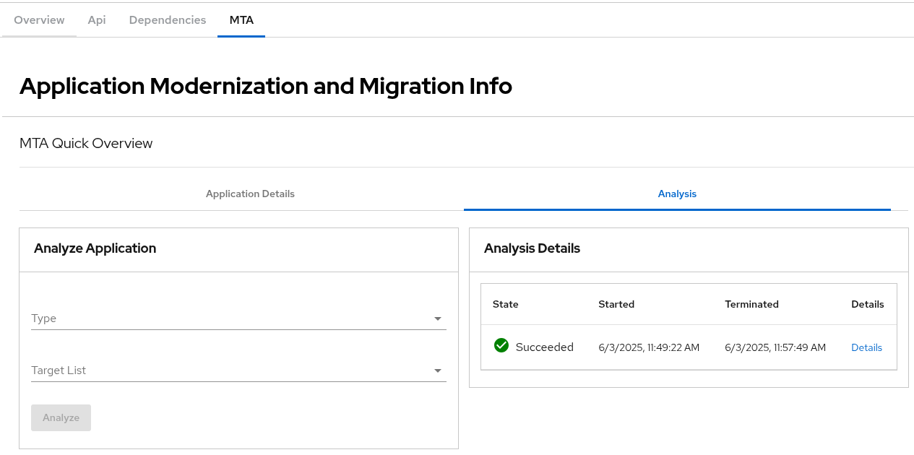

# backstage-mta-plugins

Welcome to the backstage-mta plugin!

_These plugins were created through the Backstage CLI_

## Getting started

There are four plugins available in this repository:

- [MTA Backend Plugin](./plugins/mta-backend)
- [MTA Frontend Plugin](./plugins/mta-frontend)
- [Catalog MTA Entity Providwer Plugin](./plugins/catalog-backend-module-mta-entity-provider)
- [Scaffolder MTA Plugin](./plugins/scaffolder-backend-module-mta)

You can also serve each plugin in isolation by running `yarn start` in each plugins respective directory.
This method of serving the plugin provides quicker iteration speed and a faster startup and hot reloads.
It is only meant for local development, and the setup for it can be found inside the [/dev](/dev) directory.

## Introduction

These plugins are designed to work in unison to provide a means to create and analyze applications in MTA (Migration toolkit for Applications). Within this readme, you will find instructions on how to develop, test, and deploy these plugins.

### MTA / Tackle prerequisites

- To begin, you will need to have an MTA instance running in your cluster. For upstream MTA (Tackle), you can follow the instructions [here](https://github.com/konveyor/operator?tab=readme-ov-file#konveyor-operator-installation-on-k8s).

  - Create a Tackle instance in the cluster. This can be done by running the following command:

  ```bash
  kubectl apply -f https://raw.githubusercontent.com/konveyor/tackle2-operator/main/tackle-k8s.yaml
  ```

  - Once the tackle instance is running, you can create a Tackle CR to configure the tackle instance. You can apply the CR by running the following command:

  ```bash
  cat << EOF | kubectl apply -f -
  kind: Tackle
  apiVersion: tackle.konveyor.io/v1alpha1
  metadata:
    name: tackle
    namespace: konveyor-tackle
  spec:
    feature_auth_required: true
  EOF
  ```

- Obtain the URL for the tackle instance by running the following command:

```bash
oc get routes
```

You will need the URL for the tackle instance to configure the MTA plugin. This URL needs to be added to the app-config configmap [here](app-config-rhdh.example.yaml) under the `mta` key. Be sure to add the `http://` or `https://` prefix to the URL.

- Additionally, The MTA plugin requires a keycloak instance to authenticate with the MTA instance. This can be created and configured simply by running the [Tackle create keycloak script](tackle-create-keycloak-client.sh) or the [MTA create keycloak script](mta-create-keycloak-client.sh). This will create a keycloak client for the MTA instance and provide the necessary configuration for the MTA plugin. The keycloak configuration also needs to be added to the app-config configmap [here](app-config-rhdh.example.yaml) under the `mta` key.

### RHDH Operator

- To begin setting up the RHDH operator for local development, you will need to clone the repository from [here](https://github.com/redhat-developer/rhdh-operator) and follow the instructions in the README.md file. This will allow you to deploy the RHDH operator to your local cluster. You will need to run `make deploy` after cloning the repo from the project root. This will ensure all CRDs are installed first. Then you will need to create the backstage rhdh CR. An example of the backstage CR can be found [here](./backstage-operator-cr.yaml). Note the referenced configmaps in the CR, as they will be needed for the plugins to function correctly.

### Configmaps and Secrets

- Two primary configmaps are required to get the MTA plugin loaded as a dynamic plugin within RHDH:

- [App config](app-config-rhdh.example.yaml) - Rename this file to app-config-rhdh.yaml and update the values as needed. This configmap contains the configuration for the backstage instance. The keys are as follows:

  - `mta` - Contains the configuration for the MTA resources.

    - `url` - The URL for the MTA instance running in the cluster.
    - `backendPluginRoot` - The root URL for the MTA backend plugin.
    - `version` - The version of the backend plugin.
    - `providerAuth` - The keycloak authentication configuration for the MTA instance.
      - `realm` - The realm for the keycloak instance.
      - `clientId` - The client ID for the keycloak instance.A
      - `secret` - The client secret for the keycloak instance.

  - `dynamicPlugins` - Contains the configuration for the front end dynamic plugins. More info [here](https://github.com/janus-idp/backstage-showcase/blob/main/showcase-docs/dynamic-plugins.md#customizing-and-adding-entity-tabs)

- [Dynamic plugins](dynamic-plugins.yaml)

  - `package` - The package name for the plugin.
  - `integrity` - The integrity hash for the plugin.
  - `disabled` - Whether the plugin is enabled or not.

  - A script is available for reference [here](01-stage-dynamic-plugins.sh) that will package up the plugins into the deploy directory and generate the integrity hashes for the plugins. When the time comes to deploy the plugins, you will also need to create a plugin-registry using the script [here](02-create-plugin-registry.sh). This will create a plugin registry that the RHDH operator will use to deploy the plugins. A detailed end to end guide can be found [here](https://github.com/gashcrumb/dynamic-plugins-getting-started/tree/main)

## Compile for Dynamic plugin testing

- Once you have made necessary modification to the configmap and secrets, you can compile the plugin by running the following commands in the plugin directory.

```bash
./rebuild-script.sh
```

This script will:

- Delete the existing namespace for the plugin if it exists.
- Run `yarn && yarn run tsc && yarn run build:all` to compile the plugin.
- Export each plugin as a dynamic plugin to their own respective dist-dynamic directory using the janus-cli.
- Run npm pack to create a tarball of each plugin into the dynamic plugin root directory ( ./deploy ).
- Create a new namespace for the backstage instance.
- Generate the integrity hash for each plugin and reference it within the dynamic-plugin configmap defined inline within the script.
- Create the plugin registry for the dynamic plugins.
- Apply the app-config and dynamic-plugins configmaps to the cluster.
- Create the backstage instance using the RHDH operator.

## Using Released Plugins in Red Hat Developer Hub (via Dynamic Plugins)

If you want to use the released MTA plugin in **Red Hat Developer Hub (RHDH)** via the **dynamic plugin system**, here’s how you can do it.

### 1. Identify the Plugin Package

The following are listed in public NPM registry:

- @backstage-community/backstage-plugin-mta-backend
- @backstage-community/backstage-plugin-mta-frontend
- @backstage-community/backstage-plugin-catalog-backend-module-mta-entity-provider
- @backstage-community/backstage-plugin-scaffolder-backend-module-mta

### 2. Add the Plugins to `dynamic-plugins.yaml`

Here’s an example snippet of what your `dynamic-plugins.yaml` might look like:

```yaml
includes:
  - dynamic-plugins.default.yaml
plugins:
  - package: '@backstage-community/backstage-plugin-mta-backend@0.4.0'
    disabled: false
    integrity: 'sha512-d0Z1H9yfJBd6Z+3AIgnFPbxWBArkVBzX94L9s0zaO7n8oX3DH2itB7TZLRHXzQ4+6bhq0K2JsRbMGBbJ6KskTw=='
  - package: '@backstage-community/backstage-plugin-mta-frontend@0.3.0'
    disabled: false
    integrity: 'sha512-PeU+Y8NsIuaAlrEGOl3lErz2pT7s8b1KX1ZeXdBrgTyt39MbpA1DranNb9TehJYzDvJj1KTJWBzpNauJGmcV4A=='
    pluginConfig:
      dynamicPlugins:
        frontend:
          backstage-community.backstage-plugin-mta-frontend:
            entityTabs:
              - path: /mta
                title: MTA
                mountPoint: entity.page.mta
            mountPoints:
              - mountPoint: entity.page.mta/cards
                importName: EntityMTAContent
                config:
                  layout:
                    gridColumn:
                      lg: 'span 12'
                      md: 'span 8'
                      xs: 'span 6'
                  if:
                    allOf:
                      - isKind: component
                      - isType: service
  - package: '@backstage-community/backstage-plugin-catalog-backend-module-mta-entity-provider@0.3.0'
    disabled: false
    integrity: 'sha512-BqfQL0hZm6JwXb1JNVJS9oZroOgm+n79UXsNb/PKZDijl4lYW2nc/UAKHi3Zg7aX4fHfYfXrPk/xtWABcvix3A=='
  - package: '@backstage-community/backstage-plugin-scaffolder-backend-module-mta@0.4.0'
    disabled: false
    integrity: 'sha512-vwKyHvGDu0Zf5fgrHcl/1IXTuZmkoWV3G+8o6agX2+s6NHAOH9xRx+U5ZhOcs4eKNkcNf7XHKa2K2Y2pNkZbhg=='
```

**NOTE:** Check the [npm registry](https://www.npmjs.com/package/@backstage-community/backstage-plugin-mta-backend) for the latest versions and update both the version number and integrity hash

To get the integrity has perform the following:

```bash
npm view {npm-registry-package@version} dist.integrity
```

For example to get the integrity has for the backend plugin version 0.4.0 do the following:

```bash
npm view '@backstage-community/backstage-plugin-scaffolder-backend-module-mta@0.4.0' dist.integrity
```

## For Users

Open the RHDH Application and select a component from the catalog.

**NOTE:** You may need to choose all under "My Org" to see any components imported from MTA or created with the template


Select a catalog component and choose the MTA tab

This is where you can update information about the application such as the repository URL, Source Credentials or Maven Credentials. In the "Advanced Details" you can also see any Tags, Risk Level and Effort as well as link directly to the Issues ("View Issues") found with the last analysis.

Choosing the `Analysis` tab shows the following:


Here you can run an Analyze on the application or see the details of previous analysis
