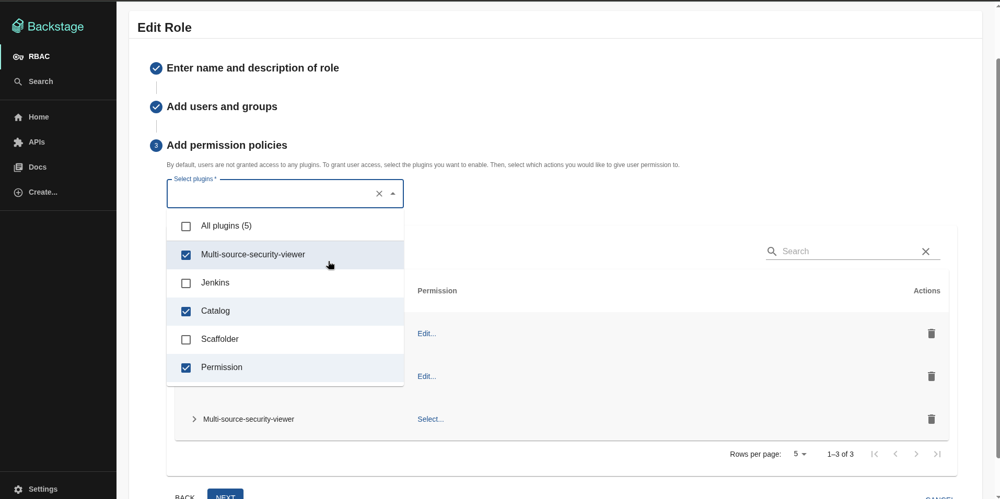
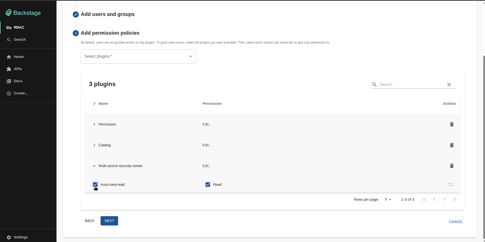

# Multi Source Security Viewer Backend plugin for Backstage

At this time this plugin is used to enable the ability to set RBAC permissions in the RBAC UI.

## Prerequisites

- Ensure that you're using the [MSSV Frontend plugin](../multi-source-security-viewer/README.md)
- Ensure that you have the [RBAC plugin fully configured](../../../rbac/plugins/rbac/README.md).

## Installation

This plugin is installed via the `@backstage-community/plugin-multi-source-security-viewer-backend` package. To install it to your backend package, run the following command:

```bash
# From your root directory
yarn --cwd packages/backend add @backstage-community/plugin-multi-source-security-viewer-backend
```

Then add the plugin to your backend in `packages/backend/src/index.ts`:

```ts
const backend = createBackend();
// ...
backend.add(
  import('@backstage-community/plugin-multi-source-security-viewer-backend'),
);
```

## Configuration

Once installed you can enable RBAC permissions for this plugin.

```yaml
permission:
  enabled: true
  rbac:
    pluginsWithPermission:
      - multi-source-security-viewer
```

You should now be able to see the permissions for this plugin show up in the RBAC UI:

**Selecting MSSV permission**:



\*\*Configuring MSSV permission:


