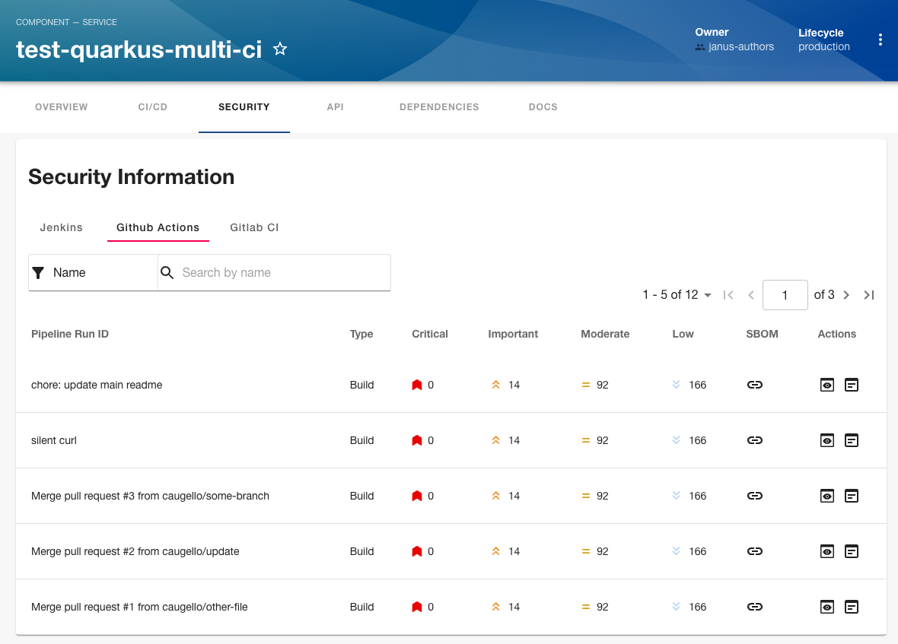
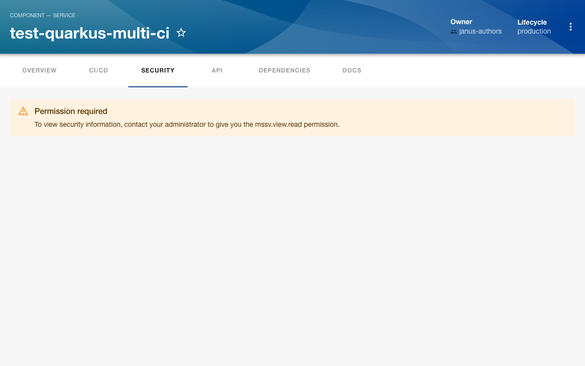

# Multi Source Security Viewer

This plugin enables you to visualize pipeline security information from multiple sources.

## Setting up the plugin

### For adminstrators

#### Prerequisites

1. Install the CI providers you want the plugin to handle the security scan outputs from.
   The supported CI's are:

- [Jenkins](../../../jenkins/plugins/jenkins-backend/README.md)
- [Github Actions](../../../github-actions/plugins/github-actions/README.md)
- [Gitlab CI](https://github.com/immobiliare/backstage-plugin-gitlab?tab=readme-ov-file#setup)
- [Azure Pipelines](../../../azure-devops/plugins/azure-devops/README.md)

#### Procedure

1. Install the plugin using the following command:

```
yarn workspace app add @backstage-community/plugin-multi-source-security-viewer
```

To enable the PipelineRun list in the Security tab on the entity view page, add the following snippet in the packages/app/src/components/catalog/EntityPage.tsx.

```diff
+import {
+  isMultiCIAvailable,
+  EntityMultiCIPipelinesContent,
+} from '@backstage-community/plugin-multi-source-security-viewer';
+
+import { EntityJenkinsContent } from '@backstage-community/plugin-jenkins';
+import { EntityGithubActionsContent } from '@backstage-community/plugin-github-actions';
+
+const securityContent = (
+  <EntitySwitch>
+    <EntitySwitch.Case if={isMultiCIAvailable}>
+      <EntityMultiCIPipelinesContent />
+    </EntitySwitch.Case>
+  </EntitySwitch>
+);
+
+const entityServicePage = (
+  <EntityLayout.Route path="/security" title="Security">
+    {securityContent}
+  </EntityLayout.Route>
+);
```

The plugin will be displayed when the annotations of the CI provider will be present. This can also be additionally controlled by setting the following annotation on the component.

```
mssv/enabled: 'true'
```

If you choose to display the plugin when the annotation is present along with the CI provider annotations, use `isMultiCIAvailableAndEnabled` instead.

```diff
+import {
+  isMultiCIAvailableAndEnabled,
+  EntityMultiCIPipelinesContent,
+} from '@backstage-community/plugin-multi-source-security-viewer';
+
+import { EntityJenkinsContent } from '@backstage-community/plugin-jenkins';
+import { EntityGithubActionsContent } from '@backstage-community/plugin-github-actions';
+
+const securityContent = (
+  <EntitySwitch>
+    <EntitySwitch.Case if={isMultiCIAvailableAndEnabled}>
+      <EntityMultiCIPipelinesContent />
+    </EntitySwitch.Case>
+  </EntitySwitch>
+);
+
+const entityServicePage = (
+  <EntityLayout.Route path="/security" title="Security">
+    {securityContent}
+  </EntityLayout.Route>
+);
```

## For users

### Using the plugin in Backstage

#### Prerequisites

1. Your backstage application is installed and running.
2. You have installed the Multi Source Security Viewer plugin.
3. Ensure your CI annotations are set:

- [Jenkins](../../../jenkins/plugins/jenkins/README.md)
- [Github Actions]([../../../github-actions/plugins/github-actions/README.md)
- [Gitlab CI](https://github.com/immobiliare/backstage-plugin-gitlab?tab=readme-ov-file#annotations)
- [Azure Pipelines](../../../azure-devops/plugins/azure-devops/README.md)

### Procedure

1. Open your Backstage application and select a component from the **Catalog** page.
2. Go to the **Security** tab.

The **Security** tab displays the list of Pipeline Runs from your CI's based on the component annotations.



The table provides a visual representation of identified vulnerabilities in the OCI image produced by the pipelinerun.
The Author of the pipeline scanner task would provide the CVE summary data using the below format that the UI can interpret.

### Actions buttons

#### SBOM

Link to SBOM action will be enabled if there is a SBOM task in the pipeline or a external link if provided by the [eye catcher](#format).
The sbom is captured from the `show-sbom-rhdh` [step](https://github.com/redhat-appstudio/tssc-dev-multi-ci/blob/main/rhtap/show-sbom-rhdh.sh).

#### Logs

Pipeline steps and their logs are visible if steps have been identified.


#### Output

Output action will be enabled when the pipeline emits some results and/or contains its [eye catchers](#format).

This action opens a modal where it will render the reports for Enterprise contract and Advanced cluster security. The report data should be exposed via logs through EYE_CATCHERS.

Supported EYE_CATCHERS:

- ACS_IMAGE_SCAN_EYECATCHER_BEGIN
- ACS_IMAGE_SCAN_EYECATCHER_END
- ACS_IMAGE_CHECK_EYECATCHER_BEGIN
- ACS_IMAGE_CHECK_EYECATCHER_END
- ACS_DEPLOY_EYECATCHER_BEGIN
- ACS_DEPLOY_EYECATCHER_END
- EC_EYECATCHER_BEGIN
- EC_EYECATCHER_END


### Format:

The data is extracted from logs. The steps are identified with `Step : <ANY>`.

eg: `Step: cosign-sign-attest`.

The logs button will be disabled if no steps are found.

Scan results are extracted between EYE_CATCHERS as json.

eg: from `ACS_IMAGE_SCAN_EYECATCHER_BEGIN` to `ACS_IMAGE_SCAN_EYECATCHER_END`

Log format example:

```
Step: image-scan
some-logs
...
...
...
ACS_IMAGE_SCAN_EYECATCHER_BEGIN
{
  results: [
    {
      summary: {
        CRITICAL: 0,
        HIGH: 1,
        LOW: 1,
        MEDIUM: 0,
        TOTAL: 2,
      }
    }
  ]
}
ACS_IMAGE_SCAN_EYECATCHER_END
...
...
some-logs
```

The above will populate the pipeline run table with its vulnerabilities summary.

### Enterprise contract Task [Optional]:

Create a CI step that captures the JSON output between the EC_EYECATCHER:

See [example](https://github.com/redhat-appstudio/tssc-dev-multi-ci/blob/main/rhtap/verify-enterprise-contract.sh) script.

[Example output](./src/__fixtures__/ec.ts)

### ACS Image scan Task [Optional]:

Create a CI step that captures the JSON output between the ACS_IMAGE_SCAN_EYECATCHER:

See [example](https://github.com/redhat-appstudio/tssc-dev-multi-ci/blob/main/rhtap/acs-image-scan.sh) script.

[Example output](./src/__fixtures__/acsimagescanresult.ts)

### ACS Image check Task [Optional]:

Create a CI step that captures the JSON output between the ACS_IMAGE_CHECK_EYECATCHER:

See [example](https://github.com/redhat-appstudio/tssc-dev-multi-ci/blob/main/rhtap/acs-image-check.sh) script.

[Example output](./src/__fixtures__/acsimagecheckresults.ts)

### ACS Deployment check Task [Optional]:

Create a CI step that captures the JSON output between the ACS_DEPLOY_EYECATCHER:

See [example](https://github.com/redhat-appstudio/tssc-dev-multi-ci/blob/main/rhtap/acs-deploy-check.sh) script.

[Example output](./src/__fixtures__/acsdeploymentcheckresults.ts)

## Additional configuration

### For adminstrators

#### Permission Framework Support

The Multi Source Security Viewer (MSSV) plugin has support for the permission framework.

1. When [RBAC permission](https://github.com/backstage/community-plugins/tree/main/workspaces/rbac/plugins/rbac-backend#installation) framework is enabled, for non-admin users to access MSSV UI, the role associated with your user should have the following permission policies associated with it.
   Add the following in your permission policies configuration file named `rbac-policy.csv`:

```CSV
p, role:default/team_a, mssv.view.read, read, allow
```

You can specify the path to this configuration file in your application configuration:

```yaml
permission:
  enabled: true
  rbac:
    policies-csv-file: /some/path/rbac-policy.csv
    policyFileReload: true
```

2. When using the [permission policy](https://backstage.io/docs/permissions/writing-a-policy/) framework.

Configure the backend by [configuring the permission policy](https://github.com/backstage/backstage/blob/master/docs/permissions/getting-started.md#test-permission-policy). You can use below policy as example.

```typescript
import { createBackendModule } from '@backstage/backend-plugin-api';
import {
  PolicyDecision,
  AuthorizeResult,
} from '@backstage/plugin-permission-common';
import {
  PermissionPolicy,
  PolicyQuery,
  PolicyQueryUser,
} from '@backstage/plugin-permission-node';
import { policyExtensionPoint } from '@backstage/plugin-permission-node/alpha';

class MssvPermissionPolicy implements PermissionPolicy {
  async handle(
    request: PolicyQuery,
    user: PolicyQueryUser,
  ): Promise<PolicyDecision> {
    const isGuestUser = user.info.userEntityRef === 'user:development/guest';
    if (isGuestUser && request.permission.name === 'mssv.view.read') {
      return { result: AuthorizeResult.DENY };
    }
    return { result: AuthorizeResult.ALLOW };
  }
}

export default createBackendModule({
  pluginId: 'permission',
  moduleId: 'permission-policy',
  register(reg) {
    reg.registerInit({
      deps: { policy: policyExtensionPoint },
      async init({ policy }) {
        policy.setPolicy(new MssvPermissionPolicy());
      },
    });
  },
});
```


