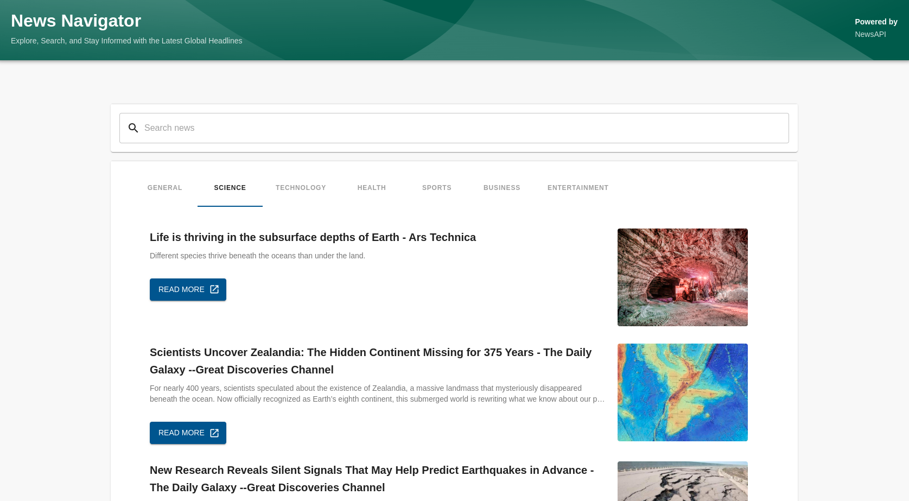
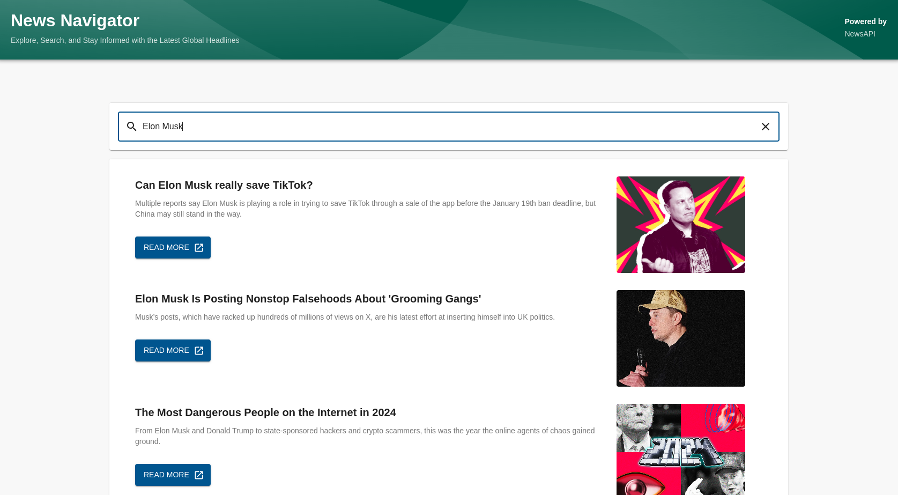

# News Navigator Plugin for Backstage

## What is News Navigator?

News Navigator is a plugin for Backstage that allows users to find latest news updates across different categories like sports, politics, technology, etc. It also allows users to search for news articles by keywords.

#### Plugin's Features

- **Latest News**: Get the latest news updates from different categories.
- **Search News**: Search for news articles by keywords.
- **Powered by News API**: The plugin uses the [News API](https://newsapi.org/) to fetch news articles.

## Getting Started

You will **need** to install both frontend and backend pluggins:

- Installation instructions for [frontend plugin](./plugins/news-navigator/README.md)
- Installation instructions for [backend plugin](./plugins/news-navigator-backend/README.md)

## Screenshots

#### Home Page

#### Search By Keyword

