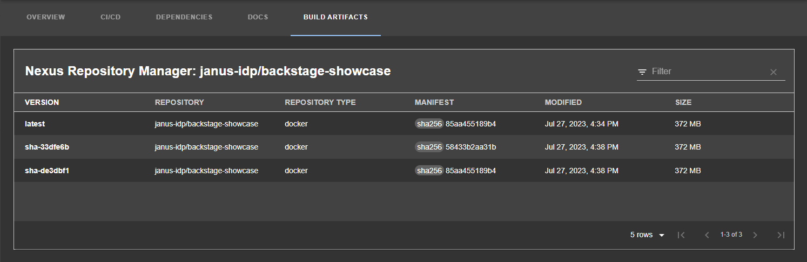

# Nexus Repository Manager plugin for Backstage

The Nexus Repository Manager plugin displays the information about your build artifacts that are available in the Nexus Repository Manager in your Backstage application.

## For administrators

### Installation and configuration

1. Install the Nexus Repository Manager plugin using the following command:

   ```console
   yarn workspace app add @janus-idp/backstage-plugin-nexus-repository-manager
   ```

1. Set the proxy to the desired Nexus Repository Manager server in the `app-config.yaml` file as follows:

   ```yaml title="app-config.yaml"
   proxy:
     endpoints:
       '/nexus-repository-manager':
         target: 'https://<NEXUS_REPOSITORY_MANAGER_URL>'
         headers:
           X-Requested-With: 'XMLHttpRequest'
           # Uncomment the following line to access a private Nexus Repository Manager using a token
           # Authorization: 'Bearer <YOUR TOKEN>'
         changeOrigin: true
         # Change to "false" in case of using self hosted Nexus Repository Manager instance with a self-signed certificate
         secure: true
   ```

1. Optional: Change the base URL of Nexus Repository Manager proxy as follows:

   ```yaml title="app-config.yaml"
   nexusRepositoryManager:
     # default path is `/nexus-repository-manager`
     proxyPath: /custom-path
   ```

1. Optional: Enable experimental annotations:

   ```yaml title="app-config.yaml"
   nexusRepositoryManager:
     experimentalAnnotations: true
   ```

   Replace the `isNexusRepositoryManagerAvailable` import with `isNexusRepositoryManagerExperimentalAvailable` when adding the `<NexusRepositoryManagerPage />` component.

   **NOTE**: The annotations mentioned in this step are not thoroughly tested.

1. Enable an additional tab on the service entity page in `packages/app/src/components/catalog/EntityPage.tsx`:

   ```tsx title="packages/app/src/components/catalog/EntityPage.tsx"
   /* highlight-add-next-line */
   import {
     isNexusRepositoryManagerAvailable,
     NexusRepositoryManagerPage,
   } from '@janus-idp/backstage-plugin-nexus-repository-manager';

   const serviceEntityPage = (
     <EntityLayout>
       {/* ... */}
       {/* highlight-add-next-line */}
       <EntityLayout.Route
         if={isNexusRepositoryManagerAvailable}
         path="/build-artifacts"
         title="Build Artifacts"
       >
         <NexusRepositoryManagerPage />
       </EntityLayout.Route>
     </EntityLayout>
   );
   ```

   You may also wish to add the route to other component types, such as `library`s.

1. Annotate your entity with any of the following annotations:

   ```yaml title="catalog-info.yaml"
   metadata:
     annotations:
       # insert the chosen annotations here
       # example
       nexus-repository-manager/docker.image-name: `<ORGANIZATION>/<REPOSITORY>`,
   ```

   For more information about annotations, see the [annotation file](./ANNOTATIONS.md).

## For users

### Using the Nexus Repository Manager plugin in Backstage

The Nexus Repository Manager is a front-end plugin that enables you to view the information about build artifacts.

#### Prerequisites

- Your Backstage application is installed and running.
- You have installed the Nexus Repository Manager plugin. For the installation process, see [Installation and configuration](#installation-and-configuration).

#### Procedure

1. Open your Backstage application and select a component from the **Catalog** page.
2. Go to the **BUILD ARTIFACTS** tab.

   The **BUILD ARTIFACTS** tab contains a list of build artifacts and related information, such as **VERSION**, **REPOSITORY**, **REPOSITORY TYPE**, **MANIFEST**, **MODIFIED**, and **SIZE**.

   
