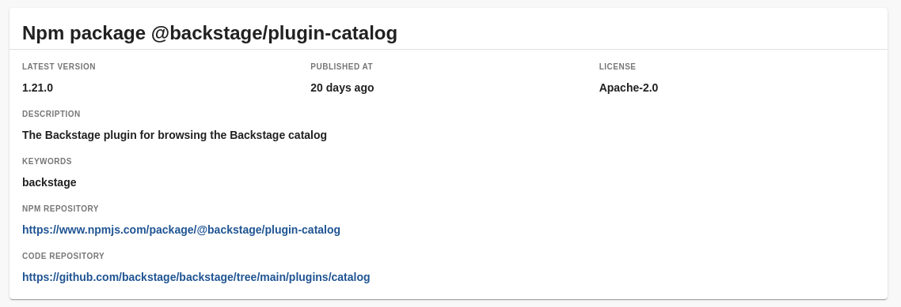
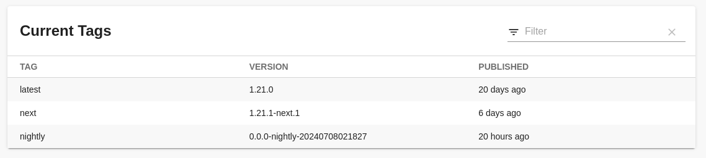
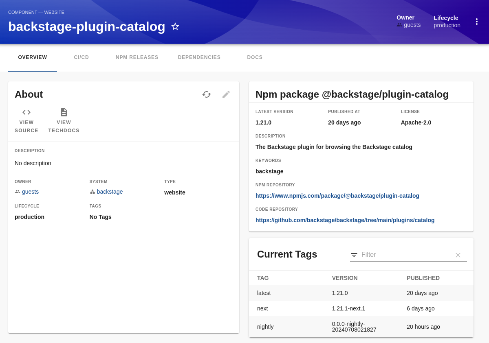
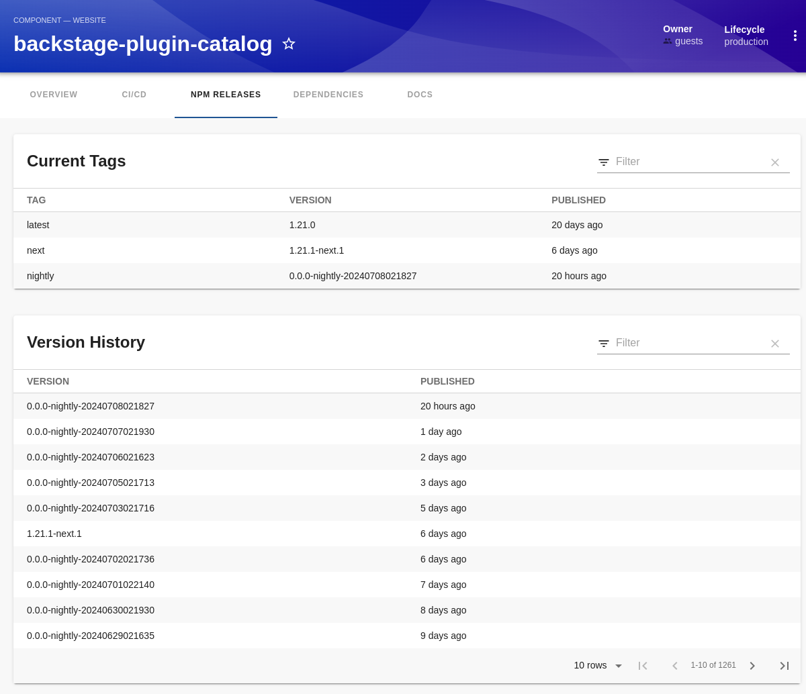

# npm plugin

## Screenshots

### Npm info card



### Npm release overview card



### Extended catalog entity overview tab (example)



### New catalog entity npm release tab



## Setup

Add to `packages/app/src/components/catalog/EntityPage.tsx`:

After all other imports:

```tsx
import {
  isNpmAvailable,
  NpmInfoCard,
  NpmReleaseOverviewCard,
  NpmReleaseTableCard,
} from '@backstage-community/plugin-npm';
```

Add to `const overviewContent` after `EntityAboutCard`:

```tsx
<EntitySwitch>
  <EntitySwitch.Case if={isNpmAvailable}>
    <Grid container item md={6} xs={12}>
      <Grid item md={12}>
        <NpmInfoCard />
      </Grid>
      <Grid item md={12}>
        <NpmReleaseOverviewCard />
      </Grid>
    </Grid>
  </EntitySwitch.Case>
</EntitySwitch>
```

Add to `const serviceEntityPage` and `const websiteEntityPage` after the `/ci-cd` case
and to `const defaultEntityPage` between the `/` and `/docs` routecase.

```tsx
<EntityLayout.Route
  if={isNpmAvailable}
  path="/npm-releases"
  title="NPM Releases"
>
  <NpmReleaseTableCard />
</EntityLayout.Route>
```
