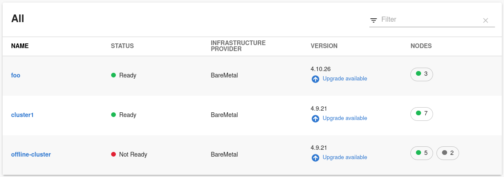
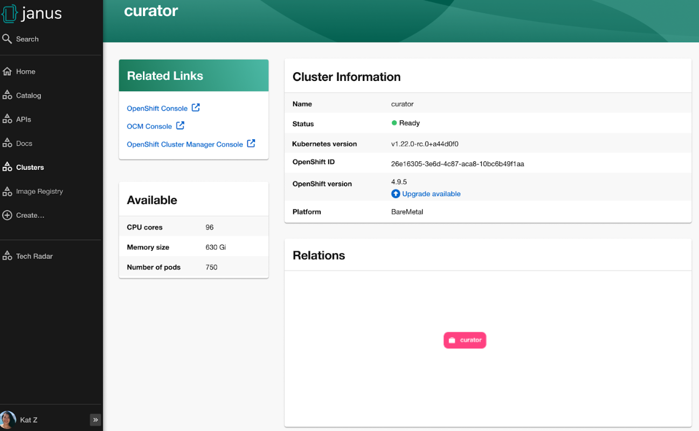

# Open Cluster Management plugin for Backstage

The Open Cluster Management (OCM) plugin integrates your Backstage instance with the `MultiClusterHub` and `MultiCluster` engines of OCM.

## Capabilities

The OCM plugin has the following capabilities:

- All clusters represented as `ManagedCluster` in `MultiClusterHub` or MCE are discovered and imported into the Backstage catalog, such as:
  - Entity is defined as `kind: Resource` with `spec.type` set to `kubernetes-cluster`.
  - Links to the OpenShift Container Platform (OCP) console, OCM console, and OpenShift Cluster Manager are provided in `metadata.links`.
- Shows real-time data from OCM on the Resource entity page, including:
  - Cluster current status (up or down)
  - Cluster nodes status (up or down)
  - Cluster details (console link, OCP, and Kubernetes version)
  - Details about available compute resources on the cluster

## For administrators

### Installation

The OCM plugin is composed of two packages, including:

- `@backstage-community/plugin-ocm-backend` package connects the Backstage server to OCM. For setup process, see [Backend Setup](#setting-up-the-ocm-backend-package)
- The `@backstage-community/plugin-ocm` package, which contains frontend components requires the `\*-backend` package to be present and properly set up. For detailed instructions on setting up the backend, refer to the [Backend Setup](#setting-up-the-ocm-backend-package) section.

**NOTE**
If you are interested in Resource discovery and do not want any of the front-end components, then you can install and configure the `@backstage-community/plugin-ocm-backend` package only.

---

#### Prerequisites

- OCM is [deployed and configured](https://access.redhat.com/documentation/en-us/red_hat_advanced_cluster_management_for_kubernetes/2.10/html/install/installing#doc-wrapper) on a Kubernetes cluster.
- [Kubernetes plugin for Backstage](https://backstage.io/docs/features/kubernetes) is installed and configured (Optional)
- On the target Hub clusters please create a `ServiceAccount` and grant it the following `ClusterRole`:

  ```yaml
  kind: ClusterRole
  apiVersion: rbac.authorization.k8s.io/v1
  metadata:
    name: backstage-ocm-plugin
  rules:
    - apiGroups:
        - cluster.open-cluster-management.io
      resources:
        - managedclusters
      verbs:
        - get
        - watch
        - list
    - apiGroups:
        - internal.open-cluster-management.io
      resources:
        - managedclusterinfos
      verbs:
        - get
        - watch
        - list
  ```

#### Setting up the OCM backend package

1. Install the OCM backend plugin using the following command:

   ```console
   yarn workspace backend add @backstage-community/plugin-ocm-backend
   ```

1. Configure the OCM backend plugin using one of the following configurations:

   - The OCM configuration provides the information about your hub. To use the OCM configuration, add the following code to your `app-config.yaml` file:

     ```yaml title="app-config.yaml"
     catalog:
       providers:
         ocm:
           env: # Key is reflected as provider ID. Defines and claims plugin instance ownership of entities
             name: # Name that the hub cluster will assume in Backstage Catalog (in OCM this is always local-cluster which can be confusing)
             url: # URL of the hub cluster API endpoint
             serviceAccountToken: # Token used for querying data from the hub
             skipTLSVerify: # Skip TLS certificate verification, defaults to false (Optional)
             caData: # Base64-encoded CA bundle in PEM format (Optional)
     ```

     - To ensure the Hub clusters are properly ingested into the catalog, the value provided to the `name` field must comply with the backstage entity name format [requirements](https://backstage.io/docs/features/software-catalog/descriptor-format/#name-required)

   - Alternatively, If the Backstage Kubernetes plugin is installed and configured to connect to the Hub cluster, then you can bind the both hub and Kubernetes configuration by providing the name of the Hub in the `app-config.yaml` as follows:

     ```yaml title="app-config.yaml"
     kubernetes:
       serviceLocatorMethod:
         type: 'multiTenant'
       clusterLocatorMethods:
         - type: 'config'
           clusters:
             # highlight-add-start
             - name: <cluster-name>
               # Other cluster configurations
               url: <cluster-api-url>
               serviceAccountToken: <token>
               skipTLSVerify: # Skip TLS certificate verification, defaults to false (Optional)
               caData: # Base64-encoded CA bundle in PEM format (Optional)
             # highlight-add-end

     catalog:
       providers:
         ocm:
           env: # Key is reflected as provider ID. Defines and claims plugin instance ownership of entities
             # highlight-add-start
             kubernetesPluginRef: <cluster-name> # Match the cluster name in kubernetes plugin config
             # The remaining OCM configurations are ignored if kubernetesPluginRef is provided (with exception of schedule and owner)
             # ... Other OCM Configurations
             # highlight-add-end
     ```

     - If the `kubernetesPluginRef` is provided, then it will take precedence over any other configuration for that OCM provider
     - Please ensure that `<cluster-name>` follows the same requirements as the `name` field in the OCM configuration.
     - Note: It is not necessary to have the kubernetes plugin installed, since only the kubernetes configuration is required if `kubernetesPluginRef` is used

     Ensure that the Backstage uses a `ServiceAccount` token and the required permissions are granted as mentioned previously.

     This is useful when you already use a Kubernetes plugin in your Backstage instance. Also, the hub cluster must be connected using the `ServiceAccount`.

     For more information about the configuration, see [Backstage Kubernetes plugin](https://backstage.io/docs/features/kubernetes/configuration#configuring-kubernetes-clusters) documentation.

1. Optional: Configure the default owner for the cluster entities in the catalog for a specific environment. For example, use the following code to set `foo` as the owner for clusters from `env` in the `app-config.yaml` catalog section:

```yaml title="app-config.yaml"
catalog:
  providers:
    ocm:
      env:
        # ...
        # highlight-next-line
        owner: user:foo
```

For more information about the default owner configuration, see [upstream string references documentation](https://backstage.io/docs/features/software-catalog/references/#string-references).

##### Installing the OCM backend package

In order to install the plugin follow the first 2 configuration steps described [here](#setting-up-the-ocm-backend-package). Then add the following lines to the `packages/backend/src/index.ts` file.

```ts title="packages/backend/src/index.ts"
import {
  catalogModuleOCMEntityProvider,
  ocmPlugin,
} from '@backstage-community/plugin-ocm-backend';

const backend = createBackend();
/* highlight-add-start */
backend.add(catalogModuleOCMEntityProvider);
backend.add(ocmPlugin);
/* highlight-add-end */

backend.start();
```

---

**NOTE**
The default schedule for the OCM plugin has a frequency of 1 hour and a timeout of 15 minutes. If you want to modify the schedule, you can do so by specifying the `schedule` field in the `app-config.yaml` file as follows:

```yaml title="app-config.yaml"
catalog:
  providers:
    ocm:
      env:
        # ...
        # highlight-add-start
        schedule: # optional; same options as in TaskScheduleDefinition
          # supports cron, ISO duration, "human duration" as used in code
          frequency: { minutes: 1 } # Customize with your desired frequency
          # supports ISO duration, "human duration" as used in code
          timeout: { minutes: 1 } # Customize with your desired timeout
        # highlight-add-end
```

---

#### Setting up the OCM frontend package

1. Install the OCM frontend plugin using the following command:

   ```console
   yarn workspace app add @backstage-community/plugin-ocm
   ```

2. Select the components that you want to use, such as:

   - `OcmPage`: This is a standalone page or dashboard displaying all clusters as tiles. You can add `OcmPage` to `packages/app/src/App.tsx` file as follows:

     ```tsx title="packages/app/src/App.tsx"
     /* highlight-add-next-line */
     import { OcmPage } from '@backstage-community/plugin-ocm';

     const routes = (
       <FlatRoutes>
         {/* ... */}
         {/* highlight-add-next-line */}
         <Route path="/ocm" element={<OcmPage logo={<Logo />} />} />
       </FlatRoutes>
     );
     ```

     You can also update navigation in `packages/app/src/components/Root/Root.tsx` as follows:

     ```tsx title="packages/app/src/components/Root/Root.tsx"
     /* highlight-add-next-line */
     import { OcmIcon } from '@backstage-community/plugin-ocm';

     export const Root = ({ children }: PropsWithChildren<{}>) => (
       <SidebarPage>
         <Sidebar>
           <SidebarGroup label="Menu" icon={<MenuIcon />}>
             {/* ... */}
             {/* highlight-add-next-line */}
             <SidebarItem icon={OcmIcon} to="ocm" text="Clusters" />
           </SidebarGroup>
           {/* ... */}
         </Sidebar>
         {children}
       </SidebarPage>
     );
     ```

   - `ClusterContextProvider`: This component is a React context provided for OCM data, which is related to the current entity. The `ClusterContextProvider` component is used to display any data on the React components mentioned in `packages/app/src/components/catalog/EntityPage.tsx`:

     ```tsx title="packages/app/src/components/catalog/EntityPage.tsx"
     /* highlight-add-start */
     import {
       ClusterAvailableResourceCard,
       ClusterContextProvider,
       ClusterInfoCard,
     } from '@backstage-community/plugin-ocm';

     const isType = (types: string | string[]) => (entity: Entity) => {
       if (!entity?.spec?.type) {
         return false;
       }
       return typeof types === 'string'
         ? entity?.spec?.type === types
         : types.includes(entity.spec.type as string);
     };
     /* highlight-add-end */

     export const resourcePage = (
       <EntityLayout>
         {/* ... */}
         {/* highlight-add-start */}
         <EntityLayout.Route path="/status" title="status">
           <EntitySwitch>
             <EntitySwitch.Case if={isType('kubernetes-cluster')}>
               <ClusterContextProvider>
                 <Grid container direction="column" xs={6}>
                   <Grid item>
                     <ClusterInfoCard />
                   </Grid>
                   <Grid item>
                     <ClusterAvailableResourceCard />
                   </Grid>
                 </Grid>
               </ClusterContextProvider>
             </EntitySwitch.Case>
           </EntitySwitch>
         </EntityLayout.Route>
         {/* highlight-add-end */}
       </EntityLayout>
     );

     export const entityPage = (
       <EntitySwitch>
         {/* ... */}
         {/* highlight-add-next-line */}
         <EntitySwitch.Case if={isKind('resource')} children={resourcePage} />
       </EntitySwitch>
     );
     ```

     In the previous codeblock, you can place the context provider into your `Resource` entity renderer, which is usually available in `packages/app/src/components/catalog/EntityPage.tsx` or in an imported component.

   - `<ClusterInfoCard />`: This is an entity component displaying details of a cluster in a table:

   - `<ClusterAvailableResourceCard />`: This is an entity component displaying the available resources on a cluster. For example, see [`.status.capacity`](https://open-cluster-management.io/concepts/managedcluster/#cluster-heartbeats-and-status) of the `ManagedCluster` resource.

## For users

### Using the OCM plugin in Backstage

The OCM plugin integrates your Backstage instance with multi-cluster engines and displays real-time data from OCM.

#### Prerequisites

- Your Backstage application is installed and running.
- You have installed the OCM plugin. For the installation process, see [Installation](#installation).
- If RBAC permission framework is enabled, ensure adding the following permission policies in an external permission policies configuration file named `rbac-policy.csv` to allow the rbac admins or your desired user(s)/group(s) to access the ocm backend plugin:

```csv rbac-policy.csv
p, role:default/rbac_admin, ocm.entity.read, read, allow
p, role:default/rbac_admin, ocm.cluster.read, read, allow
```

#### Procedure

1. Open your Backstage application.
1. Click the **Clusters** tab from the left-side panel to view the **Managed Clusters** page.

   The **Managed Clusters** page displays the list of clusters with additional information, such as status, infrastructure provider, associated OpenShift version, and available nodes.

   

   You can also upgrade the OpenShift version for a cluster using the **Upgrade available** option in the **VERSION** column.

1. Select a cluster from the **Managed Clusters** to view the related cluster information.

   You are redirected to the cluster-specific page, which consists of:

   - **Cluster Information**, such as name, status, accessed Kubernetes version, associated OpenShift ID and version, and accessed platform.
   - **Available** cluster capacity, including CPU cores, memory size, and number of pods.
   - **Related Links**, which enable you to access different consoles directly, such as OpenShift Console, OCM Console, and OpenShift Cluster Manager Console.
   - **Relations** card, which displays the visual representation of the cluster and associated dependencies.

     
