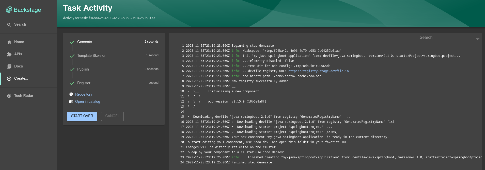
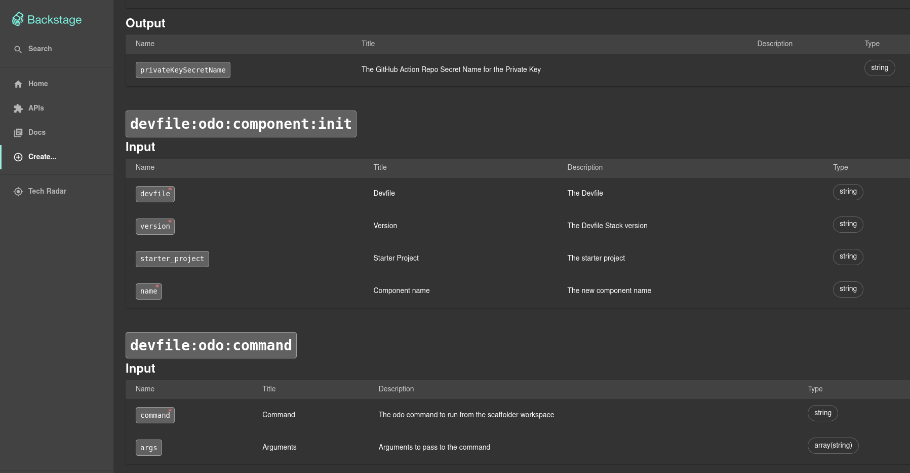

# scaffolder-odo-actions

This is a [Backend Plugin](https://backstage.io/docs/plugins/backend-plugin/) containing a set of [Custom Actions](https://backstage.io/docs/features/software-templates/writing-custom-actions) using the [`odo`](https://odo.dev/) CLI.
It contains the following actions:

- `devfile:odo:command`: a generic action that can execute any `odo` command from the scaffolder workspace.

- `devfile:odo:component:init`: allows to execute the [`odo init`](https://odo.dev/docs/command-reference/init) command from the Scaffolder workspace. The goal of this action is to generate a starter project for a given Devfile that can be customized later on.

## Preview



## Installation

From your Backstage instance root folder:

```shell
yarn add --cwd packages/backend @backstage-community/plugin-scaffolder-backend-module-odo
```

This will download the right `odo` binary for the current operating system and architecture from the Red Hat servers at <https://developers.redhat.com/content-gateway/rest/mirror/pub/openshift-v4/clients/odo/>.

This behavior can be customized by adding a new `"odo"` field in your `packages/backend/package.json` file, like so:

```json
// packages/backend/package.json

{
  "odo": {
    // specifying the version is optional.
    // You can also specify "latest" to use the latest version of odo, or "nightly" to use the latest nightly build of odo.
    "version": "3.15.0",
    "skipDownload": false
  }
}
```

Note that the custom actions here do require an `odo` binary to work properly.
So if you choose to skip the download (using the `odo.skipDownload` property above), you need to make sure to meet any of the requirements below:

- either you can explicitly set the path to the `odo` binary in your `app-config.yaml` (see [below](#app-configyaml));
- or `odo` is already [installed](https://odo.dev/docs/overview/installation) and available globally in the system paths of the environment the Backstage instance is running in.

## Configuration

### Code

Import the module by modifying the `packages/backend/src/index.ts` file on your Backstage instance:

```ts
// packages/backend/src/index.ts

backend.add(
  import('@backstage-community/plugin-scaffolder-backend-module-odo'),
);
```

### app-config.yaml

Optionally, the behavior of these custom actions can be customized by adding the following section to your `app-config.yaml` file:

```yaml
# app-config.yaml

odo:
  # When adding this plugin to your Backstage instance, it will automatically try to download the right odo binary and use it.
  # But if you already have odo installed, you can override the path below.
  # binaryPath: '/path/to/odo'
  telemetry:
    # Disable the odo telemetry.
    # Default: false
    disabled: false
  devfileRegistry:
    # Used for calling `odo init` and any other custom actions relying on a Devfile registry.
    # If you are using the Devfile Selector Custom Field Extension in your template,
    # you need to also add this URL to the 'proxy.endpoints' field under a '/devfile-registry' field.
    # Default: 'https://registry.devfile.io'
    url: 'https://registry.devfile.io'
```

You should now see the custom `devfile:odo:*` actions if you navigate to the Actions page at <http://localhost:3000/create/actions>.



## Usage

You can use the action in any of the steps of your [Software Template](https://backstage.io/docs/features/software-templates/).
See <https://github.com/ododev/odo-backstage-software-template> for an example of a Software Template making use of the Actions here.

### Example with the `odo init` action

This action can be used in conjunction with the [odo-module-devfile-field-extension](../odo-module-devfile-field-extension) Custom Field Extension to get the Devfile input data from the end-user, e.g.:

```yaml
spec:
  parameters:
    - title: Provide details about the Devfile
      required:
        - devfile_data
      properties:
        devfile_data:
          type: object
          required:
            - devfile
            - version
          properties:
            devfile:
              type: string
            version:
              type: string
            starter_project:
              type: string
          ui:field: DevfileSelectorExtension

  steps:
    - id: odo-init
      name: Generate
      action: devfile:odo:component:init
      input:
        name: ${{ parameters.name }}
        devfile: ${{ parameters.devfile_data.devfile }}
        version: ${{ parameters.devfile_data.version }}
        starter_project: ${{ parameters.devfile_data.starter_project }}
```

### Example with the generic `odo` action

```yaml
spec:
  # [...]

  steps:
    - id: generic-odo-command
      name: Execute odo command
      action: devfile:odo:command
      input:
        command: ${{ parameters.command }} # e.g.: 'analyze'
        args: ${{ parameters.args }} # e.g.: ['-o', 'json']
```
