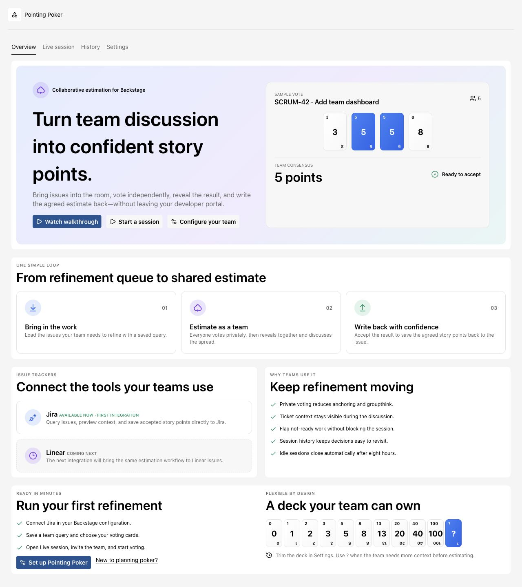
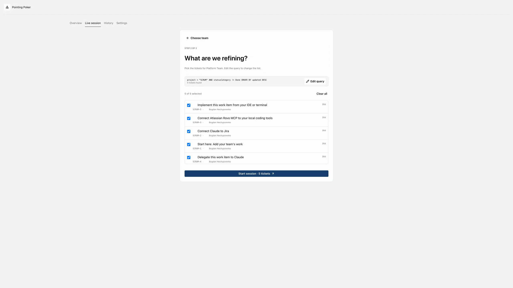
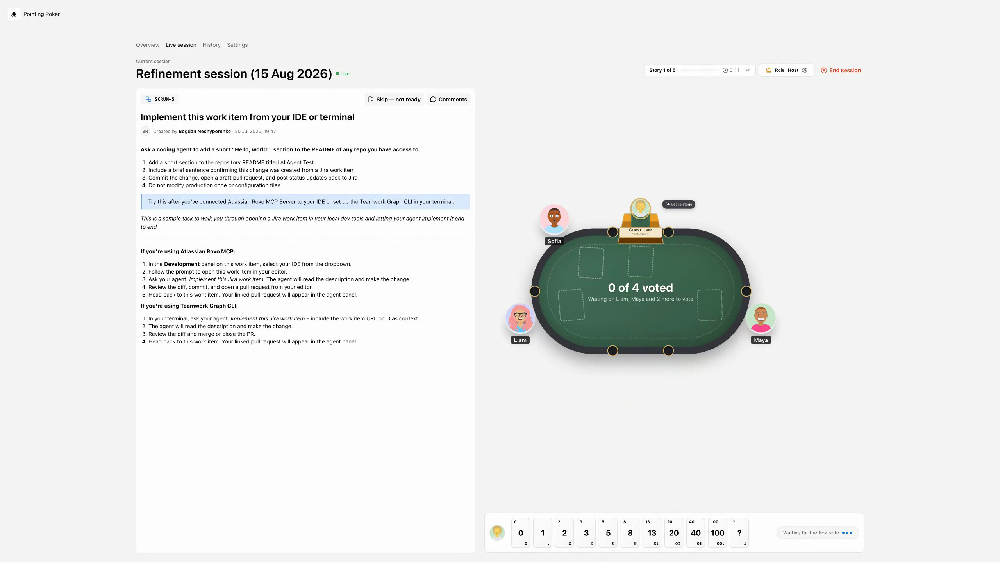
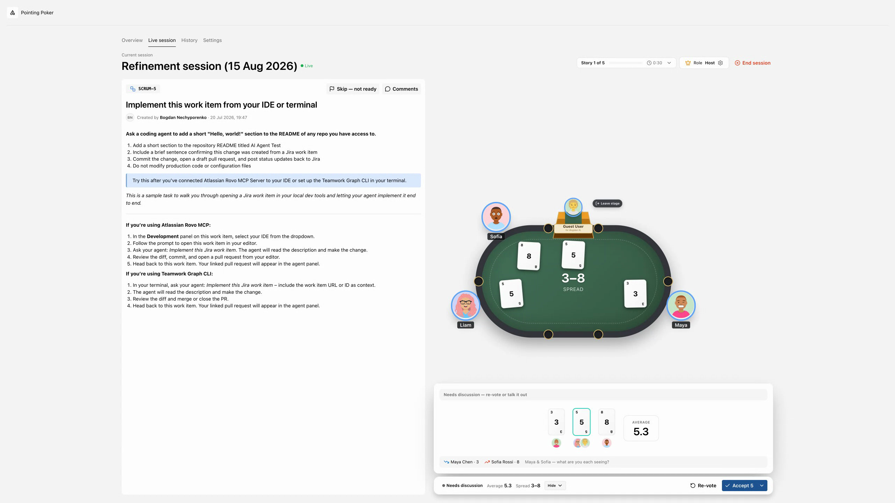

# Pointing Poker

Pointing Poker brings collaborative story-point estimation into Backstage. Teams can select the exact work that belongs in a refinement session, discuss every ticket with its tracker context visible, vote privately, reveal together, and write the agreed estimate back without switching tools.



## Why use it?

- Keep refinement in the developer portal where teams already discover services and ownership.
- Reduce anchoring and groupthink with private voting and synchronized reveals.
- Select a focused refinement queue with JQL instead of loading an entire backlog.
- Keep descriptions, acceptance criteria, subtasks, attachments, and comments beside the table.
- Give every story a spokesperson. The ticket creator presents by default; anyone can take the tribune when the creator is absent.
- Surface vote spread, average, consensus, and discussion prompts before accepting an estimate.
- Write accepted story points back to Jira and retain session history for later review.
- Extend the backend with another issue tracker through the ticket-provider extension point.

## Workflow

### 1. Select the refinement queue

Teams save their own JQL and select only the tickets that belong in the session.



### 2. Discuss and vote at one table

The issue context remains visible while participants join with avatars, present the ticket, comment, flag not-ready work, and vote privately.



### 3. Reveal, align, and write back

Votes reveal automatically when everyone has voted. The result view highlights the spread and average, supports re-voting, and lets the host accept the agreed value.



## Packages

| Package                                              | Purpose                                                              |
| ---------------------------------------------------- | -------------------------------------------------------------------- |
| `@backstage-community/plugin-pointing-poker`         | Frontend page, session UI, settings, and history                     |
| `@backstage-community/plugin-pointing-poker-backend` | Session persistence, voting API, and ticket-provider extension point |
| `@backstage-community/plugin-pointing-poker-jira`    | Jira search, issue context, comments, and story-point write-back     |
| `@backstage-community/plugin-pointing-poker-common`  | Shared provider contracts and domain types                           |

## Installation

Install the frontend and backend packages, plus the Jira provider when Jira is your issue tracker:

```bash
yarn --cwd packages/app add @backstage-community/plugin-pointing-poker
yarn --cwd packages/backend add \
  @backstage-community/plugin-pointing-poker-backend \
  @backstage-community/plugin-pointing-poker-jira
```

Add the page to your app routes:

```tsx
import { PointingPokerPage } from '@backstage-community/plugin-pointing-poker';

<Route path="/pointing-poker" element={<PointingPokerPage />} />;
```

Register the backend plugin and Jira module:

```ts
backend.add(import('@backstage-community/plugin-pointing-poker-backend'));
backend.add(import('@backstage-community/plugin-pointing-poker-jira'));
```

### Minimal Jira configuration

After registering the frontend plugin, backend plugin, and Jira module, this is
all the runtime configuration required to make Pointing Poker work with Jira:

```yaml
pointingPoker:
  jira:
    host: https://YOUR_COMPANY.atlassian.net
    email: ${JIRA_USER_EMAIL}
    apiToken: ${JIRA_API_TOKEN}
```

Set `JIRA_USER_EMAIL` and `JIRA_API_TOKEN` in the Backstage backend environment;
the credentials stay server-side and are not exposed to the frontend.

The signed-in Backstage user should belong to at least one catalog `Group` with `spec.type: team`. Pointing Poker uses catalog membership to discover teams and session participants.

## Team settings

Each team can configure:

- the JQL that defines its refinement queue;
- the voting-card deck, including Fibonacci-style values and `?`;
- participant avatars used around the table.

## Extending issue-tracker support

The backend exposes `pointingPokerTicketProviderExtensionPoint`. A backend module can register any implementation of the shared `TicketProvider` contract, allowing the session experience to support issue trackers beyond Jira without coupling tracker logic to the core plugin.

## Development

From `workspaces/pointing-poker`:

```bash
yarn install
export JIRA_USER_EMAIL=you@example.com
export JIRA_API_TOKEN=your-token
yarn start
```

The example app runs at `http://localhost:3000/pointing-poker` and uses an in-memory SQLite database.
