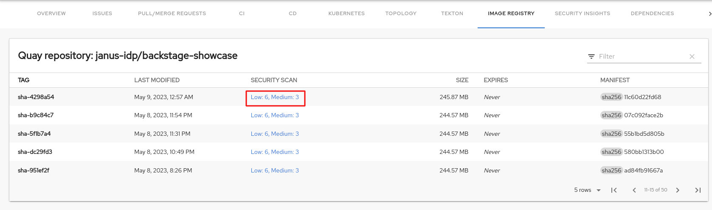
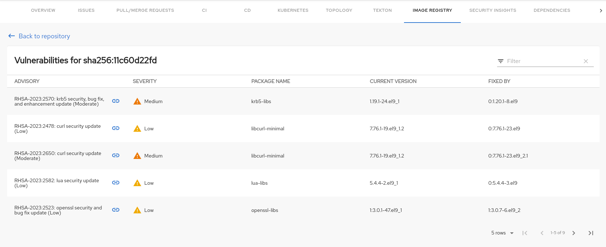

# Quay plugin for Backstage

The Quay plugin displays the information about your container images within the Quay registry in your Backstage application.

## For administrators

### Installation

1. Install the Quay plugin using the following command:

   ```console
   yarn workspace app add @backstage-community/plugin-quay
   ```

### Configuration

1. Set `uiUrl` to the desired Quay server in the `app-config.yaml` file as follows:

   ```yaml title="app-config.yaml"
   quay:
     # The UI url for Quay, used to generate the link to Quay
     uiUrl: 'https://quay.io'
   ```

> [!NOTE]
> If you are trying to access a private repository in a Quay organization, set the `apiKey` value to your Application's OAuth token.
> For example:
>
> ```
> quay:
>   uiUrl: 'https://quay.io'
>   apiKey: 'abc123'
> ```
>
> **Robot tokens will not work for this, you will need an Application OAuth token**.
> For more information on creating OAuth tokens, see https://docs.redhat.com/en/documentation/red_hat_quay/3/html-single/red_hat_quay_api_guide/index#creating-oauth-access-token

2. Enable an additional tab on the entity view page in `packages/app/src/components/catalog/EntityPage.tsx`:

   ```tsx title="packages/app/src/components/catalog/EntityPage.tsx"
   /* highlight-add-next-line */
   import { isQuayAvailable, QuayPage } from '@backstage-community/plugin-quay';

   const serviceEntityPage = (
     <EntityLayout>
       {/* ... */}
       {/* highlight-add-next-line */}
       <EntityLayout.Route if={isQuayAvailable} path="/quay" title="Quay">
         <QuayPage />
       </EntityLayout.Route>
     </EntityLayout>
   );
   ```

3. Annotate your entity with the following annotations:

   ```yaml title="catalog-info.yaml"
   metadata:
     annotations:
       'quay.io/repository-slug': `<ORGANIZATION>/<REPOSITORY>',
   ```

## For users

### Using the Quay plugin in Backstage

Quay is a front-end plugin that enables you to view the information about the container images.

#### Prerequisites

- Your Backstage application is installed and running.
- You have installed the Quay plugin. For installation process, see [Installation](#installation).

#### Procedure

1. Open your Backstage application and select a component from the **Catalog** page.
1. Go to the **Image Registry** tab.

   The **Image Registry** tab in the Backstage UI contains a list of container images and related information, such as **TAG**, **LAST MODIFIED**, **SECURITY SCAN**, **SIZE**, **EXPIRES**, and **MANIFEST**.

   

1. If a container image does not pass the security scan, select the security scan value of the image to check the vulnerabilities.

   

   The vulnerabilities page displays the associated advisory with a link, severity, package name, and current and fixed versions.

   

   The advisory link redirects to the Red Hat Security Advisory page that contains detailed information about the advisory, including the solution.
