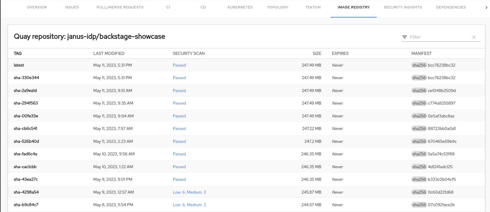

# Quay plugin for Backstage

The Quay plugin displays the information about your container images within the Quay registry in your Backstage application.

## For administrators

### Installation

1. Install the Quay plugin using the following command:

   ```console
   yarn workspace app add @backstage-community/plugin-quay
   ```

### Configuration

By default you can use the Backstage proxy to make requests to your Quay instance.

If you require more functionality like being able to set permissions, please see the [Quay backend plugin docs](../quay-backend/README.md) to configure that instead.

1. Set the proxy to the desired Quay server in the `app-config.yaml` file as follows:

   ```yaml title="app-config.yaml"
   proxy:
     endpoints:
       '/quay/api':
         target: 'https://quay.io'
         credentials: require
         headers:
           X-Requested-With: 'XMLHttpRequest'
           # Uncomment and use the Authorization header below to access a private Quay
           # Repository using a token. Refer to the "Applications and Tokens" section
           # at https://docs.quay.io/api/ to find the instructions to generate a token
           # Authorization: 'Bearer <YOUR TOKEN>'
         changeOrigin: true
         # Change to "false" in case of using self hosted quay instance with a self-signed certificate
         secure: true

   quay:
     # The UI url for Quay, used to generate the link to Quay
     uiUrl: 'https://quay.io'
   ```

> [!NOTE]
> The value inside each route is either a simple URL string, or an object on the format accepted by [http-proxy-middleware](https://www.npmjs.com/package/http-proxy-middleware). Additionally, it has an optional `credentials` key which can have the following values:
>
> - `require`: Callers must provide Backstage user or service credentials with each request. The credentials are not forwarded to the proxy target. This is the **default**.
> - `forward`: Callers must provide Backstage user or service credentials with each request, and those credentials are forwarded to the proxy target.
> - `dangerously-allow-unauthenticated`: No Backstage credentials are required to access this proxy target. The target can still apply its own credentials checks, but the proxy will not help block non-Backstage-blessed callers. If you also add allowedHeaders: ['Authorization'] to an endpoint configuration, then the Backstage token (if provided) WILL be forwarded.
>
> Note that if you have `backend.auth.dangerouslyDisableDefaultAuthPolicy` set to true, the credentials value does not apply; the proxy will behave as if all endpoints were set to dangerously-allow-unauthenticated.

2. Enable an additional tab on the entity view page in `packages/app/src/components/catalog/EntityPage.tsx`:

   ```tsx title="packages/app/src/components/catalog/EntityPage.tsx"
   /* highlight-add-next-line */
   import { isQuayAvailable, QuayPage } from '@backstage-community/plugin-quay';

   const serviceEntityPage = (
     <EntityLayout>
       {/* ... */}
       {/* highlight-add-next-line */}
       <EntityLayout.Route if={isQuayAvailable} path="/quay" title="Quay">
         <QuayPage />
       </EntityLayout.Route>
     </EntityLayout>
   );
   ```

3. Annotate your entity with the following annotations:

   ```yaml title="catalog-info.yaml"
   metadata:
     annotations:
       'quay.io/repository-slug': `<ORGANIZATION>/<REPOSITORY>',
   ```

## For users

### Using the Quay plugin in Backstage

Quay is a front-end plugin that enables you to view the information about the container images.

#### Prerequisites

- Your Backstage application is installed and running.
- You have installed the Quay plugin. For installation process, see [Installation](#installation).

#### Procedure

1. Open your Backstage application and select a component from the **Catalog** page.
1. Go to the **Image Registry** tab.

   The **Image Registry** tab in the Backstage UI contains a list of container images and related information, such as **TAG**, **LAST MODIFIED**, **SECURITY SCAN**, **SIZE**, **EXPIRES**, and **MANIFEST**.

   

1. If a container image does not pass the security scan, select the security scan value of the image to check the vulnerabilities.

   

   The vulnerabilities page displays the associated advisory with a link, severity, package name, and current and fixed versions.

   

   The advisory link redirects to the Red Hat Security Advisory page that contains detailed information about the advisory, including the solution.
