# Group Hierarchy

RBAC access control is configured by defining roles and their associated permission policies, which
are then assigned to users or groups. Leveraging group hierarchy can greatly simplify RBAC management,
making it more scalable and flexible.

## Group-Based Role Assignment

Role can be assigned to a specific group. If a user is a member of that group, or a member of any of
its child groups, the role (and its associated permissions) will automatically be applied to that user.

Examples:

- Sam will inherit `role:default/test` from `team-group` via `subteam-group`.

  

  ```yaml
  # catalog-entity.yaml
  apiVersion: backstage.io/v1alpha1
  kind: Group
  metadata:
    name: team-group
  spec:
    type: team
    children: [subteam-group]
  ---
  apiVersion: backstage.io/v1alpha1
  kind: Group
  metadata:
    name: subteam-group
  spec:
    type: team
    children: []
    parent: team-group
  ---
  apiVersion: backstage.io/v1alpha1
  kind: User
  metadata:
    name: sam
  spec:
    memberOf:
      - subteam-group
  ```

  ```CSV
  g, group:default/team-group, role:default/test
  p, role:default/test, catalog-entity, read, allow
  ```

- Sam will have `role:default/test` via `team-group`.

  

  ```yaml
  # catalog-entity.yaml
  apiVersion: backstage.io/v1alpha1
  kind: User
  metadata:
    name: sam
  ---
  apiVersion: backstage.io/v1alpha1
  kind: Group
  metadata:
    name: team-group
  spec:
    type: team
    children: []
    members:
      - sam
  ```

  ```CSV
  g, group:default/team-group, role:default/test
  p, role:default/test, catalog-entity, read, allow
  ```

- Sam will inherit `role:default/role-a` from `group-a` and `role:default/role-c` from `group-c`.

  

  ```yaml
  # catalog-entity.yaml
  apiVersion: backstage.io/v1alpha1
  kind: Group
  metadata:
    name: group-a
  spec:
    type: team
    children: [group-b]
  ---
  apiVersion: backstage.io/v1alpha1
  kind: Group
  metadata:
    name: group-b
  spec:
    type: team
    children: []
  ---
  apiVersion: backstage.io/v1alpha1
  kind: Group
  metadata:
    name: group-c
  spec:
    type: team
    children: []
  ---
  apiVersion: backstage.io/v1alpha1
  kind: User
  metadata:
    name: sam
  spec:
    memberOf:
      - group-b
      - group-c
  ```

  ```CSV
  g, group:default/group-a, role:default/role-a
  g, group:default/group-c, role:default/role-c
  p, role:default/role-a, catalog-entity, read, allow
  p, role:default/role-c, catalog-entity, delete, allow
  ```

## Managing Group Hierarchy Depth

While group hierarchy provides powerful inheritance features, it can have performance implications.
Organizations with potentially complex group hierarchy can specify `maxDepth` configuration value,
that will ensure that the RBAC plugin will stop at a certain depth when building user graphs.

```YAML
permission:
  enabled: true
  rbac:
    maxDepth: 1
```

The `maxDepth` must be greater than or equal to 0 to ensure that the graphs are built correctly. Also the graph
will be built with a hierarchy of 1 + maxDepth.

A value of 0 for maxDepth disables the group inheritance feature.

## Non-Existent Groups in the Hierarchy

For group hierarchy to function, groups don't need to be present in the catalog as long as the group
has an existing parent group or is a member of existing group or an existing user is a member of
that group.
(Note that this does not work with in-memory database.)

Examples:

- Sam will inherit `role:default/test`, although `team-group` isn't explicitly defined.

  

  ```yaml
  # catalog-entity.yaml
  apiVersion: backstage.io/v1alpha1
  kind: User
  metadata:
    name: sam
  spec:
    memberOf:
      - team-group
  ```

  ```CSV
  g, group:default/team-group, role:default/test
  p, role:default/test, catalog-entity, read, allow
  ```

- Sam will inherit `role:default/test` via `subteam-group` that is a child of `team-group`, although `subteam-group` isn't explicitly defined.

  

  ```yaml
  # catalog-entity.yaml
  apiVersion: backstage.io/v1alpha1
  kind: User
  metadata:
    name: sam
  spec:
    memberOf:
      - subteam-group
  ---
  apiVersion: backstage.io/v1alpha1
  kind: Group
  metadata:
    name: team-group
  spec:
    type: team
    children: [subteam-group]
  ```

  ```CSV
  g, group:default/team-group, role:default/test
  p, role:default/test, catalog-entity, read, allow
  ```

- Sam will inherit `role:default/test` via `group-d` <- `group-c` <- `group-b` <- `group-a`,
  although `group-d` and `group-b` aren't explicitly defined.

  

  ```yaml
  # catalog-entity.yaml
  apiVersion: backstage.io/v1alpha1
  kind: User
  metadata:
    name: sam
  spec:
    memberOf:
      - group-d
  ---
  apiVersion: backstage.io/v1alpha1
  kind: Group
  metadata:
    name: group-c
  spec:
    type: team
    children: [group-d]
    parent: group-b
  ---
  apiVersion: backstage.io/v1alpha1
  kind: Group
  metadata:
    name: group-a
  spec:
    type: team
    children: [group-b]
  ```

  ```CSV
  g, group:default/group-a, role:default/test
  p, role:default/test, catalog-entity, read, allow
  ```
