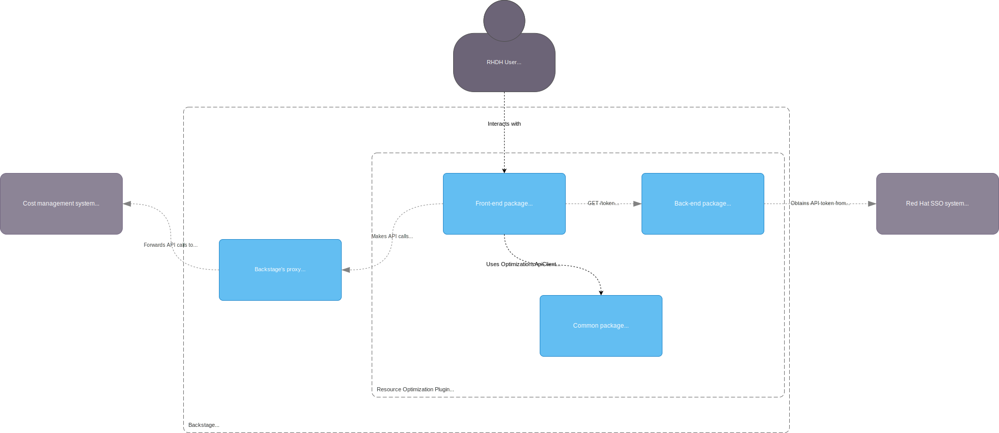

# ADR-0001: Optimizations plugin for Red Hat Developer Hub - Phase 1

## Status

Accepted

## Context

[Resource Optimization](https://docs.redhat.com/en/documentation/cost_management_service/1-latest/html-single/getting_started_with_resource_optimization_for_openshift/index#what_is_resource_optimization_for_openshift) is a feature that extends the Cost Management service with the goal of helping users to rightsize workloads running on their OpenShift clusters.  
Currently, this feature is exposed exclusively through [OCM](https://console.redhat.com/openshift) but, with the introduction of Red Hat Developer Hub ([Backstage](https://backstage.io)) we can bring the same feature to the platform via a plugin.

## Alternatives

In Red Hat Developer Hub there are three types of plugins:

1. Standalone (a front-end SPA, rendering hard-coded content, like the [TechRadar](https://demo.backstage.io/tech-radar) plugin)
2. Service backed (a front-end SPA with a NodeJS back-end and DB implementing most of the logic)
3. 3rd-party backed (a front-end SPA calling a 3rd-part API)

## Decision

1. We’ll Implement a 3rd-party backed [plugin](https://backstage.io/docs/frontend-system/building-plugins/index/), that will use the [proxy module](https://backstage.io/docs/plugins/proxying/) to call the [Optimizations API](https://developers.redhat.com/api-catalog/api/cost-management#content-operations-group-Optimizations)
2. Based on the alternatives for [calling existing APIs](https://backstage.io/docs/plugins/call-existing-api#creating-a-backstage-backend-plugin) as discussed in the Backstage documentation, we’ll implement a slim back-end plugin for the purpose of refreshing the necessary access token to contact the API.
3. An isomorphic JavaScript client will be generated from the Optimizations API [OpenAPI spec](https://raw.githubusercontent.com/RedHatInsights/ros-ocp-backend/main/openapi.json) to streamline the API calls from the front-end plugin. This client will be exposed via a [common package](https://backstage.io/docs/architecture-decisions/adrs-adr011).

## Consequences

### Pros:

- Resuses existing logic

### Cons:

- The solution relies on the availability of the API
- At the moment, users will be able to see recommendations for clusters and their projects based on the service account settings. Users looking to workaround this limitation can refer to [this document](https://docs.redhat.com/en/documentation/cost_management_service/1-latest/html/limiting_access_to_cost_management_resources/assembly-limiting-access-cost-resources-rbac). (RBAC integration will be introduced during phase 2 of this project).

## Architecture overview:

### Enablement

Users will need to create a service account in the Hybrid Cloud Console [Identity & Access Management](https://console.redhat.com/application-services/service-accounts) page and grant that account the “Cost OpenShift Viewer” role. Furthermore, users will need to follow the instructions to [enable clusters to receive optimization recommendations](https://docs.redhat.com/en/documentation/cost_management_service/1-latest/html-single/getting_started_with_resource_optimization_for_openshift/index#prerequisites).

### Additional notes

Calling the Optimizations API requires an access token. Users can obtain one from Red Hat SSO using the Client Credentials Grant Flow (see [this article](https://access.redhat.com/articles/7036194#to-assist-you-in-the-migration-process-we-have-outlined-the-steps-necessary-for-this-transition-5) for detailed information on this regard).

**Please note:** Access tokens will expire after fifteen (15) minutes. The process of obtaining an access token needs to be repeated approximately every ten (10) minutes so that the token is rotated prior to expiration.  
Due to this limitation we decided to create a slim companion back-end plugin that will handle the token rotation logic. This plugin will receive the service account Client ID and Client Secret as configuration parameters.
