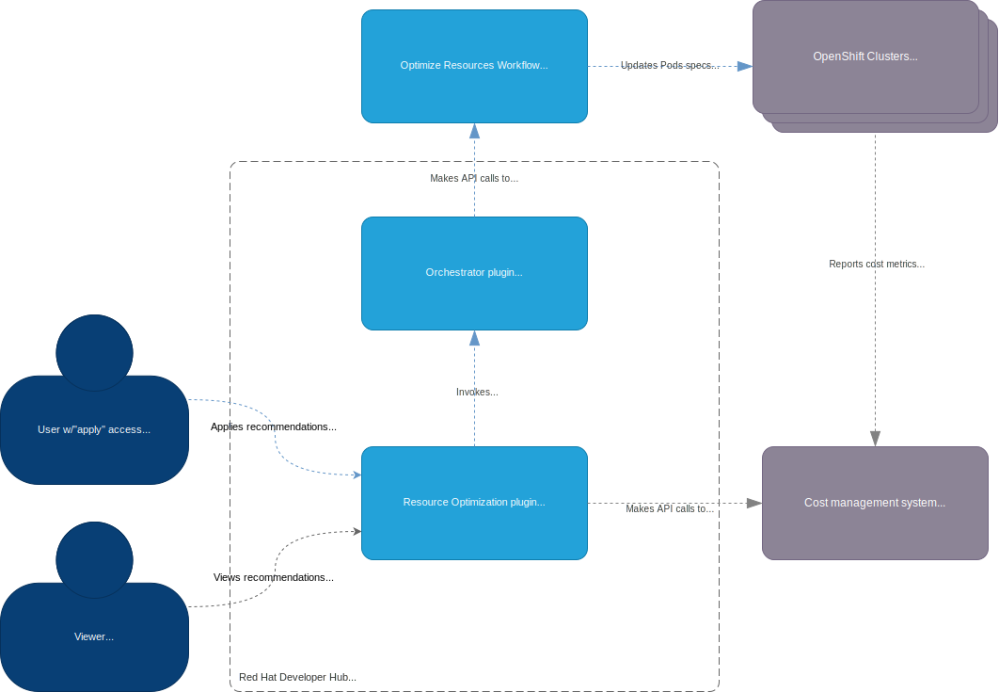

# ADR-0002: Applying optimizations using the Orchestrator plugin

## Status

Proposed

## Context

Instead of copy & pasting the optimization recommendations from the UI, we would like to allow users to apply these recommendations in an automated fashion (captured by [COST-5509](https://issues.redhat.com/browse/COST-5509)).

## Alternatives

We considered applying the recommendations by directly calling the Kube API of the clusters from within the Resource Optimization plugin, without relying on the Orchestrator plugin. However, this approach was deemed less flexible due to the diverse procedures users might have for cluster configuration patching.

### Challenges with Direct API Calls

- Varied approval processes: Non-production clusters might not require approval gateways, while production environments often necessitate review and approval before applying new configurations.
- Limited customization: Direct API calls would restrict the ability to accommodate different organizational workflows and security protocols.

### Advantages of Using the Orchestrator Plugin

- The decision to utilize the Orchestrator plugin offers several benefits:
- Custom workflow definition: Users can create tailored processes that align with their specific operational requirements.
- Third-party integration: The plugin facilitates easier integration with external services that implement approval gateways or other necessary steps in the configuration update process.
- Flexibility: This design choice allows users to implement their own integration logic, adapting to various use cases without constraining the Resource Optimization plugin.

## Decision

We’ll leverage the Orchestrator plugin capabilities to apply the recommendations. This approach will allow users to define workflows tailored to the process of their organizations.

## Consequences

### Pros

- Separation of concerns, the Resource Optimization plugin remains focused on its own domain while the Orchestrator plugin is used as an integration framework.

### Cons

- The feature depends on the Orchestrator plugin.

## Architecture overview

## Additional information

1. [RHIN-1852](https://issues.redhat.com/browse/RHIN-1852): Allow users to apply optimizations by triggering a workflow.
2. [FLPATH-1755](https://issues.redhat.com/browse/FLPATH-1755): Create a workflow for applying cost optimizations.
