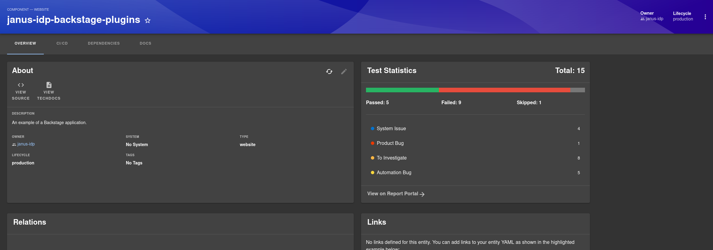

# Report Portal Plugin

Welcome to the report-portal plugin!

[ReportPortal](https://reportportal.io) is an open-source test automation dashboard that allows teams to manage and analyze test results from various test automation frameworks. It provides a centralized platform for aggregating test reports, offering real-time insights into test execution and helping to identify and address issues quickly.

The plugin integrates report portal instances to show projects and launches directly in backstage. This will be helpful for not just developers but also QEs

### Getting started

Your plugin has been added to the example app in this repository, meaning you'll be able to access it by running `yarn start` in the root directory, and then navigating to [/report-portal](http://localhost:3000/report-portal).

You can also serve the plugin in isolation by running `yarn start` in the plugin directory.
This method of serving the plugin provides quicker iteration speed and a faster startup and hot reloads.
It is only meant for local development, and the setup for it can be found inside the [/dev](./dev) directory.

### Prequisite

- To make this plugin work you need to install [report-portal-backend](../report-portal-backend/) plugin to backend package.
- To make the search bar work you need to install [search-module-report-portal](../search-backend-module-report-portal-collator/) plugin to backend package.

### Screenshots:

- Dashboard for each entity in backstage:

  - A card for overall statistics panel / donut on overview tab
    

  - **[WIP]** An entity tab that will show more detailed statistics for a specific launch.

- A page to show details for each instance such as projects and launches
  

## Installation:

- Run the following command in your backstage project

  ```shell
  yarn workspace app add @backstage-community/plugin-report-portal
  ```

- Now import the components

  - open `/packages/app/src/App.tsx` and add the following code

    ```ts
    import { ReportPortalGlobalPage } from '@backstage-community/plugin-report-portal';

    export const AppBase = () => {
      // In <FlatRoutes> add the following route
      <Route path="/report-portal" element={<ReportPortalGlobalPage />} />;
    };
    ```

  - open `/packages/app/src/components/Root/Root.tsx` and add the following code

    ```ts
    import { ReportPortalIcon } from '@backstage-community/plugin-report-portal';
    import { IconComponent } from '@backstage/core-plugin-api';
    //...
    //...
    export const Root = ({ children }: PropsWithChildren<{}>) => (
      <SidebarPage>

        <!-- Add the link to route in your sidebar component -->
        <SidebarItem icon={ReportPortalIcon as IconComponent} to="report-portal" text="Report Portal" />
      </SidebarPage>
    )
    ```

  - To add a card on overview tab of entity page, open `/packages/app/src/components/catalog/EntityPage.tsx` and add the following code:

    ```js
    import { ReportPortalOverviewCard } from '@backstage-community/plugin-report-portal';
    //...
    const overviewContent = (
      <Grid>

        <!-- add your card on overview -->
        <Grid item lg={4} md={6} xs={12}>
          <ReportPortalOverviewCard variant="gridItem" />
        </Grid>
      </Grid>
    );
    ```

- Add the below configuration to your `app-config.yaml` file

  ```yaml
  reportPortal:
    # Contact email template for support
    #  for example "mailto://example@company.com?subject=${subject}&body=${body}"
    #  where 'subject' and 'body' must be in url-encoded format
    supportEmailTemplate: ${REPORT_PORTAL_SUPPORT_MAIL}

    # Under integrations you can configure
    # multiple instances of report portal
    integrations:
      # host address of your instance
      # for e.g: report-portal.mycorp.com
      - host: ${REPORT_PORTAL_HOST}

        # Baser API url of your instance
        # for e.g: https://report-portal.mycorp.com/api/
        baseUrl: ${REPORT_PORTAL_BASE_URL}

        # Get the API key from profile page of your instance
        # for e.g: Bearer fae22be1-0000-0000-8392-de1635eed9f4
        token: ${REPORT_PORTAL_TOKEN}

        # (optional) Filter the projects by type
        # Default: "INTERNAL"
        filterType: 'INTERNAL'
  ```

## Annotations:

Add the below annotations to `catalog-info.yaml`

```yaml
metadata:
  annotations:
    reportportal.io/project-name: <your-project-name>
    reportportal.io/launch-name: <your-launch-name>

    # (optional) if host is not added in annotaions, first entry from app-config will be used
    reportportal.io/host: <your-report-portal-host>
```

## Acknowledgments

This project wouldn't have been possible without the help of the following contributors:

- Swapnil Jadhav
- Nancy Jain
- Shiwani Tummulwar
- Suriya Prakash
- Veerkumar Patil

Thank you for your invaluable contributions!
