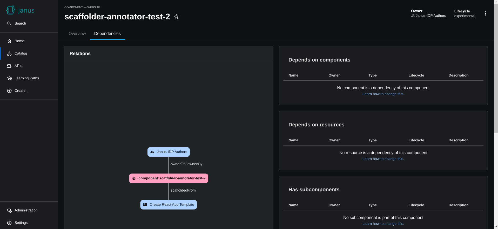
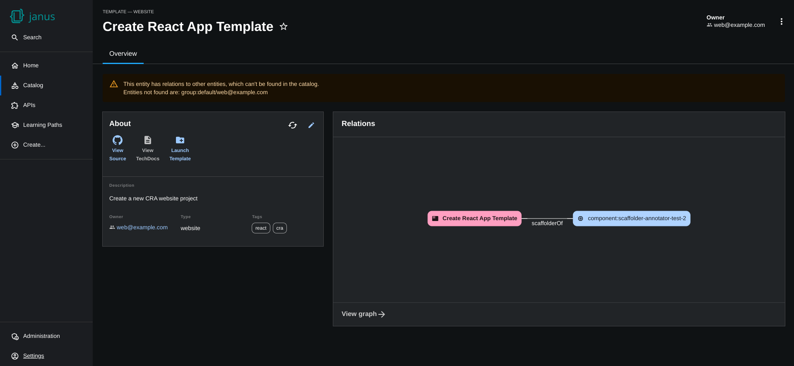
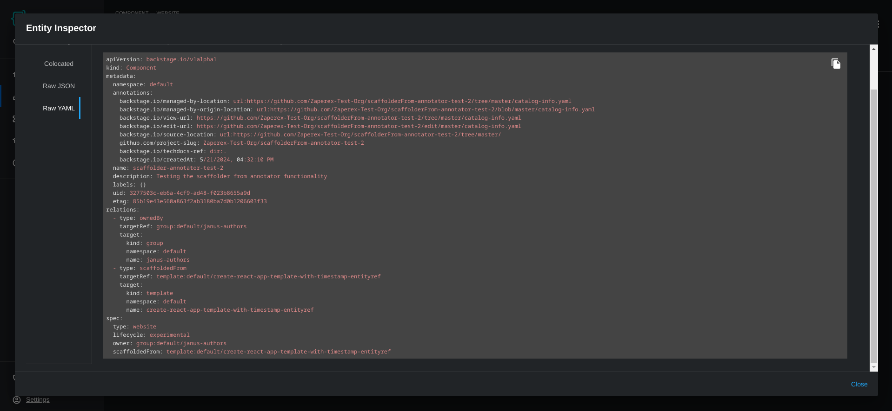
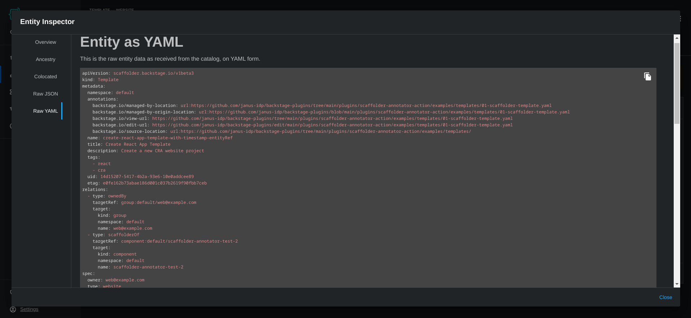

# Catalog Backend Module for Scaffolder Relation Catalog Processor

This is an extension module to the catalog-backend plugin, providing an additional catalog entity processor that adds a new relation that depends on the `spec.scaffoldedFrom` field to link scaffolder templates and the catalog entities they generated. Additionally, it includes a notification feature that automatically alerts entity owners when their scaffolder templates are updated.

## Getting Started

1. Install the scaffolder relation catalog processor module using the following command:

   ```console
   yarn workspace backend add @backstage-community/plugin-catalog-backend-module-scaffolder-relation-processor
   ```

   **Note**: If you plan to use the notification feature, you will also need to install and configure the notifications backend plugin:

   ```console
   yarn workspace backend add @backstage/plugin-notifications-backend
   ```

### Installing on the new backend system

To install this module into the [new backend system](https://backstage.io/docs/backend-system/), add the following into the `packages/backend/src/index.ts` file:

```ts title="packages/backend/src/index.ts"
const backend = createBackend();

// highlight-add-start
backend.add(
  import(
    '@backstage-community/plugin-catalog-backend-module-scaffolder-relation-processor'
  ),
);
// highlight-add-end

backend.start();
```

**For notification feature support**, also add the notifications backend module:

```ts title="packages/backend/src/index.ts"
// Add this import for notification support
backend.add(import('@backstage/plugin-notifications-backend'));
```

### Usage

Catalog entities containing the `spec.scaffoldedFrom` field will have a relation link be formed between it and the `template` corresponding to the entity ref in the `spec.scaffoldedFrom` field.

> [!NOTE]
> This plugin only processes entities that **already have** the `spec.scaffoldedFrom` field. It does not add this field to entities. If you are creating new entities through scaffolder templates and expect them to have scaffold relations, you need to ensure that the `spec.scaffoldedFrom` field is added during the scaffolding process.
> For automatic addition of the `spec.scaffoldedFrom` field, consider using the [`scaffolder-backend-module-annotator`](https://github.com/backstage/community-plugins/tree/main/workspaces/scaffolder-backend-module-annotator) plugin, which provides a `catalog:scaffolded-from` action that can be used in your scaffolder templates to automatically add this field to generated entities.

This link can be viewed in the `relations` field of the Raw YAML view of a catalog entity when inspecting an entity. In the entity with the `spec.scaffoldedFrom` field, the relation type is `scaffoldedFrom` with a target pointing to the value of the `spec.scaffoldedFrom` field. Conversely, for the target template, it will have a relation type of `ScaffolderOf` with a target pointing to the entity with the `spec.scaffoldedFrom` field.

These relations should also appear on the `EntityCatalogGraphView` component from the `@backstage/plugin-catalog-graph` package (only if the entity corresponding to the entity ref exists in the catalog).

#### Example graph view




#### Example Raw YAML view




## Template Update Notifications

This plugin includes a notification feature that automatically notifies entity owners when the scaffolder template used to create their entities has been updated to a new version. When a template update is detected, the plugin finds all entities that were scaffolded from that template (using the `spec.scaffoldedFrom` field) and notifies the owners of those entities.

### Prerequisites

To use the notification feature, you need to have the [`@backstage/plugin-notifications-backend`](https://github.com/backstage/backstage/tree/master/plugins/notifications-backend) Backstage plugin installed and configured.

### Configuration

Add the following configuration to your `app-config.yaml` to enable and customize the notification feature:

```yaml
scaffolder:
  notifications:
    templateUpdate:
      enabled: true # Set to false to disable notifications
```

Or, if you also wish to configure the notification title and description with custom text:

```yaml
scaffolder:
  notifications:
    templateUpdate:
      enabled: true # Set to false to disable notifications
      message:
        title: 'Custom title for $ENTITY_DISPLAY_NAME'
        description: 'Custom description'
```

#### Configuration Options

- `enabled` (boolean): Whether to enable template update notifications. Default: `false`
- `message.title` (string): The notification title. Supports `$ENTITY_DISPLAY_NAME` template variable. Default: `'$ENTITY_DISPLAY_NAME is out of sync with template'`
- `message.description` (string): The notification description. Supports `$ENTITY_DISPLAY_NAME` template variable. Default: `'The template used to create $ENTITY_DISPLAY_NAME has been updated to a new version. Review and update your entity to stay in sync with the template.'`

#### Template Variables

Both the title and description support the following template variables:

- `$ENTITY_DISPLAY_NAME`: The title (or name, in case title does not exist) of the entity that was scaffolded from the updated template

### Example Notification Flow

1. A scaffolder template `template:default/my-service-template` is updated from version `1.0.0` to `1.1.0`
2. The plugin detects this version change and emits a `relationProcessor.template:version_updated` event
3. The plugin queries the catalog for all entities with `spec.scaffoldedFrom: 'template:default/my-service-template'`
4. For each found entity, notifications are sent to all entities listed in the `ownedBy` relations
5. The notification includes a link to the entity's catalog page and the configured message

### Disabling Notifications

To disable the notification feature, set `scaffolder.notifications.templateUpdate.enabled` to `false` in your configuration, or simply omit the entire `scaffolder.notifications.templateUpdate` section from your config (notifications are disabled by default).
