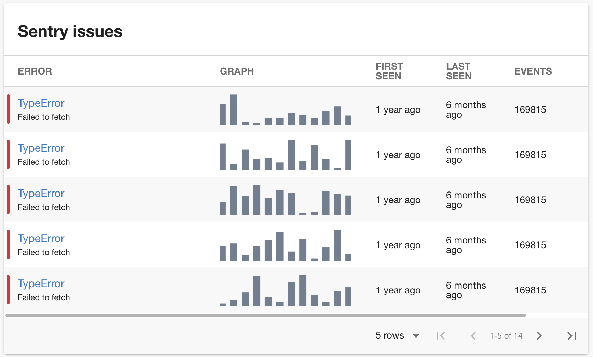

# Sentry Plugin

The Sentry Plugin displays issues from [Sentry](https://sentry.io).



## Getting Started

1. Install the Sentry Plugin:

```bash
# From your Backstage root directory
yarn --cwd packages/app add @backstage-community/plugin-sentry
```

2. Import the sentry card or content into the frontend. If using the standard Backstage frontend, follow step 2A, and if using
   the [new alpha frontend system](https://backstage.io/docs/frontend-system/), follow step 2B instead.

A. Add the `EntitySentryCard` to the EntityPage:

```jsx
// packages/app/src/components/catalog/EntityPage.tsx

import { EntitySentryCard } from '@backstage-community/plugin-sentry';

const overviewContent = (
  <Grid container spacing={3} alignItems="stretch">
    // ...
    <Grid item xs={12} sm={6} md={4}>
      <EntitySentryCard />
    </Grid>
    // ...
  </Grid>
);
```

> You can also import the full-page `EntitySentryContent` extension if you want to have a dedicated sentry page:
>
> ```tsx
> // packages/app/src/components/catalog/EntityPage.tsx
>
> import { EntitySentryContent } from '@backstage-community/plugin-sentry';
>
> const serviceEntityPage = (
>   <EntityLayout>
>     // ...
>     <EntityLayout.Route path="/sentry" title="Sentry">
>       <EntitySentryContent />
>     </EntityLayout.Route>
>     // ...
>   </EntityLayout>
> );
> ```

B. [Install the plugin](https://backstage.io/docs/frontend-system/building-apps/index#install-features-manually) by updating `App.tsx` to include the plugin in the features block during app creation:

```tsx
// packages/app/src/App.tsx
import { createApp } from '@backstage/frontend-app-api';
import sentryPlugin from '@axis-backstage/plugin-sentry/alpha';

...
const app = createApp({
  features: [
    ...,
    sentryPlugin,
    ],
});
export default app.createRoot();
```

3. Add the proxy config:

```yaml
# app-config.yaml

proxy:
  '/sentry/api':
    target: https://sentry.io/api/
    allowedMethods: ['GET']
    headers:
      Authorization: Bearer ${SENTRY_TOKEN}

sentry:
  organization: <your-organization>
```

4. Create a new internal integration with the permissions `Issues & Events: Read` (https://docs.sentry.io/product/integrations/integration-platform/) and provide it as `SENTRY_TOKEN` as env variable.

5. Add the `sentry.io/project-slug` annotation to your catalog-info.yaml file:

```yaml
apiVersion: backstage.io/v1alpha1
kind: Component
metadata:
  name: backstage
  description: |
    Backstage is an open-source developer portal that puts the developer experience first.
  annotations:
    sentry.io/project-slug: YOUR_PROJECT_SLUG
spec:
  type: library
  owner: CNCF
  lifecycle: experimental
```

### Demo Mode

The plugin provides a MockAPI that always returns dummy data instead of talking to the sentry backend.
You can add it by overriding the `sentryApiRef`:

```ts
// packages/app/src/apis.ts

import { createApiFactory } from '@backstage/core-plugin-api';
import {
  MockSentryApi,
  sentryApiRef,
} from '@backstage-community/plugin-sentry';

export const apis = [
  // ...

  createApiFactory(sentryApiRef, new MockSentryApi()),
];
```

If using the [new frontend system](<(https://backstage.io/docs/frontend-system/)>), then use the mock api by modifying App.tsx instead;

```ts
// packages/app/src/App.tsx

import {
  createApiFactory,
  createExtensionOverrides,
  ApiBlueprint,
} from '@backstage/frontend-plugin-api';
import {
  MockSentryApi,
  sentryApiRef,
} from '@backstage-community/plugin-sentry';
import sentryPlugin from '@axis-backstage/plugin-sentry/alpha';


const sentryMockApi = ApiBlueprint.make({
  name: 'sentry',
  params: {
    factory: createApiFactory({
      api: sentryApiRef,
      deps: {},
      factory: () => new MockSentryApi(),
    }),
  },
});

const app = createApp({
  features: [
    ...,
    sentryPlugin,
    createExtensionOverrides({
      extensions: [
        sentryMockApi,
      ],
    }),
    ],
});
...
```
