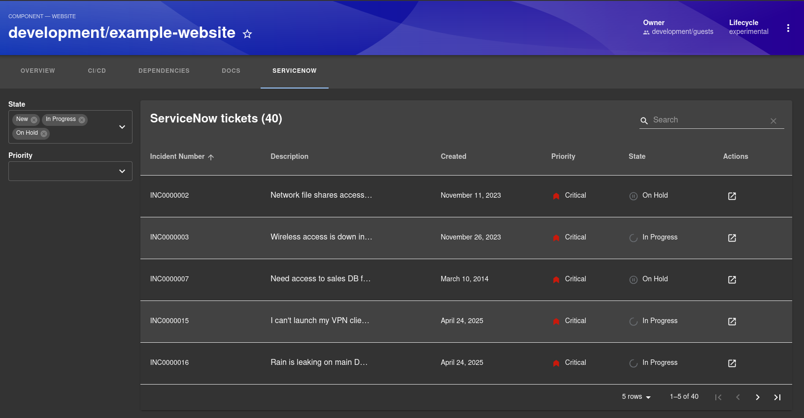

# ServiceNow Plugin for Backstage

This plugin integrates [ServiceNow](https://www.servicenow.com/) with Backstage, enabling users to view and interact with ServiceNow incident data directly from entity pages in the catalog.

## Features

- Displays "ServiceNow" incident tab, related to a specific entity.
- Supports a "My ServiceNow Tickets" tab, showing incidents for the logged-in user.

## Screenshot

Software Catalog integration:



## Link Backstage Entities to ServiceNow Incidents

To associate a ServiceNow incident with a Backstage entity, ensure your ServiceNow incident table includes a custom field named `Backstage entity id`.

**Required setup in ServiceNow:**

- **Field name (system ID):** `u_backstage_entity_id`
- **Field label (display name):** `Backstage entity id`
- **Data type:** String
- **Value example:** `my-servicenow-entity-id`

Refer to [Configuration](./Configuration.md) for detailed backend configuration instructions.

### Annotations

To enable ServiceNow integration for an entity, add the following annotation to its metadata:

```yaml
metadata:
  annotations:
    servicenow.com/entity-id: my-servicenow-entity-id # has to match the value defined in the incident ticket `u_backstage_entity_id` field
```

### Condition Functions

The plugin includes a `isServicenowAvailable` function to check if the ServiceNow annotation is specified on a software catalog entity.

There is a second condition (`isMyProfile`) that checks whether the current entity matches the logged-in user's entity reference.

This can be used to show "My ServiceNow Tickets" only on a user's own profile page.

> **Note**: The plugin stores the user's `userEntityRef` in `localStorage` at runtime to support this check.

## Backend plugin configuration

```yaml
servicenow:
  instanceUrl: ${SERVICENOW_BASE_URL}
  basicAuth:
    username: ${SERVICENOW_USERNAME}
    password: ${SERVICENOW_PASSWORD}
```
