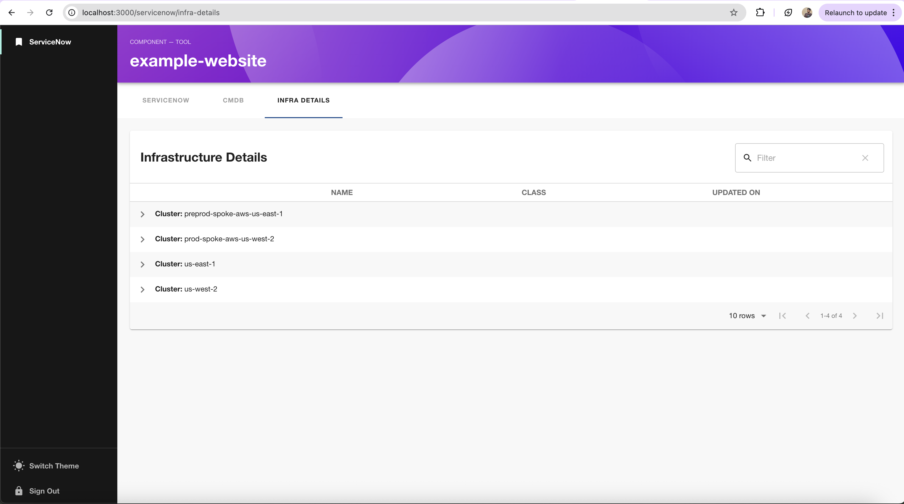

# ServiceNow Frontend Plugin

This is the frontend implementation of the ServiceNow plugin for Backstage.

Together with its backend this plugin can show incident data for catalog entities and integrates with the CMDB plugin to provide comprehensive ServiceNow information.

## Features

- 📊 **Incident Management**: View and track ServiceNow incidents directly in Backstage
- 🗂️ **CMDB Integration**: Access Configuration Management Database information
- 👤 **User-specific Views**: Show personalized ServiceNow tickets for logged-in users
- 🔗 **Deep Linking**: Direct links to ServiceNow forms and tickets
- 📱 **Responsive Design**: Works seamlessly across different screen sizes

## Screenshots

Software Catalog integration with incident data:


CMDB service details integration:


Infrastructure details view:



## Installation

1. **Install the frontend dependency**:

   ```bash
   # From your Backstage root directory
   yarn --cwd packages/app add @backstage-community/plugin-servicenow
   ```

2. **Add components to your app** (classic frontend system):

   Open `packages/app/src/components/catalog/EntityPage.tsx` and add these imports:

   ```tsx
   import {
     EntityServicenowContent,
     isServicenowAvailable,
     isMyProfile,
   } from '@backstage-community/plugin-servicenow';
   ```

   Then add the following **route** to the `serviceEntityPage`, `websiteEntityPage`,
   and `defaultEntityPage` to show a ServiceNow tab if the annotation is configured:

   ```tsx
   <EntityLayout.Route
     path="/servicenow"
     title="ServiceNow"
     if={isServicenowAvailable}
   >
     <EntityServicenowContent />
   </EntityLayout.Route>
   ```

   You can also add a "My ServiceNow Tickets" tab to the `userEntity`.
   The `isMyProfile` condition shows this tab only for the entity of the current user:

   ```tsx
   <EntityLayout.Route path="/servicenow" title="ServiceNow" if={isMyProfile}>
     <EntityServicenowContent />
   </EntityLayout.Route>
   ```

3. Or, if you're using the **new frontend system**:

   In your `packages/app/src/App.tsx` add the plugin to your `createApp` `features` list:

   ```tsx
   import servicenowPlugin from '@backstage-community/plugin-servicenow/alpha';

   // ...
   export default createApp({
     features: [..., servicenowPlugin],
   });
   ```

## Configuration

### Basic ServiceNow Integration

To enable ServiceNow integration for an entity, add the following annotation to its metadata:

```yaml
metadata:
  annotations:
    servicenow.com/entity-id: my-servicenow-entity-id # has to match the value defined in the incident ticket `u_backstage_entity_id` field
```

### CMDB Integration

For CMDB (Configuration Management Database) integration, you can also install the companion CMDB plugin:

```bash
# Install the CMDB plugin (if available)
yarn --cwd packages/app add @backstage-community/backstage-plugin-cmdb
```

The CMDB plugin works seamlessly with the ServiceNow plugin to provide comprehensive configuration management data alongside incident information.

### Advanced Configuration

For more detailed configuration options including:

- Backend setup and authentication
- Custom field mappings
- API endpoints configuration
- Security settings

Please refer to the [General Documentation](../../docs/index.md) and [Configuration Guide](../../docs/Configuration.md).

## Development

1. Install dependencies with `yarn install`
2. Start the Backstage dev app with `yarn start`

Your plugin has been added to the example app in this `plugins/servicenow` directory, meaning you'll be able to access it by running `yarn start` in the current directory, and then navigating to [/servicenow](http://localhost:3000/servicenow).

## Troubleshooting

### Common Issues

**Plugin not showing up in entity pages:**

- Verify the `servicenow.com/entity-id` annotation is correctly set
- Check that the backend plugin is properly configured and running
- Ensure the entity type supports the ServiceNow tab (service, website, or default entities)

**Authentication errors:**

- Confirm ServiceNow backend credentials are correctly configured
- Check network connectivity to your ServiceNow instance
- Verify API permissions for the configured ServiceNow user

**Missing data or empty tables:**

- Ensure the `u_backstage_entity_id` field in ServiceNow matches your entity annotation
- Check ServiceNow API endpoints are accessible and returning data
- Verify field mappings in the backend configuration

### Getting Help

- Check the [main documentation](../../docs/index.md) for setup guides
- Review the [configuration documentation](../../docs/Configuration.md) for advanced options
- For issues and feature requests, visit the [GitHub repository](https://github.com/backstage/community-plugins)

## Contributing

We welcome contributions! Please see the [contributing guidelines](../../../../CONTRIBUTING.md) for more information on how to get involved.

## License

This plugin is licensed under the Apache License 2.0. See the [LICENSE](../../../../LICENSE) file for details.
