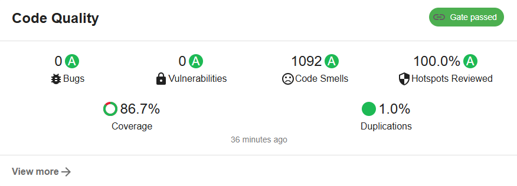
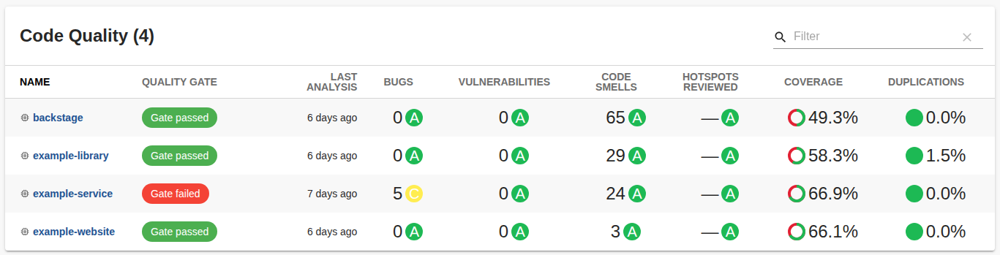

# SonarQube Plugin

The SonarQube Plugin displays code statistics from [SonarCloud](https://sonarcloud.io) or [SonarQube](https://sonarqube.com).




## Getting Started

1. Install the SonarQube Plugin:

```bash
# From your Backstage root directory
yarn --cwd packages/app add @backstage-community/plugin-sonarqube @backstage-community/plugin-sonarqube-react
```

2. Add the `EntitySonarQubeCard` to the EntityPage:

```diff
  // packages/app/src/components/catalog/EntityPage.tsx
+ import { EntitySonarQubeCard } from '@backstage-community/plugin-sonarqube';
+ import { isSonarQubeAvailable } from '@backstage-community/plugin-sonarqube-react';

 ...

 const overviewContent = (
   <Grid container spacing={3} alignItems="stretch">
     <Grid item md={6}>
       <EntityAboutCard variant="gridItem" />
     </Grid>
+    <EntitySwitch>
+      <EntitySwitch.Case if={isSonarQubeAvailable}>
+        <Grid item md={6}>
+          <EntitySonarQubeCard variant="gridItem" />
+        </Grid>
+      </EntitySwitch.Case>
+    </EntitySwitch>
   </Grid>
 );
```

The "Read more" link that shows in the MissingAnnotationEmptyState is also configurable.

```diff
  // packages/app/src/components/catalog/EntityPage.tsx
+ import { EntitySonarQubeCard } from '@backstage-community/plugin-sonarqube';

+ const MISSING_ANNOTATION_READ_MORE_URL = 'https://backstage.io/docs/features/software-catalog/descriptor';

 ...

 const overviewContent = (
   <Grid container spacing={3} alignItems="stretch">
     <Grid item md={6}>
       <EntityAboutCard variant="gridItem" />
     </Grid>
+    <Grid item md={6}>
+      <EntitySonarQubeCard variant="gridItem" missingAnnotationReadMoreUrl={MISSING_ANNOTATION_READ_MORE_URL} />
+    </Grid>
   </Grid>
 );
```

3. Add the `SonarQubeRelatedEntitiesOverview` to the EntityPage:

```diff
  // packages/app/src/components/catalog/EntityPage.tsx
+ import { SonarQubeRelatedEntitiesOverview } from '@backstage-community/plugin-sonarqube';

 ...

 const systemPage = (
   <EntityLayout>

 ...

+    <EntityLayout.Route path="/sonarqube" title="Code Quality">
+      <SonarQubeRelatedEntitiesOverview relationType={RELATION_HAS_PART} entityKind="component" />
+    </EntityLayout.Route>
+
   </EntityLayout>
 );
```

4. Run the following commands in the root folder of the project to install and compile the changes.

```yaml
yarn install
yarn tsc
```

5. Add the `sonarqube.org/project-key` annotation to the `catalog-info.yaml` file of the target repo for which code quality analysis is needed.

```yaml
apiVersion: backstage.io/v1alpha1
kind: Component
metadata:
  name: backstage
  description: |
    Backstage is an open-source developer portal that puts the developer experience first.
  annotations:
    sonarqube.org/project-key: YOUR_INSTANCE_NAME/YOUR_PROJECT_KEY
spec:
  type: library
  owner: CNCF
  lifecycle: experimental
```

`YOUR_INSTANCE_NAME/` is optional and will query the default instance if not provided.

## Configuration

The card shows the technical debt (`sqale_index`) as a work duration, the way SonarQube shows it on the project page. SonarQube turns those minutes into days using the working day set by `sonar.technicalDebt.hoursInDay`, which defaults to 8 hours. That setting is not exposed over the web API, so if your instance uses a different working day, set the same value here to keep both readings in sync:

```yaml
sonarqube:
  technicalDebt:
    hoursInDay: 6 # defaults to 8
```

## New Frontend System

### Setup

If you're using [feature discovery](https://backstage.io/docs/frontend-system/architecture/app/#feature-discovery),
the plugin will be automatically discovered and enabled.

Otherwise, you can manually enable the plugin by adding it to your app:

```tsx
// packages/app/src/App.tsx
import sonarqubePlugin from '@backstage-community/plugin-sonarqube/alpha';

const app = createApp({
  features: [
    // ...
    sonarqubePlugin,
  ],
});
```

### Extensions

The following extensions are available in the plugin:

- `api:sonarqube/sonarqube-api`
- `entity:sonarqube/entity-sonarqube-card`
- `entity:sonarqube/sonarqube-related-entities-overview`

### Legacy Frontend System

When using the legacy frontend system, customize through component props:

- **`EntitySonarQubeCard`** - Props: `variant`, `missingAnnotationReadMoreUrl`, `duplicationRatings`
- **`SonarQubeRelatedEntitiesOverview`** - Props: `relationType`, `entityKind`
- **`EntitySonarQubeContentPage`** - Props: `title`, `supportTitle`, `missingAnnotationReadMoreUrl`

Example:

```tsx
<EntitySonarQubeCard
  variant="gridItem"
  missingAnnotationReadMoreUrl="https://your-docs-url.com"
/>
```

### Integrating with `EntityPage` (New Frontend System)

Follow this section if you are using Backstage's [new frontend system](https://backstage.io/docs/frontend-system/).

Import `sonarQubePlugin` in your `App.tsx` and add it to your app's `features` array:

```typescript
import sonarQubePlugin from '@backstage-community/plugin-sonarqube/alpha';

// ...

export const app = createApp({
  features: [
    // ...
    sonarQubePlugin,
    // ...
  ],
});
```

## Links

- [Sonarqube Backend](../sonarqube-backend/README.md)
