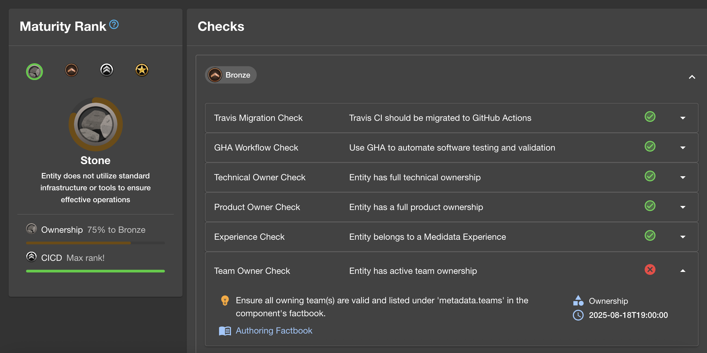

# Tech Insights Maturity

Tech Insights Maturity helps teams see where their services stand and get actionable steps for improving them. This plugin introduces maturity rankings and categories into your checks.

## Maturity Ranks

Maturity Ranks are assigned to components based on their fulfillment of their required Maturity Checks associated with each Rank.

These are the currently available Maturity Ranks:

 **Stone**: Default, base-level rank. Components with this Rank are failing one or more Bronze-level Check.

 **Bronze**: Components with this Rank have fulfilled all Bronze-level Checks.

 **Silver**: Components with this Rank have fulfilled all Bronze- and Silver-level Checks.

 **Gold**: Components with this Rank have fulfilled all Bronze-, Silver-, and Gold-level Checks.

## Installation

### Install the plugin

```bash
# From your Backstage root directory
yarn --cwd packages/app add @backstage-community/plugin-tech-insights-maturity
```

### Add Maturity Summary Card to the entity overview page:

If you want to show Maturity Summary in the overview of any entity use `EntityMaturitySummaryCard`.
Note: This applies to all types of entity.


```tsx
// packages/app/src/components/catalog/EntityPage.tsx

import { EntityMaturitySummaryCard } from '@backstage-community/plugin-tech-insights-maturity';

const overviewContent = (
  <Grid container spacing={3} alignItems="stretch">
    {entityWarningContent}
    <Grid item md={3} xs={6}>
      <EntityAboutCard variant="gridItem" />
    </Grid>
    <Grid item md={3} xs={6}>
      <EntityCatalogGraphCard variant="gridItem" height={400} />
    </Grid>
    ...
    <Grid item md={3} xs={6}>
      <EntityMaturitySummaryCard />
    </Grid>
  </Grid>
);
```

### Add Maturity Checks overview (Maturity Scorecards) page to the any Component EntityPage:

Note: This only applies to entities of Kind: 'Component'



```tsx
// packages/app/src/components/catalog/EntityPage.tsx

import { EntityMaturityScorecardContent } from '@backstage-community/plugin-tech-insights-maturity';

const componentEntityPage = (
  <EntityLayoutWrapper>
    <EntityLayout.Route path="/" title="Overview">
      {overviewContent}
    </EntityLayout.Route>
    <EntityLayout.Route path="/ci-cd" title="CI/CD">
      {cicdContent}
    </EntityLayout.Route>
    ...
    <EntityLayout.Route path="/maturity" title="Maturity">
      <EntityMaturityScorecardContent />
    </EntityLayout.Route>
    ...
  </EntityLayoutWrapper>
);
```

### Add Maturity Summary overview page to System/Domain/Group:

Note: This only applies to entities of Kind: 'System', 'Domain', or 'Group'


```tsx
// packages/app/src/components/catalog/EntityPage.tsx

import { EntityMaturitySummaryContent } from '@backstage-community/plugin-tech-insight-maturity';

const systemEntityPage = (
  <EntityLayoutWrapper>
    <EntityLayout.Route path="/" title="Overview">
      {overviewContent}
    </EntityLayout.Route>
    ...
    <EntityLayout.Route path="/maturity" title="Maturity">
      <EntityMaturitySummaryContent />
    </EntityLayout.Route>
    ...
  </EntityLayoutWrapper>
);
```

### Add Maturity page:


First make the Maturity page available as route

```tsx
// packages/app/src/App.tsx

import { MaturityPage } from '@backstage-community/plugin-tech-insights-maturity';

const routes = (
  <FlatRoutes>
    ...
    <Route path="/maturity" element={<MaturityPage />} />
  </FlatRoutes>
);
```

Then add it to the navigation menu

```tsx
// packages/app/src/components/Root/Root.tsx

import EmojiObjectsIcon from '@material-ui/icons/EmojiObjects';

export const Root = ({ children }: PropsWithChildren<{}>) => (
  ...
  <SidebarItem icon={EmojiObjectsIcon} to="maturity" text="Maturity" />
  ...
);
```

## Compatibility!!

This module is based on the existing Tech Insights Plugin and should be compatible with any existing implementations of [tech-insights-backend](../../../tech-insights/plugins/tech-insights-backend/README.md) or [tech-insights-backend-module-jsonfc](../../../tech-insights/plugins/tech-insights-backend-module-jsonfc/README.md).

If you don't have any existing Tech Insights implementation, make sure to set it up first before you can use this frontend plugin.

After configuring your backend, add Maturity Metadata to all of your checks!

Sample check written in app-config:

```yaml title="app-config.yaml"
techInsights:
  factRetrievers: ...
  factChecker:
    checks:
      groupOwnerCheck:
        ...
        metadata:
          category: 'Ownership',
          rank: 1, // rank values: Bronze - 1, Silver - 2, Gold - 3
          solution: 'Add a group owner to spec.owner field in the factbook',
```

Sample check written in TS

```ts
export const groupOwnerCheck = {
  ...,
  metadata: {
    category: 'Ownership',
    rank: 1, // rank values: Bronze - 1, Silver - 2, Gold - 3
    solution: 'Add a group owner to spec.owner field in the factbook',
  },
};
```
