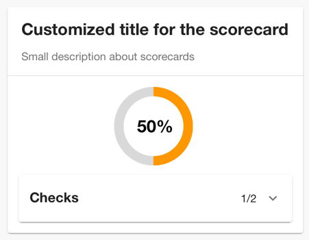
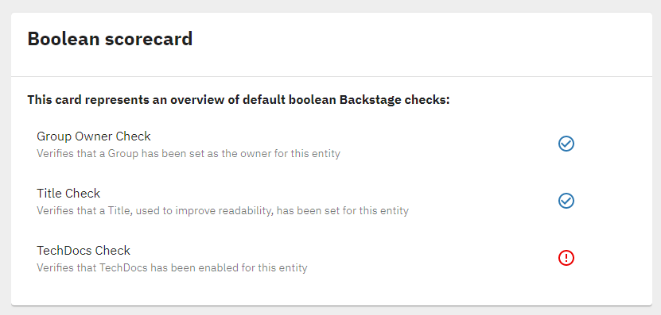
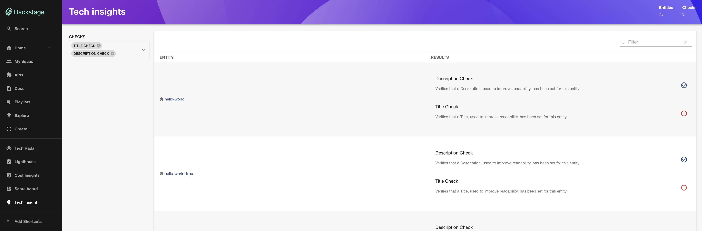
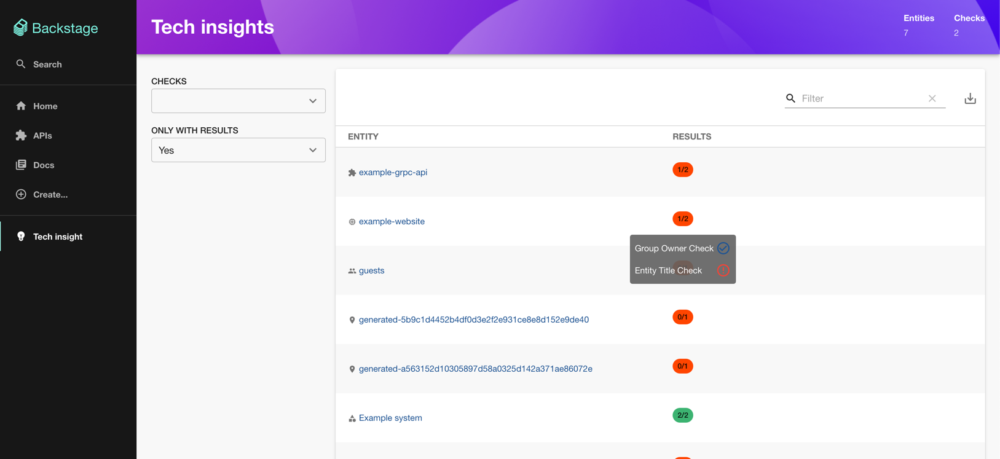

# Tech Insights

This plugin provides the UI for the `@backstage/tech-insights-backend` plugin, in order to display results of the checks running following the rules and the logic defined in the `@backstage/tech-insights-backend` plugin itself.

Main areas covered by this plugin currently are:

- Providing an overview for default boolean checks in a form of Scorecards.
- Providing an option to render different custom components based on type of the checks running in the backend.

## Installation

### Install the plugin

```bash
# From your Backstage root directory
yarn --cwd packages/app add @backstage-community/plugin-tech-insights
```

### Add boolean checks overview (Scorecards) page to the EntityPage

```tsx
// packages/app/src/components/catalog/EntityPage.tsx

import { EntityTechInsightsScorecardContent } from '@backstage-community/plugin-tech-insights';

const serviceEntityPage = (
  <EntityLayoutWrapper>
    <EntityLayout.Route path="/" title="Overview">
      {overviewContent}
    </EntityLayout.Route>
    <EntityLayout.Route path="/ci-cd" title="CI/CD">
      {cicdContent}
    </EntityLayout.Route>
    ...
    <EntityLayout.Route path="/tech-insights" title="Scorecards">
      <EntityTechInsightsScorecardContent
        title="Customized title for the scorecard"
        description="Small description about scorecards"
      />
    </EntityLayout.Route>
    ...
  </EntityLayoutWrapper>
);
```

It is obligatory to pass `title` prop to `EntityTechInsightsScorecardContent`, `description` prop is optional.

If you like to display multiple cards in a `EntityLayout.Route` use `EntityTechInsightsScorecardCard`.

You can pass an array `checksId` as a prop with the [Fact Retrievers ids](../tech-insights-backend#creating-fact-retrievers) to limit which checks you want to show in this card. If you don't pass, the default value is show all checks.

```tsx
<EntityTechInsightsScorecardContent
  title="Show only simpleTestCheck in this card"
  checksId={['simpleTestCheck']}
/>
```

You can also pass a `filter` function to both `EntityTechInsightsScorecardContent` and `EntityTechInsightsScorecardCard` which filters in/out check result after they have been fetched. This can be useful to filter by more logical conditions on fields like `id` or `name`, e.g. the first characters in a name.

To only show failed checks, you can pass the boolean `onlyFailed` to these components.

If you prefer a condensed list (with smaller text size and less padding) in `EntityTechInsightsScorecardContent`, you can pass the boolean `dense`.

If you want to show checks in the overview of an entity use `EntityTechInsightsScorecardCard`.

```tsx
// packages/app/src/components/catalog/EntityPage.tsx

import { EntityTechInsightsScorecardCard } from '@backstage-community/plugin-tech-insights';

const overviewContent = (
  <Grid container spacing={3} alignItems="stretch">
    {entityWarningContent}
    <Grid item md={6} xs={12}>
      <EntityAboutCard variant="gridItem" />
    </Grid>
    <Grid item md={6} xs={12}>
      <EntityCatalogGraphCard variant="gridItem" height={400} />
    </Grid>
    ...
    <Grid item md={8} xs={12}>
      <EntityTechInsightsScorecardCard
        title="Customized title for the scorecard"
        description="Small description about scorecards"
        checksId={['simpleTestCheck']}
      />
    </Grid>
  </Grid>
);
```

If you want to display checks as a gauge visualization, pass the boolean `gauge` to `EntityTechInsightsScorecardCard`.

```tsx
// packages/app/src/components/catalog/EntityPage.tsx

import { EntityTechInsightsScorecardCard } from '@backstage-community/plugin-tech-insights';

const overviewContent = (
  <Grid container spacing={3} alignItems="stretch">
    ...
    <Grid item md={4}>
      <EntityTechInsightsScorecardCard
        title="Customized title for the scorecard"
        description="Small description about scorecards"
        gauge
      />
    </Grid>
  </Grid>
);
```



## Boolean Scorecard Example

If you follow the [Backend Example](../tech-insights-backend#backend-example), once the needed facts have been generated the default boolean scorecard will look like this:



### Add overview (Scorecards) page



First make the Scorecard page available as route

```tsx
// packages/app/src/App.tsx

import { TechInsightsScorecardPage } from '@backstage-community/plugin-tech-insights';

const routes = (
  <FlatRoutes>
    ...
    <Route path="/tech-insights" element={<TechInsightsScorecardPage />} />
  </FlatRoutes>
);
```

To show a condensed list (with smaller text size and less padding), you can pass the boolean `dense`.

If you want to display checks as a badge visualization, pass the boolean `badge` to `TechInsightsScorecardPage`.



Then add it to the navigation menu

```tsx
// packages/app/src/components/Root/Root.tsx

import EmojiObjectsIcon from '@material-ui/icons/EmojiObjects';

export const Root = ({ children }: PropsWithChildren<{}>) => (
  ...
  <SidebarItem icon={EmojiObjectsIcon} to="tech-insights" text="Tech insight" />
  ...
);
```

## Custom views rendering tech-insights results

The `@backstage-community/plugin-tech-insights-react` package contains reusable frontend components for rendering tech-insights results, along with a reference implementation (techInsightsApiRef) for the tech-insights api. See the [README](../tech-insights-react/README.md) for more information.
