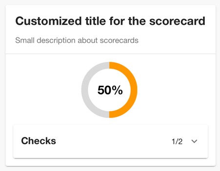
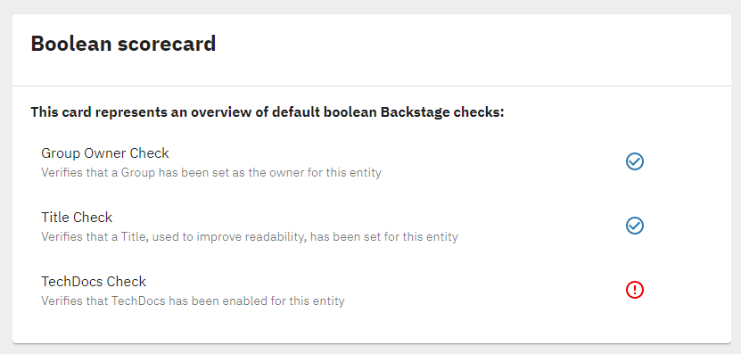
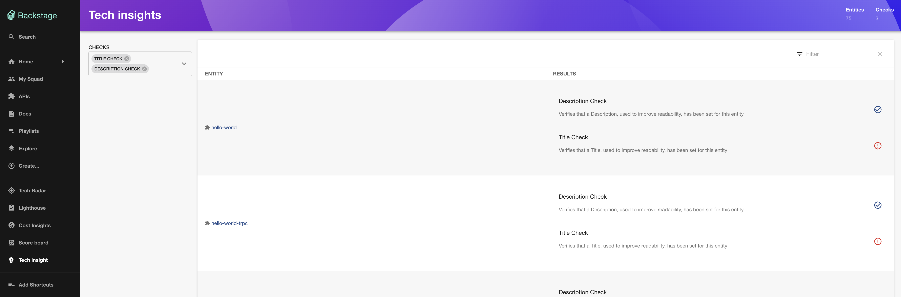
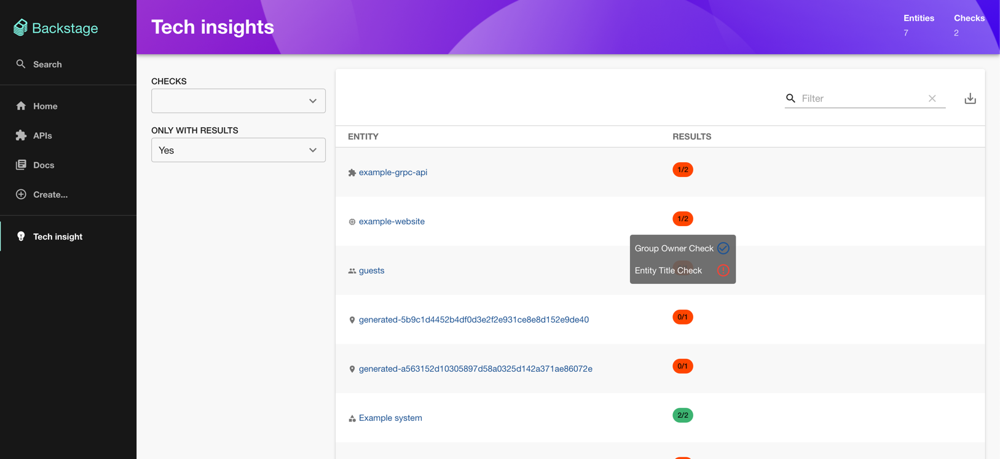

# Tech Insights

This plugin provides the UI for the `@backstage/tech-insights-backend` plugin, in order to display results of the checks running following the rules and the logic defined in the `@backstage/tech-insights-backend` plugin itself.

Main areas covered by this plugin currently are:

- Providing an overview for default boolean checks in a form of Scorecards.
- Providing an option to render different custom components based on type of the checks running in the backend.

## Installation

### Install the plugin

```bash
# From your Backstage root directory
yarn --cwd packages/app add @backstage-community/plugin-tech-insights
```

### Integrating with the New Frontend System

If you are using Backstage's [new frontend system](https://backstage.io/docs/frontend-system/), the plugin will be auto-discovered and automatically register:

- The Tech Insights API
- The Scorecards page at `/tech-insights`
- Entity content for displaying scorecards on entity pages
- Entity cards for displaying scorecards in entity overview

#### Creating custom scorecards with TechInsightsScorecardBlueprint

The `TechInsightsScorecardBlueprint` allows you to create custom scorecard content that can be filtered to specific entities. This is useful when you want different scorecards to appear for different entity types or based on entity metadata. The `entityFilter` parameter uses the same entity predicate format as other Backstage entity filters, allowing you to match on `kind`, `metadata`, `spec` fields, and more.

```ts
import { createFrontendModule } from '@backstage/frontend-plugin-api';
import { TechInsightsScorecardBlueprint } from '@backstage-community/plugin-tech-insights-react/alpha';

// In this example, all API entities would get the first scorecard, but only the production APIs would get the second scorecard.
const techInsightsModule = createFrontendModule({
  pluginId: 'tech-insights',
  extensions: [
    TechInsightsScorecardBlueprint.make({
      name: 'apis',
      params: {
        entityFilter: { kind: 'api' },
        title: 'API Scorecard',
        description: 'Checks specific to API entities',
        checkIds: ['apiDefinitionCheck'],
      },
    }),
    TechInsightsScorecardBlueprint.make({
      name: 'production-apis',
      params: {
        entityFilter: { kind: 'api', 'spec.lifecycle': 'production' },
        title: 'Production API Scorecard',
        checkIds: ['groupOwnerCheck', 'productionReadinessCheck'],
      },
    }),
  ],
});
```

> **Note:** As soon as one or more `TechInsightsScorecardBlueprint` extensions are registered, the default "all checks" scorecard is no longer rendered on the Tech Insights tab. Only scorecards whose `entityFilter` matches the current entity are shown, so entity kinds that do not match any filter will see an empty Tech Insights tab. If you want to keep a generic scorecard alongside kind-specific ones, register an additional scorecard without an `entityFilter` (or with a catch-all filter) to act as the default:
>
> ```ts
> TechInsightsScorecardBlueprint.make({
>   name: 'default',
>   params: {
>     title: 'Scorecards',
>     // No entityFilter, so this scorecard is shown for every entity.
>   },
> }),
> ```

#### Configuring the Tech Insights tab via app-config

The Tech Insights entity tab is provided by the `entity-content:tech-insights/scorecards-content` extension. You can configure or disable it from `app-config.yaml` like any other extension in the new frontend system.

To customize the tab title or path, and (when no `TechInsightsScorecardBlueprint` extensions are registered) the fallback scorecard's title, description, default checks, and density:

```yaml
app:
  extensions:
    - entity-content:tech-insights/scorecards-content:
        config:
          title: My Scorecards
          description: Check compliance status
          checkIds: ['groupOwnerCheck']
          dense: false
```

> **Note:** The `description`, `checkIds`, and `dense` config fields only apply to the built-in fallback scorecard that is rendered when no `TechInsightsScorecardBlueprint` extensions are registered. As soon as any scorecard blueprint is registered, scorecard rendering is driven by the blueprint's own `params` (and the matching extension's `config` overrides), and these fallback config fields are ignored. The `title` field continues to control the tab label in either case.

To completely hide the Tech Insights tab from entity pages:

```yaml
app:
  extensions:
    - entity-content:tech-insights/scorecards-content: false
```

#### Configuring the Tech Insights overview card via app-config

A scorecards overview card is also auto-registered on entity overview pages via the `entity-card:tech-insights/scorecards` extension. To disable it:

```yaml
app:
  extensions:
    - entity-card:tech-insights/scorecards: false
```

### Integrating with the Legacy Frontend System

The following sections describe how to integrate the plugin with the legacy frontend system.

#### Add boolean checks overview (Scorecards) page to the EntityPage

```tsx
// packages/app/src/components/catalog/EntityPage.tsx

import { EntityTechInsightsScorecardContent } from '@backstage-community/plugin-tech-insights';

const serviceEntityPage = (
  <EntityLayoutWrapper>
    <EntityLayout.Route path="/" title="Overview">
      {overviewContent}
    </EntityLayout.Route>
    <EntityLayout.Route path="/ci-cd" title="CI/CD">
      {cicdContent}
    </EntityLayout.Route>
    ...
    <EntityLayout.Route path="/tech-insights" title="Scorecards">
      <EntityTechInsightsScorecardContent
        title="Customized title for the scorecard"
        description="Small description about scorecards"
      />
    </EntityLayout.Route>
    ...
  </EntityLayoutWrapper>
);
```

It is obligatory to pass `title` prop to `EntityTechInsightsScorecardContent`, `description` prop is optional.

If you like to display multiple cards in a `EntityLayout.Route` use `EntityTechInsightsScorecardCard`.

You can pass an array `checksId` as a prop with the [Fact Retrievers ids](../tech-insights-backend#creating-fact-retrievers) to limit which checks you want to show in this card. If you don't pass, the default value is show all checks.

```tsx
<EntityTechInsightsScorecardContent
  title="Show only simpleTestCheck in this card"
  checksId={['simpleTestCheck']}
/>
```

You can also pass a `filter` function to both `EntityTechInsightsScorecardContent` and `EntityTechInsightsScorecardCard` which filters in/out check result after they have been fetched. This can be useful to filter by more logical conditions on fields like `id` or `name`, e.g. the first characters in a name.

To only show failed checks, you can pass the boolean `onlyFailed` to these components.

If you prefer a condensed list (with smaller text size and less padding) in `EntityTechInsightsScorecardContent`, you can pass the boolean `dense`.

If you want to show checks in the overview of an entity use `EntityTechInsightsScorecardCard`.

```tsx
// packages/app/src/components/catalog/EntityPage.tsx

import { EntityTechInsightsScorecardCard } from '@backstage-community/plugin-tech-insights';

const overviewContent = (
  <Grid container spacing={3} alignItems="stretch">
    {entityWarningContent}
    <Grid item md={6} xs={12}>
      <EntityAboutCard />
    </Grid>
    <Grid item md={6} xs={12}>
      <EntityCatalogGraphCard height={400} />
    </Grid>
    ...
    <Grid item md={8} xs={12}>
      <EntityTechInsightsScorecardCard
        title="Customized title for the scorecard"
        description="Small description about scorecards"
        checksId={['simpleTestCheck']}
      />
    </Grid>
  </Grid>
);
```

If you want to display checks as a gauge visualization, pass the boolean `gauge` to `EntityTechInsightsScorecardCard`.

```tsx
// packages/app/src/components/catalog/EntityPage.tsx

import { EntityTechInsightsScorecardCard } from '@backstage-community/plugin-tech-insights';

const overviewContent = (
  <Grid container spacing={3} alignItems="stretch">
    ...
    <Grid item md={4}>
      <EntityTechInsightsScorecardCard
        title="Customized title for the scorecard"
        description="Small description about scorecards"
        gauge
      />
    </Grid>
  </Grid>
);
```



## Boolean Scorecard Example

If you follow the [Backend Example](../tech-insights-backend#backend-example), once the needed facts have been generated the default boolean scorecard will look like this:



#### Add overview (Scorecards) page



First make the Scorecard page available as route

```tsx
// packages/app/src/App.tsx

import { TechInsightsScorecardPage } from '@backstage-community/plugin-tech-insights';

const routes = (
  <FlatRoutes>
    ...
    <Route path="/tech-insights" element={<TechInsightsScorecardPage />} />
  </FlatRoutes>
);
```

To show a condensed list (with smaller text size and less padding), you can pass the boolean `dense`.

If you want to display checks as a badge visualization, pass the boolean `badge` to `TechInsightsScorecardPage`.



Then add it to the navigation menu

```tsx
// packages/app/src/components/Root/Root.tsx

import EmojiObjectsIcon from '@material-ui/icons/EmojiObjects';

export const Root = ({ children }: PropsWithChildren<{}>) => (
  ...
  <SidebarItem icon={EmojiObjectsIcon} to="tech-insights" text="Tech insight" />
  ...
);
```

## Custom views rendering tech-insights results

The `@backstage-community/plugin-tech-insights-react` package contains reusable frontend components for rendering tech-insights results, along with a reference implementation (techInsightsApiRef) for the tech-insights api. See the [README](../tech-insights-react/README.md) for more information.
