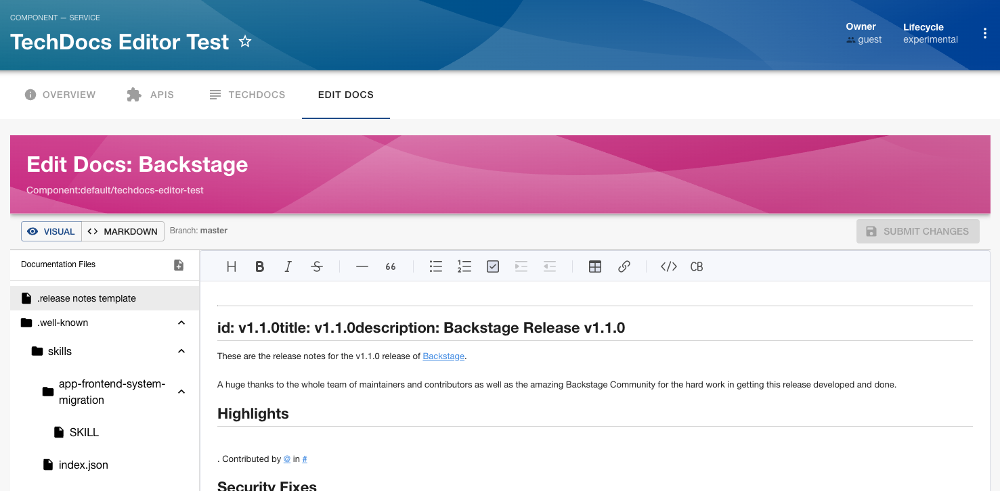
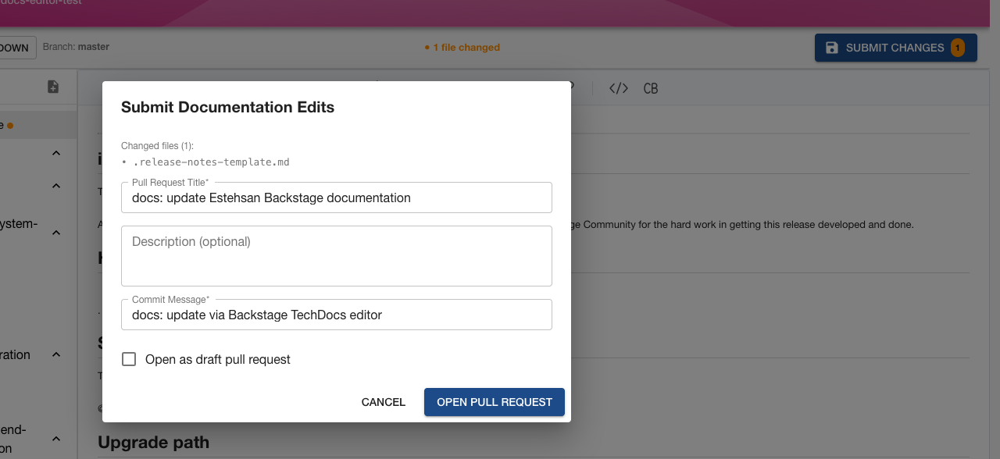

# TechDocs Editor Plugin

Edit documentation directly inside Backstage. Browse the docs file tree for any catalog entity, make changes in a WYSIWYG or Markdown editor, and submit them as a GitHub or GitLab pull/merge request — without leaving the portal.





## Setup

1. Install the plugin:

```bash
# From your Backstage root directory
yarn --cwd packages/app add @backstage-community/plugin-techdocs-editor
```

2. Install and configure the [backend plugin](../techdocs-editor-backend/README.md).

3. Add the plugin to your app and configure your catalog entities (see sections below).

### Legacy Frontend System

Add the route to `packages/app/src/App.tsx`:

```tsx
import {
  techdocsEditorPlugin,
  TechDocsEditorPage,
} from '@backstage-community/plugin-techdocs-editor';

// Inside your <FlatRoutes>:
<Route
  path="/techdocs-editor/:namespace/:kind/:name"
  element={<TechDocsEditorPage />}
/>;
```

Optionally, add the **Edit** button to the TechDocs reader so users can jump straight into the editor from any docs page:

```tsx
import { TechDocsEditPageAddon } from '@backstage-community/plugin-techdocs-editor';

<TechDocsReaderPage>
  <TechDocsEditPageAddon />
  {/* other addons... */}
</TechDocsReaderPage>;
```

### New Frontend System

Add the plugin to your `packages/app/src/App.tsx`:

```tsx
import techdocsEditorPlugin from '@backstage-community/plugin-techdocs-editor/alpha';

export default createApp({
  features: [
    // ...
    techdocsEditorPlugin,
  ],
});
```

The `TechDocsEditPageAddon` is still available and can be used the same way as in the legacy system.

### Entity annotations

The editor reads files from a remote Git repository. For most entities this is resolved automatically — no annotation change is needed if the entity already has a `github.com/project-slug` or `gitlab.com/project-slug` annotation (added automatically by Backstage's catalog processors).

If you prefer to be explicit, add a `url:` annotation to `catalog-info.yaml`:

```yaml
metadata:
  annotations:
    backstage.io/techdocs-ref: url:https://github.com/org/repo/tree/main
```

> Entities with `backstage.io/techdocs-ref: dir:.` work out of the box as long as a `github.com/project-slug` or `gitlab.com/project-slug` annotation is present on the same entity.

## How it works

1. Open the editor by clicking **Edit** in the TechDocs subheader, or navigate to `/techdocs-editor/default/component/my-service`.
2. The left sidebar shows the full docs file tree sourced from the Git repository. Files you have edited are highlighted.
3. Click any file to open it. Switch between **Visual** (WYSIWYG) and **Markdown** source modes using the toolbar toggle.
4. To create a new page, click the new-page icon in the file tree header and enter a relative path ending in `.md`.
5. Click **Submit Changes** when done. Enter a PR title, optional description, and commit message, then click **Open Pull Request**.
6. A link to the newly opened pull/merge request is shown. Merge it to publish the updated docs.

## Permissions

| Permission              | Action                                   |
| ----------------------- | ---------------------------------------- |
| `techdocs.editor.read`  | View the file tree and read source files |
| `techdocs.editor.write` | Submit pull/merge requests               |

## Links

- [Backend plugin](../techdocs-editor-backend/README.md)
- [React component library](../techdocs-editor-react/README.md)
- [Node extension point](../techdocs-editor-node/README.md)
- [Shared types & permissions](../techdocs-editor-common/README.md)
