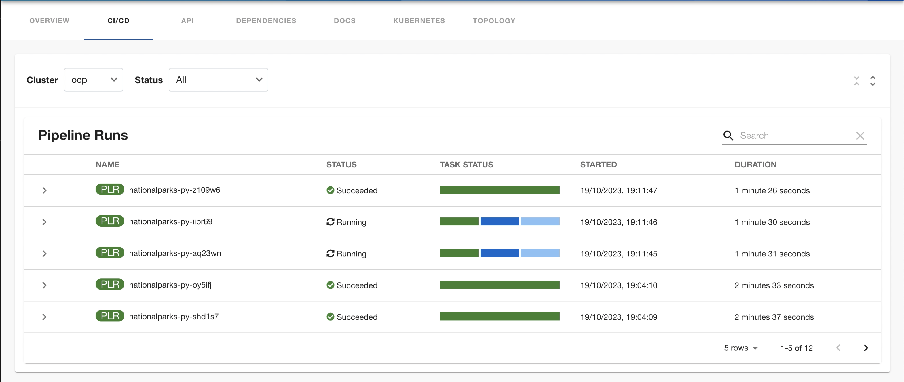
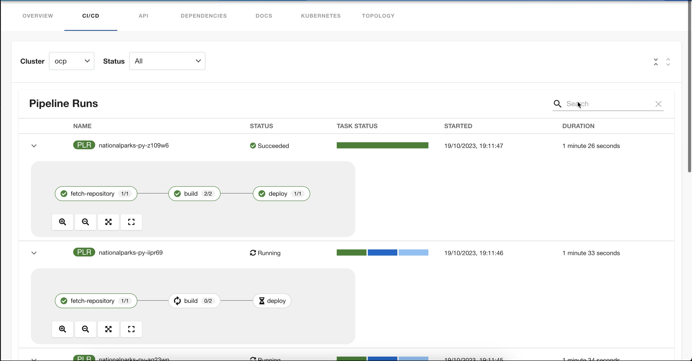
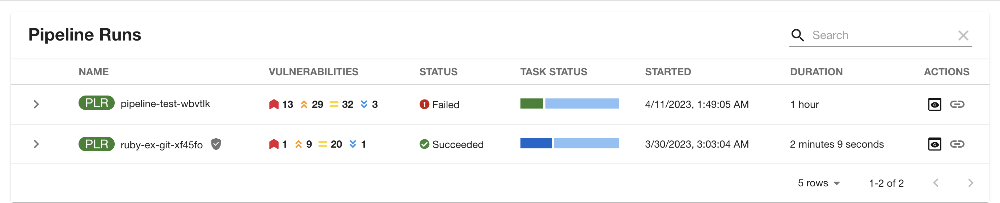
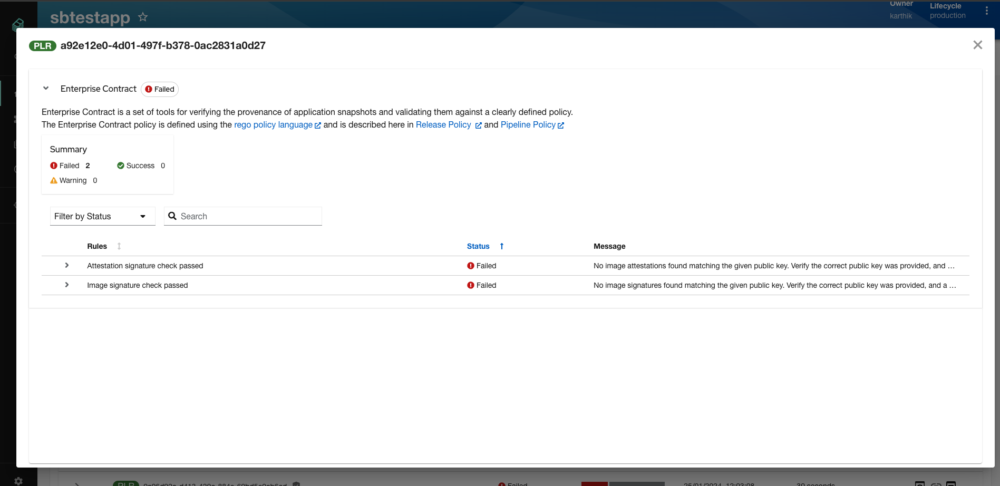
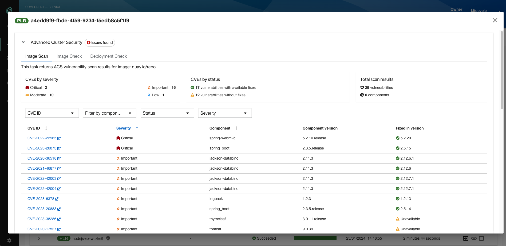
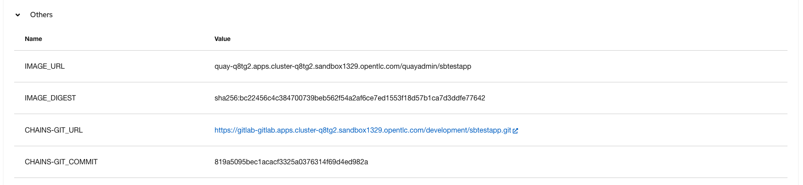

# Tekton plugin for Backstage

The Tekton plugin enables you to visualize the `PipelineRun` resources available on the Kubernetes cluster.

## For administrators

### Setting up the Tekton plugin

#### Prerequisites

- The Kubernetes backend plugin `@backstage/plugin-kubernetes-backend` is installed and configured by following the [installation](https://backstage.io/docs/features/kubernetes/installation) and [configuration](https://backstage.io/docs/features/kubernetes/configuration) guides.

- The following `customResources` component is added in the [`app-config.yaml`](https://backstage.io/docs/features/kubernetes/configuration#configuring-kubernetes-clusters) file:
  ```yaml
   kubernetes:
     ...
     customResources:
       - group: 'tekton.dev'
         apiVersion: 'v1'
         plural: 'pipelineruns'
       - group: 'tekton.dev'
         apiVersion: 'v1'
         plural: 'taskruns'
  ```
- The Kubernetes plugin is configured and connects to the cluster using a `ServiceAccount`.
- The [`ClusterRole`](https://backstage.io/docs/features/kubernetes/configuration#role-based-access-control) must be granted for custom resources (PipelineRuns and TaskRuns) to `ServiceAccount` accessing the cluster.
- To view the pod logs, you have granted permissions for `pods/log`.
- If you have the Backstage Kubernetes Plugin configured, then the `ClusterRole` is already granted.

  You can use the following code to grant the `ClusterRole` for custom resources and pod logs:

  ```yaml
    ...
    apiVersion: rbac.authorization.k8s.io/v1
    kind: ClusterRole
    metadata:
      name: backstage-read-only
    rules:
      - apiGroups:
          - ""
        resources:
          - pods/log
        verbs:
          - get
          - list
          - watch
      ...
      - apiGroups:
          - tekton.dev
        resources:
          - pipelineruns
          - taskruns
        verbs:
          - get
          - list

  ```

  > Tip: You can use the [prepared manifest for a read-only `ClusterRole`](https://raw.githubusercontent.com/backstage/community-plugins/main/workspaces/tekton/plugins/tekton/manifests/clusterrole.yaml), which provides access for both Kubernetes plugin and Tekton plugin.

- The following annotation is added to the entity's `catalog-info.yaml` file to identify whether an entity contains the Kubernetes resources:

  ```yaml
  annotations:
    ...

    backstage.io/kubernetes-id: <BACKSTAGE_ENTITY_NAME>
  ```

  You can also add the `backstage.io/kubernetes-namespace` annotation to identify the Kubernetes resources using the defined namespace.

  ```yaml
  annotations:
    ...

    backstage.io/kubernetes-namespace: <RESOURCE_NS>
  ```

- The following annotation is added to the `catalog-info.yaml` file of the entity to enable the Tekton related features in Backstage. The value of the annotation identifies the name of the Backstage entity:

  ```yaml
  annotations:
    ...

    tekton.dev/cicd : "true"
  ```

- A custom label selector can be added, which Backstage uses to find the Kubernetes resources. The label selector takes precedence over the ID annotations.

  ```yaml
  annotations:
    ...

    backstage.io/kubernetes-label-selector: 'app=my-app,component=front-end'
  ```

- The following label is added to the resources so that the Kubernetes plugin gets the Kubernetes resources from the requested entity:

  ```yaml
  labels:
    ...

    backstage.io/kubernetes-id: <BACKSTAGE_ENTITY_NAME>`
  ```

  ***

  **NOTE**

  When using the label selector, the mentioned labels must be present on the resource.

  ***

#### Procedure

1. Install the Tekton plugin using the following command:

   ```console
   yarn workspace app add @backstage-community/plugin-tekton
   ```

1. To enable the PipelineRun list in the **CI/CD** tab on the entity view page, add the following snippet in the `packages/app/src/components/catalog/EntityPage.tsx`.

   ```tsx title="packages/app/src/components/catalog/EntityPage.tsx"
   /* highlight-add-next-line */
   import {
     isTektonCIAvailable,
     TektonCI,
   } from '@backstage-community/plugin-tekton';

   const cicdContent = (
     <EntitySwitch>
       {/* ... */}
       {/* highlight-add-start */}
       <EntitySwitch.Case if={isTektonCIAvailable}>
         <TektonCI />
       </EntitySwitch.Case>
       {/* highlight-add-end */}
     </EntitySwitch>
   );
   ```

#### Permissions

If you are using permissions, please ensure that the following Kubernetes permissions are enabled:

- `kubernetes.clusters.read	`
- `kubernetes.resources.read`

Read [the documentation](https://github.com/backstage/backstage/blob/master/docs/features/kubernetes/permissions.md) for more info on these permissions.

## For users

### Using the Tekton plugin in Backstage

Tekton is a front-end plugin that enables you to view the `PipelineRun` resources.

#### Prerequisites

- Your Backstage application is installed and running.
- You have installed the Tekton plugin. For the installation process, see [Installation](#setting-up-the-tekton-plugin).

#### Procedure

1. Open your Backstage application and select a component from the **Catalog** page.

1. Go to the **CI/CD** tab.

   The **CI/CD** tab displays the list of PipelineRun resources associated with a Kubernetes cluster. The list contains pipeline run details, such as **NAME**, **STATUS**, **TASK STATUS**, **STARTED**, and **DURATION**.

   

1. Click on expand row button besides PipelineRun name in the list to view the PipelineRun visualization. The pipeline run resource include tasks to complete. When you hover the mouse pointer on a task card, you can view the steps to complete that particular task.

   

## Enabling UI elements

### Vulnerabilites Column

`Vulnerabilities` column provides a visual representation of identified vulnerabilities in the OCI image produced by the pipelinerun. The Author of the pipeline scanner task would provide the CVE summary data using the below format that the UI can interpret.

The result of the scanner task should be emitted back to the pipelinerun and it should contain a result that ends with `SCAN_OUTPUT` string.

## Format:

Result name: `<any_prefix>_SCAN_OUTPUT`
eg: `SCAN_OUTPUT`, `MY_ACS_SCAN_OUTPUT`

Result value: `'{"vulnerabilities":{"critical": 0,"high": 9,"medium": 2,"low": 13,"unknown": 0},
             "unpatched_vulnerabilities": {"critical": 0,"high": 1,"medium": 0,"low":1}}'`

---

Example PipelineRun:

```
   ...
   status:
     results:
       -  name: 'MY_SCAN_OUTPUT'
          value:
            '{"vulnerabilities":{"critical": 0,"high": 9,"medium": 2,"low": 13,"unknown": 0},
             "unpatched_vulnerabilities": {"critical": 0,"high": 1,"medium": 0,"low":1}}'
```



---

## Action buttons

### SBOM

Link to SBOM action will be enabled if there is a SBOM task in the pipelinerun and it should contain required annotations and emit the below result

## Format:

annotations:

```
    task.output.location: results
    task.results.format: application/text
    task.results.type: external-link  # Optional: This will redirect to external page
    task.results.key: LINK_TO_SBOM

```

results.name: `LINK_T0_SBOM`

results.value: `<sbom-viewer-url>`

---

Example:

## Task: [Optional]

```
apiVersion: tekton.dev/v1
kind: Task
metadata:
 name: export-sbom-task
 annotations:
    task.output.location: results
    task.results.format: application/text
    task.results.type: external-link  # Optional: This will redirect to external page
    task.results.key: LINK_TO_SBOM
spec: …
      steps:
        -  image: registry.access.redhat.com/ubi8/ubi-minimal
           name: export-sbom
           script:  |
             #!/bin/sh
             ## sbom image generation script goes here
             echo 'quay.io/repo/image:build-8e536-1692702836' | tee $(results.LINK_TO_SBOM.path)
```

_Note: Absence of the below annotation will open SBOM taskrun logs modal._

```
task.results.type: external-link  # This will redirect to external page
```

### Output:

Output action will be enabled when the pipelinerun emits some results and/or contains taskruns with supported annotations and emits report data in pod logs.

This action opens a modal where it will render the reports for Enterprise contract and Advanced cluster security. The report data should be exposed via pod logs and the taskruns should contain the following annotations.

Examples:

list of supported report tasks with correct annotations are listed below:

## Enterprise contract Task [Optional]:

```
apiVersion: tekton.dev/v1
kind: Task
metadata:
 name: enterprise-contract-task
 annotations:
    task.results.format: application/json
    task.results.type: ec
    task.output.location: logs
    task.results.container: step-report-json
spec: …
      steps:
        - name: report-json
          image: quay.io/enterprise-contract/ec-cli:snapshot@sha256:33be4031a3316a46db3559a4d8566bc22f9d4d491d262d699614f32f35b45b67
          command: [cat]
          args:
            - "$(params.HOMEDIR)/report-json.json"

```



---

## ACS Image scan Task [Optional]:

```
apiVersion: tekton.dev/v1
kind: Task
metadata:
 name: acs-image-scan
 annotations:
    task.results.format: application/json
    task.results.type: roxctl-image-scan
    task.results.key: SCAN_OUTPUT
    task.output.location: logs
    task.results.container: step-report
spec: …
      steps:
        - name: report
          image: 'quay.io/lrangine/crda-maven:11.0'
          script: |
              #!/bin/sh
              cat $(workspaces.reports.path)/image-scan

```

## ACS Image check Task [Optional]:

```
apiVersion: tekton.dev/v1
kind: Task
metadata:
 name: acs-image-check
 annotations:
    task.results.format: application/json
    task.results.type: roxctl-image-check
    task.results.key: SCAN_OUTPUT
    task.output.location: logs
    task.results.container: step-report
spec: …
      steps:
        - name: report
          image: 'quay.io/lrangine/crda-maven:11.0'
          script: |
              #!/bin/sh
              cat $(workspaces.reports.path)/image-check

```

## ACS Deployment check Task [Optional]:

```
apiVersion: tekton.dev/v1
kind: Task
metadata:
 name: acs-deployment-check
 annotations:
    task.results.format: application/json
    task.results.type: roxctl-deployment-check
    task.results.key: SCAN_OUTPUT
    task.output.location: logs
    task.results.container: step-report
spec: …
      steps:
        - name: report
          image: 'quay.io/lrangine/crda-maven:11.0'
          script: |
              #!/bin/sh
              cat $(workspaces.reports.path)/deployment-check

```



---

## Pipelinerun results

The results emitted in the pipelinerun resource will be available in the Others section in the output modal.


