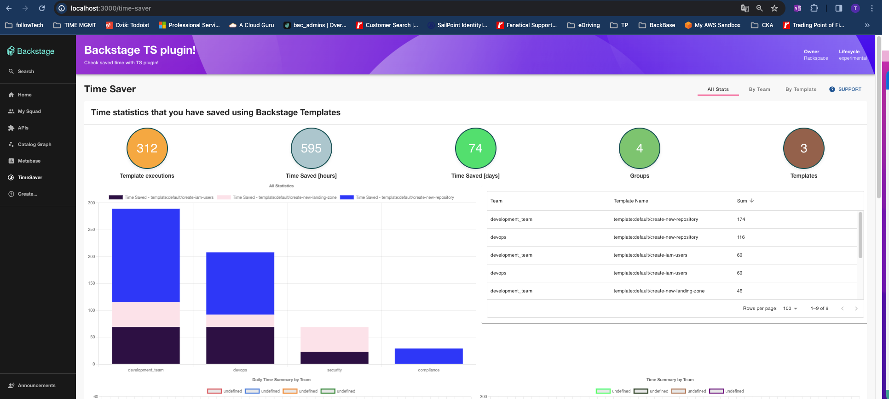
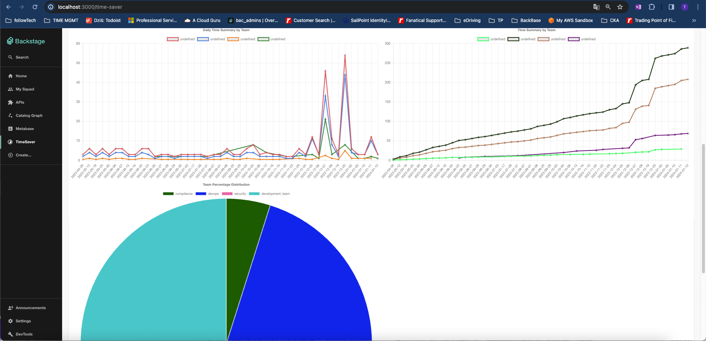
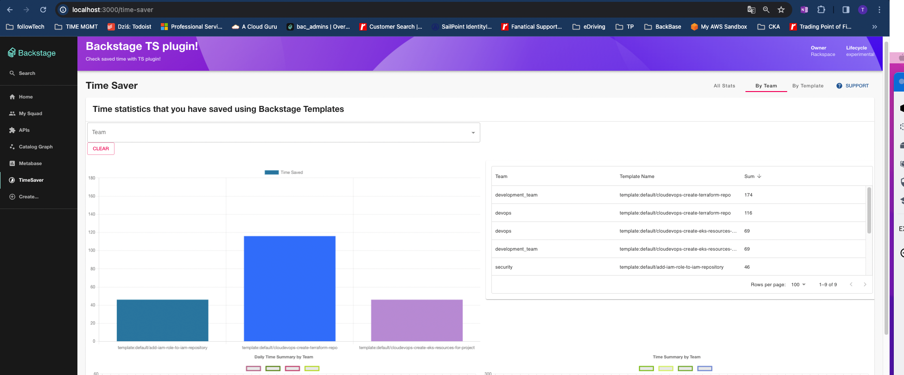
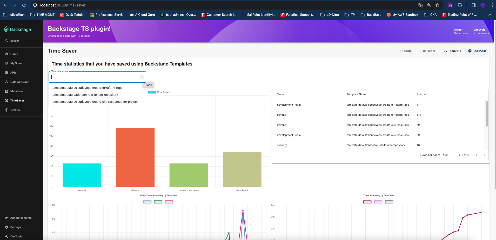

# Time Saver

This plugin provides an implementation of charts and statistics related to your time savings that are coming from usage of your templates. Plugins is built from frontend and backend part. This part of plugin `frontend` is responsible of providing views with charts describing data collected from `backend` part of plugin.

## Repos

- [time-saver](./plugins/time-saver)
- [time-saver-backend](./plugins/time-saver-backend)
- [time-saver-common](./plugins/time-saver-common)
- [time-saver-processor](./plugins/catalog-backend-module-time-saver-processor)

## Screens






## Installation

Please follow the instructions in each plugin README.md

## Generate Statistics

Configure your template definition like described below:
Provide an object under `metadata`. Provide quantities of saved time by each group executing one template in **_hours_** preferably

```diff
 apiVersion: scaffolder.backstage.io/v1beta3
 kind: Template
 metadata:
     name: example-template
     title: create-github-project
     description: Creates Github project
+      substitute:
+        engineering:
+          devops: 1
+          security: 4
+          development_team: 2
 spec:
     owner: group:default/backstage-admins
     type: service
```

Scheduler is running with its default setup every **5 minutes** to generate data from executed templates with these information.

## Migration

This plugins supports backward compatibility with migration. You can specify your Time Saver metadata for each template name. Then the migration will be performed once executing the API request to `/migrate` endpoint of the plugin.

Configure your backward time savings here:

Open the `app-config.yaml` file

```yaml
ts:
  backward:
    config: |
      [
        {
          "entityRef": "template:default/create-github-project",
          "engineering": {
            "devops": 8,
            "development_team": 8,
            "security": 3
          }
        } 
      ]
    # extend this list if needed
```
