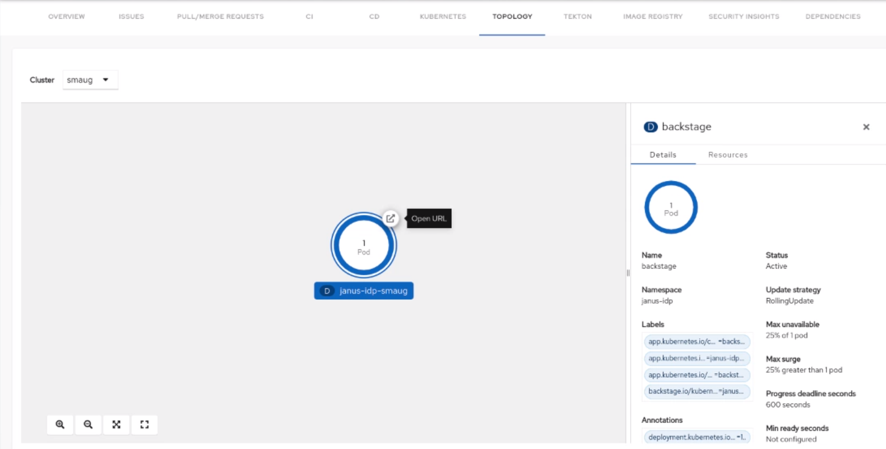

# Topology plugin for Backstage

The Topology plugin enables you to visualize the workloads such as Deployment, Job, Daemonset, Statefulset, CronJob, Pods and Virtual Machines powering any service on the Kubernetes cluster.

## For administrators

### Installation

#### Prerequisites

- The Kubernetes backend plugin `@backstage/plugin-kubernetes-backend` is installed and configured by following the [installation](https://backstage.io/docs/features/kubernetes/installation) and [configuration](https://backstage.io/docs/features/kubernetes/configuration) guides.
- The Kubernetes plugin is configured and connects to the cluster using a `ServiceAccount`.
- The [`ClusterRole`](https://backstage.io/docs/features/kubernetes/configuration#role-based-access-control) must be granted to `ServiceAccount` accessing the cluster. If you have the Backstage Kubernetes plugin configured, then the `ClusterRole` is already granted.

> Tip: You can use the [prepared manifest for a read-only `ClusterRole`](https://raw.githubusercontent.com/backstage/community-plugins/main/workspaces/topology/plugins/topology/manifests/clusterrole.yaml), providing access for both Kubernetes plugin and Topology plugin.

#### Other configurations

##### To view the OpenShift routes

- Ensure that read access is granted to the `routes` resource in the [`ClusterRole`](https://backstage.io/docs/features/kubernetes/configuration#role-based-access-control). You can use the following code to do so:

  ```yaml
    apiVersion: rbac.authorization.k8s.io/v1
    kind: ClusterRole
    metadata:
      name: backstage-read-only
    rules:
      ...
      - apiGroups:
          - route.openshift.io
        resources:
          - routes
        verbs:
          - get
          - list

  ```

- The following must be added in `kubernetes.customResources` property in the [`app-config.yaml`](https://backstage.io/docs/features/kubernetes/configuration#configuring-kubernetes-clusters) file to view the OpenShift route as well:

  ```yaml
    kubernetes:
      ...
      customResources:
        - group: 'route.openshift.io'
          apiVersion: 'v1'
          plural: 'routes'
  ```

##### To view the pods/pods log

The following permission must be granted to the [`ClusterRole`](https://backstage.io/docs/features/kubernetes/configuration#role-based-access-control) to be able to view the pod logs:

```yaml
  apiVersion: rbac.authorization.k8s.io/v1
  kind: ClusterRole
  metadata:
    name: backstage-read-only
  rules:
    ...
    - apiGroups:
        - ''
      resources:
        - pods
        - pods/log
      verbs:
        - get
        - list
        - watch
```

##### To view the Tekton PipelineRuns

- Ensure that read access is granted to the Pipelines, PipelineRuns, and TaskRuns resource in the [`ClusterRole`](https://backstage.io/docs/features/kubernetes/configuration#role-based-access-control). You can use the following code to do so:

  ```yaml
    ...
    apiVersion: rbac.authorization.k8s.io/v1
    kind: ClusterRole
    metadata:
      name: backstage-read-only
    rules:
      ...
      - apiGroups:
          - tekton.dev
        resources:
          - pipelines
          - pipelineruns
          - taskruns
        verbs:
          - get
          - list
  ```

- The following code must be added to the `kubernets.customResources` property in the [`app-config.yaml`](https://backstage.io/docs/features/kubernetes/configuration#configuring-kubernetes-clusters) file to view the Tekton PipelineRuns list in the side panel and to view the latest PipelineRun status in the Topology node decorator:

  ```yaml
    kubernetes:
      ...
      customResources:
        - group: 'tekton.dev'
          apiVersion: 'v1'
          plural: 'pipelines'
        - group: 'tekton.dev'
          apiVersion: 'v1'
          plural: 'pipelineruns'
        - group: 'tekton.dev'
          apiVersion: 'v1'
          plural: 'taskruns'
  ```

##### To view the Virtual Machines

- OpenShift Virtualization Operator is [installed and configured](https://docs.openshift.com/container-platform/4.8/virt/install/installing-virt-web.html#virt-installing-virt-operator_installing-virt-web) on a Kubernetes cluster.
- Ensure that read access is granted to the VirtualMachines resource in the [`ClusterRole`](https://backstage.io/docs/features/kubernetes/configuration#role-based-access-control). You can use the following code to do so:

  ```yaml
    ...
    apiVersion: rbac.authorization.k8s.io/v1
    kind: ClusterRole
    metadata:
      name: backstage-read-only
    rules:
      ...
      - apiGroups:
          - kubevirt.io
        resources:
          - virtualmachines
          - virtualmachineinstances
        verbs:
          - get
          - list
  ```

- The following code must be added to the `kubernetes.customResources` property in the [`app-config.yaml`](https://backstage.io/docs/features/kubernetes/configuration#configuring-kubernetes-clusters) file to view the VirtualMachine nodes on the topology plugin:

  ```yaml
    kubernetes:
      ...
      customResources:
        - group: 'kubevirt.io'
          apiVersion: 'v1'
          plural: 'virtualmachines'
        - group: 'kubevirt.io'
          apiVersion: 'v1'
          plural: 'virtualmachineinstances'
  ```

##### To enable the Source Code Editor

- Ensure that read access is granted to the `CheClusters` resource in the [`ClusterRole`](https://backstage.io/docs/features/kubernetes/configuration#role-based-access-control) as shown in the following example code:

  ```yaml
    ...
    apiVersion: rbac.authorization.k8s.io/v1
    kind: ClusterRole
    metadata:
      name: backstage-read-only
    rules:
      ...
      - apiGroups:
          - org.eclipse.che
        resources:
          - checlusters
        verbs:
          - get
          - list
  ```

- The following configuration must be added in the `kubernetes.customResources` property in the [`app-config.yaml`](https://backstage.io/docs/features/kubernetes/configuration#configuring-kubernetes-clusters) file to use the Source Code Editor:

  ```yaml
    kubernetes:
      ...
      customResources:
        - group: 'org.eclipse.che'
          apiVersion: 'v2'
          plural: 'checlusters'
  ```

#### Labels and annotations

##### Link to the source code editor or the source

The following annotations are added to workload resources, such as Deployments to navigate to the Git repository of the associated application using the source code editor:

```yaml title="deployment.yaml"
annotations:
  app.openshift.io/vcs-uri: <GIT_REPO_URL>
```

You can also add the following annotation to navigate to a specific branch:

```yaml title="deployment.yaml"
annotations:
  app.openshift.io/vcs-ref: <GIT_REPO_BRANCH>
```

> Note: If Red Hat OpenShift Dev Spaces is [installed and configured](https://access.redhat.com/documentation/en-us/red_hat_openshift_dev_spaces/3.7/html/administration_guide/installing-devspaces) and git URL annotations are also added to the workload YAML file, then clicking on the edit code decorator redirects you to the Red Hat OpenShift Dev Spaces instance.

> Note: When you deploy your application using the OCP Git import flows, then you do not need to add the labels as import flows do that. Otherwise, you need to add the labels manually to the workload YAML file.

The labels are not similar to `backstage.io/edit-url` annotations as it points to the catalog entity metadata source file and is applied to Backstage catalog entity metadata YAML file, but not Kubernetes resources.

> Tip: You can also add the `app.openshift.io/edit-url` annotation with the edit URL that you want to access using the decorator.

##### Entity annotation/label

- In order for Backstage to detect that an entity has Kubernetes components, the following annotation should be added to the entity's `catalog-info.yaml`:

  ```yaml title="catalog-info.yaml"
  annotations:
    backstage.io/kubernetes-id: <BACKSTAGE_ENTITY_NAME>
  ```

- The following label is added to the resources so that the Kubernetes plugin gets the Kubernetes resources from the requested entity:

  ```yaml title="catalog-info.yaml"
  labels:
    backstage.io/kubernetes-id: <BACKSTAGE_ENTITY_NAME>`
  ```

  ***

  **NOTE**  
  When using the label selector, the mentioned labels must be present on the resource.

  ***

##### Namespace annotation

You can also add the `backstage.io/kubernetes-namespace` annotation to identify the Kubernetes resources using the defined namespace.

```yaml title="catalog-info.yaml"
annotations:
  backstage.io/kubernetes-namespace: <RESOURCE_NS>
```

> The Red Hat OpenShift Dev Spaces instance is not accessible using the source code editor if the `backstage.io/kubernetes-namespace` annotation is added to the `catalog-info.yaml` file.

To retrieve the instance URL, CheCluster Custom Resource (CR) is required. The instance URL is not retrieved if the namespace annotation value is different from `openshift-devspaces` as CheCluster CR is created in `openshift-devspaces` namespace.

##### Label selector query annotation

You can write your own custom label, which Backstage uses to find the Kubernetes resources. The label selector takes precedence over the ID annotations.

```yaml title="catalog-info.yaml"
annotations:
  backstage.io/kubernetes-label-selector: 'app=my-app,component=front-end'
```

If you have multiple entities while Red Hat Dev Spaces is configured and want multiple entities to support the edit code decorator that redirects to the Red Hat Dev Spaces instance, you can add the `backstage.io/kubernetes-label-selector` annotation to the `catalog-info.yaml` file for each entity.

```yaml title="catalog-info.yaml"
annotations:
  backstage.io/kubernetes-label-selector: 'component in (<BACKSTAGE_ENTITY_NAME>,che)'
```

If you are using the above label selector, ensure that you add the below labels to your resources so that the Kubernetes plugin gets the Kubernetes resources from the requested entity:

```yaml title="checluster.yaml"
labels:
  component: che # add this label to your che cluster instance
```

```yaml
labels:
  component: <BACKSTAGE_ENTITY_NAME> # add this label to the other resources associated with your entity
```

You can also write your own custom query for the label selector with unique labels to differentiate your entities. However, you need to ensure that you add those labels to the resources associated with your entities including your CheCluster instance.

##### Icon displayed in the node

- The following label is added to workload resources, such as Deployments to display runtime icon in the topology nodes:

  ```yaml title="deployment.yaml"
  labels:
    app.openshift.io/runtime: <RUNTIME_NAME>
  ```

- As another option, you can include the following label to display the runtime icon:

  ```yaml title="deployment.yaml"
  labels:
    app.kubernetes.io/name: <RUNTIME_NAME>
  ```

  Supported values of `<RUNTIME_NAME>` include:

  - django
  - dotnet
  - drupal
  - go-gopher
  - golang
  - grails
  - jboss
  - jruby
  - js
  - nginx
  - nodejs
  - openjdk
  - perl
  - phalcon
  - php
  - python
  - quarkus
  - rails
  - redis
  - rh-spring-boot
  - rust
  - java
  - rh-openjdk
  - ruby
  - spring
  - spring-boot

  **NOTE** Other values result in icons not being rendered for the node.

##### App grouping

The following label is added to display the workload resources such as Deployments and Pods in a visual group:

```yaml title="catalog-info.yaml"
labels:
  app.kubernetes.io/part-of: <GROUP_NAME>
```

##### Node connector

The following annotation is added to display the workload resources such as Deployments and Pods with a visual connector:

```yaml title="catalog-info.yaml"
annotations:
  app.openshift.io/connects-to: '[{"apiVersion": <RESOURCE_APIVERSION>,"kind": <RESOURCE_KIND>,"name": <RESOURCE_NAME>}]'
```

For more information about the labels and annotations, see [Guidelines for labels and annotations for OpenShift applications](https://github.com/redhat-developer/app-labels/blob/master/labels-annotation-for-openshift.adoc).

#### Procedure

1. Install the Topology plugin using the following command:

   ```console
   yarn workspace app add @backstage-community/plugin-topology
   ```

2. Enable **TOPOLOGY** tab in `packages/app/src/components/catalog/EntityPage.tsx`:

   ```tsx title="packages/app/src/components/catalog/EntityPage.tsx"
   /* highlight-add-next-line */
   import { TopologyPage } from '@backstage-community/plugin-topology';

   const serviceEntityPage = (
     <EntityLayout>
       {/* ... */}
       {/* highlight-add-start */}
       <EntityLayout.Route path="/topology" title="Topology">
         <TopologyPage />
       </EntityLayout.Route>
       {/* highlight-add-end */}
     </EntityLayout>
   );
   ```

## For users

### Using the Topology plugin in Backstage

Topology is a front-end plugin that enables you to view the workloads as nodes that power any service on the Kubernetes cluster.

#### Prerequisites

- Your Backstage application is installed and running.
- You have installed the Topology plugin. For the installation process, see [Installation](#installation).
- If RBAC permission framework is enabled, ensure to add the following permission policies in an external permission policies configuration file named `rbac-policy.csv` to allow the rbac admins or your desired user(s)/group(s) to access the topology plugin:

```csv rbac-policy.csv
g, user:default/<YOUR_USERNAME>, role:default/topology-viewer
p, role:default/topology-viewer, kubernetes.clusters.read, read, allow
p, role:default/topology-viewer, kubernetes.resources.read, read, allow
p, role:default/topology-viewer, kubernetes.proxy, use, allow
p, role:default/topology-viewer, catalog-entity, read, allow
```

`p, role:default/topology-viewer, kubernetes.clusters.read, read, allow` and `p, role:default/topology-viewer, kubernetes.resources.read, read, allow` grants the user the ability to see the Topology panel. `p, role:default/topology-viewer, kubernetes.proxy, use, allow` grants the user the ability to view the pod logs. `p, role:default/topology-viewer, catalog-entity, read, allow` grants the user the ability to see the catalog item.

#### Procedure

1. Open your Backstage application and select a component from the **Catalog** page.
1. Go to the **TOPOLOGY** tab and you can view the workloads such as Deployments, Pods as nodes.

   

1. Select a node and a pop-up appears on the right side, which contains two tabs: **Details** and **Resources**.

   The **Details** and **Resources** tab contain the associated information and resources of the node.

   

1. Click on the **Open URL** button on the top of a node.

   

   When you click on the open URL button, it allows you to access the associated **Ingresses** and runs your application in a new tab.
