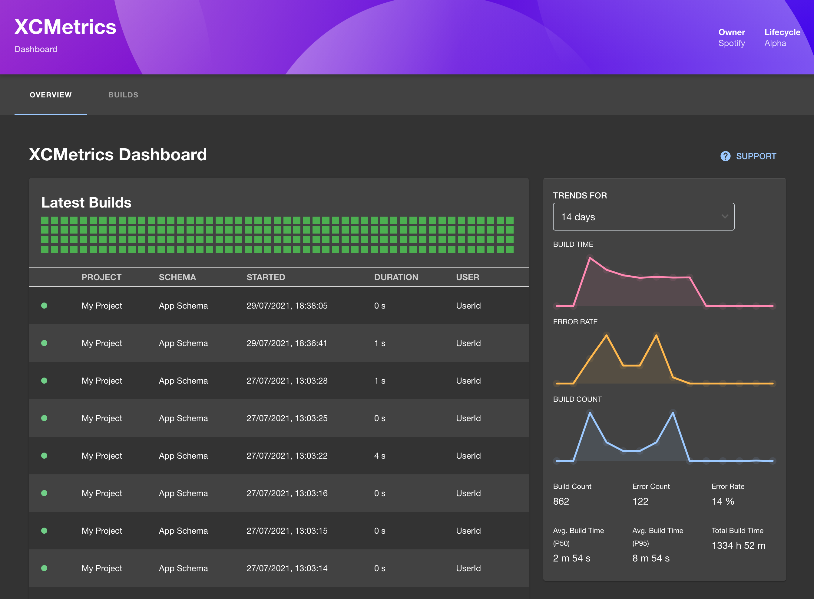

# XCMetrics

[XCMetrics](https://xcmetrics.io) is a tool for collecting build metrics from XCode.
With this plugin, you can view data from XCMetrics directly in Backstage.



## Getting started

```bash
# From your Backstage root directory
yarn --cwd packages/app add @backstage-community/plugin-xcmetrics
```

In `packages/app/src/App.tsx`, add the following:

```ts
import { XcmetricsPage } from '@backstage-community/plugin-xcmetrics';
```

```tsx
<FlatRoutes>
  {/* Other routes... */}
  <Route path="/xcmetrics" element={<XcmetricsPage />} />
</FlatRoutes>
```

Add the URL to your XCMetrics backend instance in `app-config.yaml` like so:

```yaml
proxy:
  ...
  '/xcmetrics':
    target: http://127.0.0.1:8080/v1
```

Start Backstage and navigate to `/xcmetrics` to view your build metrics!

## New Frontend System

If you are using Backstage feature discovery, the plugin can be discovered automatically. Otherwise, you can register the alpha entry manually in your app:

```tsx
import { createApp } from '@backstage/app-defaults';
import xcmetricsPlugin from '@backstage-community/plugin-xcmetrics/alpha';

const app = createApp({
  features: [
    // ...other features
    xcmetricsPlugin,
  ],
});
```

This plugin provides the following new frontend system extensions:

- A page extension for the XCMetrics dashboard
- An API extension for `xcmetricsApiRef`

Use `@backstage-community/plugin-xcmetrics/alpha` to enable the plugin through the new frontend system.
